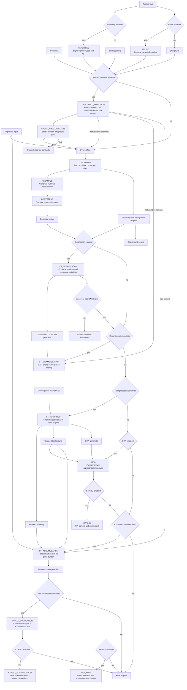

# PHYLOPHERE


```text
 PPP   H   H  Y   Y  L     L   Y   Y
 P  P  H   H   Y Y   L     L    Y Y
 PPP   HHHHH    Y    L     L     Y
 P     H   H    Y    L     L     Y
 P     H   H    Y    LLLL  LLLL  Y
```

A **Nextflow DSL2 pipeline** to run phylogenetic comparative workflows for genome–phenome analyses, centered on CAAStools-based CAAS/CAAP discovery and extended with downstream significance, disambiguation, post-processing, enrichment, and accumulation analyses.

---

## Why PhyloPhere

PhyloPhere provides:

- Reproducible orchestration of CAAStools modules (`discovery`, `resample`, `bootstrap`) in Nextflow.
- Integration with trait preprocessing and contrast selection.
- Extended downstream modules not present in vanilla CAAStools runs:
  - `ct_signification`
  - `ct_disambiguation`
  - `ct_postproc`
  - `ora` / `string`
  - `ct_accumulation`
- Optional RERConverge workflow support (`build_trait`, `build_tree`, `build_matrix`, `continuous`).
- Both **end-to-end integrated** execution and **standalone module-by-module** execution.

---

## Attribution

This project builds on and extends major prior tools and contributions:

- **CAAStools** (linudz): https://github.com/linudz/caastools
- **CAAP/isCAAP extensions in this codebase** (property-based convergence and group-aware logic, including `iscaap` handling in accumulation/randomization paths).
- **RERConverge** (partial integration in PhyloPhere).
- **María Sánchez Bermúdez** (diet/ethanol phenotype project definitions and test-use scenarios integrated in runner workflows).

Please cite resources listed in [`docs/CITATIONS.md`](docs/CITATIONS.md).

---

## What changed vs original `linudz/caastools`

Compared with standalone CAAStools usage, PhyloPhere adds:

1. **Workflow orchestration in Nextflow DSL2** with profile/config-driven execution.
2. **Integrated trait preprocessing** (`reporting`, `contrast_selection`, optional pruning, CI-aware grouping).
3. **CAAP-aware pipeline plumbing** across discovery/signification/postproc/accumulation (including CAAP groups and `iscaap`-aware downstream logic).
4. **Disambiguation stage** (`ct_disambiguation`) with ASR modes:
   - `precomputed` (cache-backed)
   - `compute`
5. **Post-processing modes**:
   - `filter` (single selected parameters)
   - `exploratory` (parameter sweep)
6. **Functional enrichment modules**:
   - ORA (WebGestalt)
   - STRING enrichment
7. **Accumulation module** (`ct_accumulation`) and optional ORA/STRING over accumulation gene lists.
8. **Integrated + standalone dual model** with robust fallback logic from channels to explicit file inputs.

### Core CT upgrades in PhyloPhere (vs classic CT usage)

These are the biggest behavior-level changes you asked to highlight:

- **Pair-aware mode (`miss_pair`)**
  Missing-data filtering can enforce pair consistency between FG/BG when thresholds are aligned, reducing artifacts from asymmetrically missing taxa.
- **Conservation-aware mode (`max_conserved`)**
  Instead of requiring strict zero overlap, CT can tolerate limited overlap between FG/BG amino-acid states (or CAAP groups), while still requiring informative side-specific change. This is useful for biologically conservative substitutions where complete disjointness is too strict.
- **CAAP mode (`caap_mode`)**
  Discovery/Bootstrap can run on amino-acid property groupings (GS0–GS4 + US handling), not only exact residue identity. This extends classic CAAS into **property-level convergence** and is propagated downstream (signification, postproc, accumulation, `iscaap`-aware logic).
- **Optimized permulations / bootstrap execution**PhyloPhere CT implements multiple practical optimizations for large runs:

  - chunked resample generation / ingestion (`chunk_size`)
  - directory-based `resample_out` support (not only legacy single-file input)
  - discovery-guided bootstrap filtering (`discovery_out`) so bootstrap tests only discovered positions/schemes
  - substantial reduction in total tests (documented in code/help as speedup-oriented optimization)

---

## End-to-end workflow (sequential integrated run)

Typical integrated chain:

1. `reporting` (optional phenotype exploration)
2. `contrast_selection`
3. `ct_tool=discovery,resample,bootstrap`
4. `ct_signification`
5. `ct_disambiguation`
6. `ct_postproc`
7. `ora` and optionally `string`
8. `ct_accumulation`
9. `ora_accumulation` and optionally `string_accumulation`

### Example integrated run

```bash
nextflow run main.nf -profile local \
  --my_traits <traits.csv> \
  --traitname <trait_column> \
  --tree <tree.nwk> \
  --alignment <alignment_dir> \
  --ct_tool "discovery,resample,bootstrap" \
  --reporting \
  --contrast_selection \
  --ct_signification \
  --ct_disambiguation \
  --ct_postproc \
  --ora --string \
  --ct_accumulation \
  --outdir <results_dir>
```

---

## Pipeline overview (Mermaid)



This diagram reflects the actual **integrated channel flow** plus the same module boundaries you can invoke in **standalone file-input mode**.

---

## Run by modules (standalone / selective execution)

You can run specific modules without full chaining.

### CT only

```bash
nextflow run main.nf -profile local \
  --ct_tool "discovery,resample,bootstrap" \
  --alignment <alignment_dir> \
  --caas_config <traitfile.tab> \
  --tree <tree.nwk> \
  --traitvalues <boot_traitfile.tab> \
  --outdir <results_dir>
```

### Signification standalone

```bash
nextflow run main.nf -profile local \
  --ct_signification \
  --discovery_input <discovery.tab> \
  --bootstrap_input <bootstrap.tab|bootstrap_dir> \
  --background_input <background_genes.txt|dir> \
  --outdir <results_dir>
```

### Disambiguation standalone

```bash
nextflow run main.nf -profile local \
  --ct_disambiguation \
  --ct_disambig_caas_metadata <global_meta_caas.tsv> \
  --caas_config <traitfile.tab> \
  --tree <tree.nwk> \
  --ct_disambig_asr_mode precomputed \
  --ct_disambig_asr_cache_dir <asr_cache_dir> \
  --outdir <results_dir>
```

### Post-processing standalone

```bash
nextflow run main.nf -profile local \
  --ct_postproc \
  --discovery_input <caas_convergence_master.csv> \
  --background_input <background_genes.txt|dir> \
  --caas_postproc_mode filter \
  --outdir <results_dir>
```

### ORA/STRING standalone

```bash
nextflow run main.nf -profile local \
  --ora --string \
  --ora_gene_lists_input <gene_lists_dir> \
  --ora_background_input <cleaned_background_main.txt|dir> \
  --outdir <results_dir>
```

### CT accumulation standalone

```bash
nextflow run main.nf -profile local \
  --ct_accumulation \
  --accumulation_caas_input <filtered_discovery.tsv> \
  --accumulation_background_input <cleaned_background_main.txt|dir> \
  --alignment <alignment_dir> \
  --caas_config <traitfile.tab> \
  --outdir <results_dir>
```

---

## Main modules in one sentence each

- **REPORTING**: Builds exploratory phenotype reports (distribution, phylogenetic context, and QC plots).
- **CONTRAST_SELECTION**: Defines high/low phenotype contrast groups, optionally using pruning and CI-aware logic.
- **CT (discovery/resample/bootstrap)**: Detects candidate convergent substitutions and tests them against permutation-based null distributions.
- **CT_SIGNIFICATION**: Combines discovery and bootstrap evidence into significance summaries and meta tables (e.g., `global_meta_caas.tsv`).
- **CT_DISAMBIGUATION**: Uses ASR-informed logic to separate true convergent events from ambiguous patterns and exports convergence master tables.
- **CT_POSTPROC**: Filters and characterizes CAAS/CAAP outputs (filter or exploratory mode), producing cleaned sets for downstream analyses.
- **ORA**: Runs over-representation analysis (WebGestalt) on selected gene lists with the chosen background universe.
- **STRING**: Runs STRING enrichment/network-context analysis on the same selected gene sets.
- **CT_ACCUMULATION**: Tests whether CAAS burden accumulates in genes more than expected by chance via randomization.
- **ORA_ACCUMULATION / STRING_ACCUMULATION**: Functional enrichment over accumulation-derived gene lists.
- **RER_MAIN**: Runs integrated RERConverge steps (trait/tree/matrix construction and continuous association mode).

## Key options by module

### Global/common

- `--outdir`
- `--my_traits`, `--traitname`, `--tree`
- `--reporting`, `--contrast_selection`
- `--secondary_trait`, `--branch_trait`, `--n_trait`, `--c_trait`

### CT (`--ct_tool`)

- `discovery|resample|bootstrap` (comma-separated)
- `--alignment`, `--caas_config`, `--traitvalues`, `--cycles`, `--chunk_size`
- Thresholds: `--maxbggaps`, `--maxfggaps`, `--maxgaps`, `--maxbgmiss`, `--maxfgmiss`, `--maxmiss`, `--max_conserved`
- CAAP mode: `--caap_mode`

### Signification

- `--discovery_input`, `--bootstrap_input`, `--background_input`
- significance threshold options from config (`alpha_threshold`, export flags)

### Disambiguation

- `--ct_disambig_caas_metadata`
- `--ct_disambig_asr_mode (precomputed|compute)`
- `--ct_disambig_asr_cache_dir`
- `--ct_disambig_posterior_threshold`

### Post-processing

- `--caas_postproc_mode (filter|exploratory)`
- `--filter_minlen`, `--filter_maxcaas`
- exploratory sweep: `--minlen_values`, `--maxcaas_values`
- gene filtering controls (`gene_filter_mode`, thresholds)

### ORA / STRING

- `--ora`, `--string`
- `--ora_gene_lists_input`, `--ora_background_input`
- ORA and STRING FDR/top thresholds and DB parameters in `conf/ora.config`

### CT accumulation

- `--ct_accumulation`
- `--accumulation_caas_input`
- `--accumulation_background_input`
- `--accumulation_n_randomizations`
- `--accumulation_randomization_type (naive|matched)`

### RERConverge

- `--rer_tool "build_trait,build_tree,build_matrix,continuous"`
- inputs in `conf/rerconverge.config`

For detailed help:

```bash
nextflow run main.nf --help
nextflow run main.nf --ct_tool discovery --help
nextflow run main.nf --ct_tool resample --help
nextflow run main.nf --ct_tool bootstrap --help
```

---

## Runners included in this repository

### `run_phenotypes.sh`

Main multi-phenotype runner with two explicit scenario classes:

1. **Pruned-secondary (cancer project)**

   - paired primary/secondary phenotype runs
   - pruning lists
   - CI-aware contrast selection (`n_trait`/`c_trait`)
2. **Simple (diet/ethanol project, María Sánchez Bermúdez)**

   - no pruning
   - no `n_trait`/`c_trait`
   - serial trait runs

Also includes **toy vs full** toggles (`IS_TOY`) controlling cycles/randomizations.

### `run_scripts/test_stress.sh`

Comprehensive stress matrix:

- integrated runs
- standalone runs per module
- ASR mode variants (compute/precomputed)
- optional cleanup/input staging

### `run_scripts/test_integrated_pipeline.sh`

Integrated end-to-end validation in both:

- `filter` mode
- `exploratory` mode

---

## Test cases and scenario evidence already in repo

- `Data/test/inputs/*`: staged standalone inputs for CT, signification, disambiguation, postproc, ORA.
- `pipeline_info/*`: historical execution reports, timelines, traces, DAGs.
- `run_scripts/test_stress.sh`: explicit integrated vs standalone validation matrix.
- `run_phenotypes.sh`: biological scenario differences (cancer CI+pruning+secondary vs diet no CI/no pruning).

---

## Monitoring with Nextflow Tower (important)

If you enable Tower, **you must provide your own API token**.

In `conf/common.config`:

```groovy
tower {
    accessToken = "INSERTCOIN"  // replace with your own token
    enabled = false
}
```

To use Tower safely:

1. Replace `INSERTCOIN` with your token.
2. Set `enabled = true` or run with `-with-tower` as desired.

Do not commit private production tokens.

---

## Installation / execution notes

- Recommended: run with Nextflow + container profile (`local`, `singularity`, `apptainer`, `slurm` as configured).
- Main config files:
  - `nextflow.config`
  - `conf/common.config`
  - `conf/ct.config`
  - `conf/ct_postproc.config`
  - `conf/ct_disambiguation.config`
  - `conf/ora.config`
  - `conf/ct_accumulation.config`
  - `conf/rerconverge.config`

---

## License

See [LICENSE](LICENSE).

## Additional docs

- [Citations](docs/CITATIONS.md)
- [CAAP mode notes](docs/CAAP_MODE.md)
- [Multi-phenotype methods](docs/METHODS_multi_phenotype.md)
