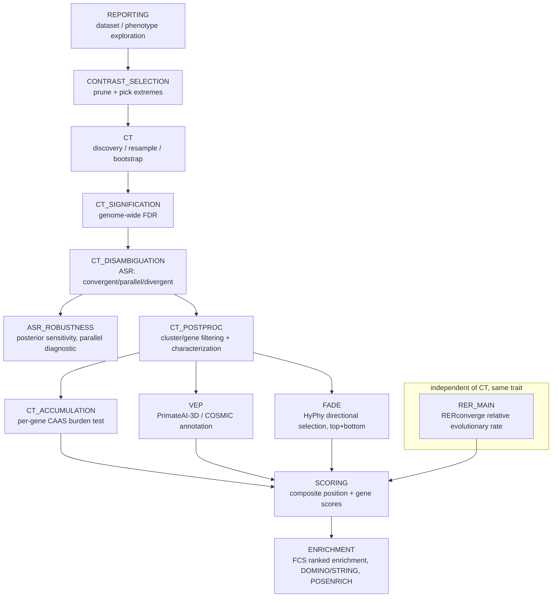

# PhyloPhere

A Nextflow pipeline for phylogenetic comparative genomics: it takes a multiple
sequence alignment, a species tree, and a phenotype, and asks *which genes and
which amino acid positions evolved differently in species that carry the
extreme values of that phenotype*. It combines convergent-substitution
detection, ancestral-state reconstruction, relative evolutionary rate,
directional selection scanning, and composite scoring/enrichment into one
reproducible, resumable pipeline — runnable from the CLI, a desktop GUI, or
Seqera Platform.

- **Repository:** https://github.com/nozerorma/PhyloPhere
- **License:** GNU GPL v3 ([LICENSE](LICENSE))
- **Requires:** Nextflow ≥ 22.10 (DSL2), a container engine (Singularity/Apptainer) or the bundled conda environment

---

## Table of contents

1. [Quickstart](#quickstart)
2. [Workflow](#workflow)
3. [Modules](#modules)
4. [Configuration reference](#configuration-reference)
5. [Resource allocation](#resource-allocation)
6. [Desktop GUI](#desktop-gui)
7. [Running on Seqera Platform](#running-on-seqera-platform)
8. [Contributions & acknowledgements](#contributions--acknowledgements)
9. [License](#license)
10. [Additional docs](#additional-docs)

---

## Quickstart

```bash
# 1. set up the environment (conda/mamba env named "phylophere")
./environment/install_env.sh

# 2. run a minimal end-to-end analysis
nextflow run main.nf \
  --my_traits       traits.csv \
  --traitname       my_phenotype \
  --tree            species.nwk \
  --alignment       alignments/ \
  --caas_config     caas_config.tab \
  --contrast_selection \
  --ct_tool         discovery,resample,bootstrap \
  --ct_disambiguation --ct_postproc --ct_accumulation \
  --scoring --enrichment \
  -profile singularity \
  --outdir out/
```

The "core" chain — CT, `--ct_disambiguation`, `--ct_postproc`,
`--ct_accumulation`, `--vep` — runs by default (see [Configuration
reference](#configuration-reference)); `--scoring`, `--enrichment`,
`--fade`, `--rer_tool` and `--contrast_selection` are opt-in and default to
off, so a first-time user should not expect scoring, enrichment, FADE, or RER
output without explicitly requesting them. `--help` always prints the general
overview, followed by detail for every module currently enabled by your
flags — i.e. help for the run you're about to launch:

```bash
nextflow run main.nf --help                       # overview + help for the default-on chain
nextflow run main.nf --help --scoring --enrichment --fade --rer_tool continuous
```

Prefer a form over flags? See the [Desktop GUI](#desktop-gui) section — it
exposes every parameter below across a set of tabs and generates the launch
scripts for you (single run, multi-phenotype local loop, or a Slurm array job).

---

## Workflow

PhyloPhere runs as a single Nextflow entry point (`main.nf`) that conditionally
composes named sub-workflows based on `params.*` toggles — there is no
`-entry` dispatch, and one invocation processes **one phenotype at a time**
(multi-phenotype sweeps are handled by looping invocations, e.g. via the GUI's
generated Slurm array script). Any stage can also be run **standalone** from a
precomputed input of its upstream stage (the `*_from` / `*_input` /
`*_dir` parameters throughout the config), which is how individual reports get
re-rendered without re-running the whole chain.


```mermaid
flowchart TD
    A[REPORTING\ndataset / phenotype exploration] --> B[CONTRAST_SELECTION\nprune + pick extremes]
    B --> C[CT\ndiscovery / resample / bootstrap]
    C --> D[CT_SIGNIFICATION\ngenome-wide FDR]
    D --> E[CT_DISAMBIGUATION\nASR: convergent/parallel/divergent]
    E --> E2[ASR_ROBUSTNESS\nposterior sensitivity, parallel diagnostic]
    E --> F[CT_POSTPROC\ncluster/gene filtering + characterization]
    F --> G[CT_ACCUMULATION\nper-gene CAAS burden test]
    F --> H[VEP\nPrimateAI-3D / COSMIC annotation]
    F --> I[FADE\nHyPhy directional selection, top+bottom]
    subgraph independent[independent of CT, same trait]
      J[RER_MAIN\nRERconverge relative evolutionary rate]
    end
    G --> K[SCORING\ncomposite position + gene scores]
    H --> K
    I --> K
    J --> K
    K --> L[ENRICHMENT\nFCS ranked enrichment, DOMINO/STRING, POSENRICH]
```

Execution order as wired in `main.nf`:

1. **REPORTING** (`--reporting`) — optional preliminary trait/tree exploration reports; skipped if `--contrast_selection` is also set (it produces its own reports).
2. **CONTRAST_SELECTION** (`--contrast_selection`) — pruning + independent-contrasts extreme selection; aborts cleanly via `--min_contrasts` if too few foreground pairs exist.
3. **CT** (`--ct_tool discovery,resample,bootstrap`) — CAAStools discovery/resample/bootstrap.
4. **CT_SIGNIFICATION** — genome-wide significance/FDR of discovered CAAS (runs whenever bootstrap ran, or standalone via `--bootstrap_from`).
5. **CT_DISAMBIGUATION** (`--ct_disambiguation`) — ASR-based convergent/parallel/divergent classification.
6. **CT_POSTPROC** (`--ct_postproc`) — cluster/gene filtering, background cleanup, characterization report; also fans out **ASR_ROBUSTNESS** in parallel as an independent posterior-confidence diagnostic.
7. **CT_ACCUMULATION** (`--ct_accumulation`), **VEP** (`--vep`), **FADE** (`--fade`), **RER_MAIN** (`--rer_tool`) — four largely independent evidence-generating stages that can run in any combination.
8. **SCORING** (`--scoring`) — integrates all of the above into composite position- and gene-level scores; optionally triggers **CAAS_PERMULATION** for a genome-wide permutation null (`--caas_permulation_enrichment`).
9. **ENRICHMENT** (`--enrichment`, nested under `--scoring`) — FCS ranked gene-set enrichment, DOMINO active-module + STRING functional enrichment, and POSENRICH position-level enrichment.

On completion, `workflow.onComplete` (in `main.nf`, backed by `lib/WorkflowMap.groovy`) writes `workflow_map.html` into `--outdir` — a visual summary of which stages ran and links to every HTML report/output directory produced.

Reports are numbered chronologically across the whole run (`1.Dataset_exploration` …
`15.Comparison_report`) so the numeric prefix always tells you where
a report sits in the pipeline, regardless of which modules were enabled. When
`--prune_data` is set, report 2 is produced twice — `2.Phenotype_exploration_complete.html`
(whole species pool) and `2.Phenotype_exploration_pruned.html` (species-pruned pool,
rendered from `0.Data_pruning.Rmd`, whose artifacts still publish under
`data_exploration/0.Data-pruning/`).

---

## Modules

### CT — convergent substitution discovery
Runs CAAStools' discovery, resample, and bootstrap tools over per-gene
alignments to detect Candidate Amino Acid Substitutions (CAAS): positions
where the phenotype's extremes carry distinct, convergent amino acids.
Inputs: `--alignment`, `--caas_config`/`--traitvalues`, `--tree`. Supports
batching large gene sets into fewer Nextflow tasks (`--ct_discovery_batch_size`,
`--ct_bootstrap_batch_size`) and a `--toy_mode`/`--toy_n` subsampling mode for
quick smoke tests. Gated by `--ct_tool` (comma list of `discovery,resample,bootstrap`).

### CONTRAST_SELECTION — trait/tree preprocessing
Prunes the alignment/tree to the species with usable trait data and selects
foreground/background extremes via an independent-contrasts algorithm, with
optional Jeffreys-CI-aware composition for population-count traits
(`--n_trait`/`--c_trait`). Enforces `--min_contrasts` before letting CT run.

### CT_SIGNIFICATION — genome-wide significance
Computes FDR-corrected statistical significance of discovered CAAS from the
bootstrap permutation output. Can run standalone from `--discovery_from` +
`--background_input` + `--bootstrap_from`; exits cleanly if zero CAAS were
discovered.

### CT_DISAMBIGUATION — convergence classification
Uses ancestral state reconstruction (ASR) plus significance metadata to
classify each CAAS as convergent, parallel, or divergent relative to the
phenotype tree topology (`--ct_disambig_convergence_mode focal_clade|mrca`).
Standalone via `--signification_from` + `--caas_config`/`--tree`.

### CT_POSTPROC — filtering & characterization
Applies cluster/gene-level filtering (`--caas_postproc_mode filter|exploratory`),
cleans the gene background, and renders the Characterization report. Also
triggers **ASR_ROBUSTNESS**, an independent diagnostic that stress-tests the
disambiguation posterior threshold (τ = 0.90/0.95/0.99) without altering the
main data path. Emits gene lists consumed by FADE's `gene_set` mode.

### CT_ACCUMULATION — per-gene CAAS burden
Permutation test for whether a gene accumulates more CAAS than expected by
chance, run once per direction (top/bottom/all). Requires `--alignment` and
`--gene_ensembl_file`; standalone via `--accumulation_caas_input`.

### VEP — pathogenicity annotation
Annotates filtered CAAS positions with PrimateAI-3D pathogenicity scores and
COSMIC somatic-mutation evidence, each skipped independently if its database
parameter is empty.

### FADE — directional selection
Runs HyPhy FADE, a Bayesian branch-site model, to detect accelerated or
decelerated amino-acid selection on phenotype-extreme branches — always both
"top" and "bottom" directions. Alignment prep is shared once across both
directions (`SELECTION_PREP`). A precomputed-JSON path
(`--fade_json_dir_top`/`bottom`) renders the report without rerunning HyPhy.

### RER_MAIN (RERconverge) — relative evolutionary rate
Computes branch-length deviations correlated with the trait, auto-routing to
continuous or binary correlation (`--rer_trait_mode auto|continuous|binary`).
Emits a permulation null consumed later by SCORING/ENRICHMENT for
permutation-corrected p-values. `--rer_continuous_file` renders the report
standalone from a precomputed RDS.

### SCORING — composite integration
Combines CT_POSTPROC (CAAS), FADE, RERconverge, CT_ACCUMULATION, and VEP into
unified position-level and gene-level composite scores. See [Composite CAAS
scoring framework](#composite-caas-scoring-framework) below for the full
formulation. Also wires in **CAAS_PERMULATION** — a genome-wide permutation
null built by replaying permuted labelings through disambiguation — when
`--caas_permulation_enrichment` is set.

### ENRICHMENT — functional & network enrichment
Runs FCS (a ranked, Wilcoxon-AUC, GMT-based enrichment engine — the single
enrichment engine now used for both CAAS and RER gene rankings), an
orthogonal cross-module Comparison report, optional DOMINO active-module
detection + STRING functional enrichment (`--scoring_ami`), and optional
POSENRICH position-level Fisher-exact enrichment (`--posenrich`) integrating
UCR/FUBAR/domain-variability/PrimateAI-3D/COSMIC evidence per position.
Universe files are module-specific (`--rer_universe_file`,
`--fade_universe_file`) rather than shared.

### REPORTING — preliminary exploration
Standalone trait/tree exploration and optional tip-name curation/pruning,
independent of CT; feeds pruned trait/tree into CONTRAST_SELECTION/FADE when
run with `--reporting`.

---

## Composite CAAS Scoring Framework

PhyloPhere integrates multiple independent evidence lines (CT convergence,
FADE selection, RER continuous association, accumulation, and VEP
characterization) into unified position-level and gene-level scores.

### Position-level score (`CAAS_score`)

For each alignment position, the composite `CAAS_score` is the weighted sum of
row-level CAAS scores (`caas_row`) across biochemically grouped schemes
(US, GS1–GS4, weight `0.2` each, max sum `1.0`). Each `caas_row` is the
product of two orthogonal `[0,1]` evidence axes:

1. **Phenotype evolution axis** — `phen_score = 1 - pvalue_boot` (permutation evidence; lower p ⇒ stronger signal).
2. **Position evolution axis** — `asr_score`/`asr_path_score`, the ancestral-state-reconstruction path score, which is count-aware (scales with the number of independent evolutionary transitions).

> The hypergeometric p-value (`Pvalue`) is deliberately excluded from the core
> score and instead acts as a significance gate (`gate_sig`/`gate_fdr`).

### Gene-level scores

- **Global gene score**: 90th percentile of position-level `CAAS_score` across the gene.
- **Directional gene scores** (`gene_caas_score_top`/`_bottom`): 90th percentile restricted to positions changing in that direction (or "both").

### Key output columns

**`position_scores.tsv`**: `CAAS_score`, `phen_score`, `asr_score`, `Pvalue`,
`Pvalue_hyp_fdr`, `change_side`, `gate_sig`, `gate_fdr`.

**`gene_scores.tsv`**: `gene_caas_score` (+ `_top`/`_bottom`), `gene_rand_score`
(Fisher-combined accumulation signal), `accum_significant`, `rer_min_pval`,
`rer_acceleration`, `fade_max_bf_top`/`_bottom`, `fade_significant_top`/`_bottom`.

### Downstream slices & enrichment inputs

- **`gene_lists/slice_*.tsv`** (9 ranked lists = 3 directions `{global,top,bottom}` × 3 significance gates `{all,sig,fdr}`) — the ranked lists FCS/DOMINO consume, each annotated with `is_fade`/`is_rer`/`is_accum` flags.
- **`fcs_stats.tsv`** — the merged per-gene score table FCS runs ranked enrichment against.
- **`gene_threshold_enrichment.tsv` / `pos_threshold_enrichment.tsv`** — Fisher's-exact odds-ratio/p-value curves testing whether tighter `CAAS_score` thresholds (top100/50/25/10/5/1) enrich for independent RER/FADE/accumulation significance.

### Stress diagnostics (`--scoring_stress true`)

Leave-one-axis-out scoring variants (`position_score_stress_variants.tsv`),
rank-stability summaries, LOO-vs-main correlations, top-N% Jaccard overlaps,
and a PCA over raw score inputs with component loadings — a robustness check
on the composite formulation, not a scientific output in itself.

---

## Configuration reference

Every `params.*` below lives in `conf/*.config`, `includeConfig`-loaded from
`nextflow.config`. Defaults are the out-of-the-box values; the GUI's tabs
mirror this same grouping.

### `conf/common.config` — core paths, reporting, workflow toggles

| Parameter | Default | Purpose |
|---|---|---|
| `help` | `false` | show help and exit |
| `outdir` | `$baseDir/out` | output directory |
| `workDir` | `$baseDir/out/work` | Nextflow work directory |
| `my_traits` | `""` | traits CSV path |
| `alignment` | `""` | alignment directory or `.tar.gz` |
| `ali_format` | `"fasta"` | alignment file format |
| `tree` | `""` | species tree (newick) |
| `traitname` | `""` | trait column to analyze |
| `tax_id` | `""` | taxid-to-species mapping |
| `ali_sp_names` | `""` | precomputed alignment species list (speeds up startup) |
| `gene_ensembl_file` | `""` | gene Ensembl ID-to-name mapping |
| `reporting` | `true` | generate HTML reports (implied by `prune_data`) |
| `sp_colname` | `"species"` | species column in traits CSV |
| `clade_name` | `"primates"` | clade focus for reports |
| `taxon_of_interest` | `"family"` | taxonomic level of interest |
| `seed` | `"1998"` | RNG seed |
| `toy_mode` / `toy_n` | `false` / `200` | random alignment subsampling for smoke tests |
| `n_trait` / `c_trait` | `""` | sample-size / case-count columns for population-style traits |
| `secondary_trait` / `branch_trait` | `""` | extra trait column / branch-coloring trait |
| `contrast_selection` | `false` | run contrast-selection workflow |
| `discrete_method` | `"quintile"` | quartile/quintile/decile/median_sd/parameterized |
| `top_quantile` / `bottom_quantile` | `"0.90"` / `"0.10"` | thresholds for `parameterized` method |
| `contrast_max_iter` | `"3"` | max contrast-selection iterations |
| `min_contrasts` | `3` | minimum foreground contrast pairs required |
| `prune_data` / `prune_list` / `prune_list_secondary` | `""` | data-pruning flag + species lists (requires `--reporting`) |
| `ct_disambiguation` / `ct_postproc` / `ct_accumulation` | `true` | sequential CT stage toggles |
| `scoring` / `vep` / `enrichment` / `posenrich` / `ami` / `fade` | `false`/`true`/`false`/`true`/`false`/`false` | module toggles |
| `rer_tool` | `""` | `build_trait,build_trees,build_matrix,continuous` |

Also outside `params{}`: `cleanup=false`; `timeline`/`report`/`trace`/`dag`
all enabled under `${outdir}/pipeline_info/`; and the `tower{}` block used for
Seqera Platform monitoring (see [Running on Seqera Platform](#running-on-seqera-platform)).

### `conf/ct.config` — CAAStools discovery / resample / bootstrap

| Parameter | Default | Purpose |
|---|---|---|
| `ct_tool` | `"discovery,resample,bootstrap"` | which CT stages to run |
| `publish_intermediates` | `false` | publish intermediate files for debugging |
| `ct_discovery_batch_size` / `ct_bootstrap_batch_size` | `25` / `10` | genes grouped per task |
| `caas_config` | `""` | CAAStools config file |
| `patterns` | `"1,2,3"` | CT patterns to search |
| `min_divergent_fraction` | `0.5` | min fraction of pairs that must diverge |
| `max_bg_gaps_fraction` / `max_fg_gaps_fraction` / `max_gaps_fraction` | `0.0` | gap tolerance (background/foreground/either) |
| `max_bg_miss_fraction` / `max_fg_miss_fraction` / `max_miss_fraction` | `0.0` | missing-data tolerance |
| `miss_pair` | `true` | enforce paired missingness |
| `caap_mode` | `true` | use CAAP (properties-based) grouping |
| `fgsize` / `bgsize` | `"6"` / `"6"` | foreground/background size (random strategy) |
| `perm_strategy` | `"BM"` | `FGBG` or `BM` |
| `traitvalues` | `""` | trait values file (BM strategy) |
| `perms_cycles` | `"100"` | resampling cycles |
| `chunk_size` | `"500"` | max resampled groups per output file |
| `include_b0` | `false` | include main hypothesis in analysis |
| `caas_full_perms` | `1000` | full-pool permulations for the CAAS FCS null (decoupled from `perms_cycles`) |
| `discovery_from` / `resample_from` / `bootstrap_from` | `""` | resume from a prior stage's output |
| `alpha_threshold` | `0.05` | alpha for hypergeometric/permutation tests |
| `export_groups` / `export_perm_discovery` | `false` | debug-only exports |

### `conf/ct_accumulation.config`

| Parameter | Default | Purpose |
|---|---|---|
| `accumulation_caas_input` | `""` | standalone `filtered_discovery.tsv` |
| `accumulation_background_input` | `""` | standalone background file/dir |
| `accumulation_entropy_dir` | `""` | Valdar entropy files |
| `accumulation_n_randomizations` | `1000000` | permutation count |
| `accumulation_randomization_type` | `"cons_decile"` | `naive` or `cons_decile` |
| `accumulation_seed` | `1998` | RNG seed |
| `accumulation_fdr` | `0.1` | BH FDR threshold |
| `accumulation_pval_threshold` / `accumulation_report_pval_threshold` | `0.05` | significance thresholds |

### `conf/ct_disambiguation.config`

| Parameter | Default | Purpose |
|---|---|---|
| `signification_from` | `""` | standalone signification-output input |
| `ct_disambig_asr_mode` | `"precomputed"` | ASR source mode |
| `ct_disambig_asr_model` | `"lg"` | ASR substitution model |
| `ct_disambig_asr_cache_dir` | `""` | ASR cache directory |
| `ct_disambig_convergence_mode` | `"focal_clade"` | `focal_clade` (per-pair MRCA) vs `mrca` (all-pairs MRCA) |
| `ct_disambig_posterior_threshold` | `0.1` | canonical posterior cutoff (shared with post-proc row filtering and ASR robustness) |
| `ct_disambig_max_tasks_per_child` | `50` | worker-recycling cap (memory hygiene) |
| `asr_robustness` | `true` | run the ASR robustness diagnostic |

### `conf/ct_postproc.config`

| Parameter | Default | Purpose |
|---|---|---|
| `disambiguation_input` / `disambiguation_dir` | `""` | standalone `caas_convergence_master.csv` or dir/`.tar.gz` |
| `background_input` | `""` | background file(s)/dir |
| `caas_postproc_mode` | `"filter"` | `exploratory` (sweep) or `filter` (single run) |
| `minlen_values` / `maxcaas_values` | `"2,3,4,10"` / `"0.6,0.7,0.8"` | exploratory sweep grids |
| `filter_minlen` / `filter_maxcaas` | `3` / `0.7` | filter-mode thresholds |
| `gene_filter_mode` | `"dubious"` | `none`/`extreme`/`dubious`/`both` |
| `extreme_threshold` | `0.99` | top-quantile cutoff |
| `iqr_multiplier` | `3.0` | IQR multiplier for "dubious" genes |
| `postproc_top` / `postproc_bottom` | `""` | gene lists feeding FADE/RER `gene_set` mode |

### `conf/enrichment.config`

| Parameter | Default | Purpose |
|---|---|---|
| `accumulation_enrichment_gene_lists_input` | `""` | standalone input |
| `gmt_dir` | `""` | GMT gene-set directory |
| `string_species` | `9606` | NCBI taxon ID |
| `string_required_score` | `400` | STRING confidence gate for functional labelling |
| `string_db_dir` | `""` | STRINGdb local cache dir |
| `domino_network_score_thr` | `700` | STRING combined_score cutoff for `network.sif` edges |
| `domino_slice_thr` | `0.3` | DOMINO slice-relevance gate |
| `domino_module_thr` | `0.05` | DOMINO Bonferroni-style module significance gate |
| `fcs_min_genes` | `5` | min genes per set |
| `fcs_fdr` | `0.15` | BH-adjusted p threshold |
| `fcs_pperm_thr` | `0.025` | permulation p threshold (phylogenetic non-independence filter) |
| `fcs_top_n` | `20` | leading-edge genes shown |
| `rer_permulation_enrichment` / `caas_permulation_enrichment` | `true` | enable RER / CAAS permulation nulls |
| `posenrich_min_size` / `posenrich_max_size` | `5` / `0` (no cap) | position-set size bounds |
| `posenrich_padj_thr` | `0.15` | BH-adjusted p threshold |
| `posenrich_fold_thr` | `1.5` | fold-enrichment/depletion threshold |
| `posenrich_background_file` | `""` | optional static background override |
| `domain_variability_file`, `ucr_positions_file`, `fubar_sites_file`, `egg_members_file`, `egg_annotations_file` | `""` | position-level annotation sources |

> Note: STRING is functional-enrichment/ID-mapping only — network clustering
> and module significance are handled by **DOMINO**, not STRINGdb's own
> walktrap+PPI-enrichment (a deliberate swap; see `subworkflows/ENRICHMENT/domino.nf`).

### `conf/fade.config` — HyPhy FADE

| Parameter | Default | Purpose |
|---|---|---|
| `selection_prep_batch_size` | `500` | genes per shared alignment-prep task |
| `fade_batch_size` | `200` | genes per FADE task |
| `fade_mode` | `"all"` | `all` genes vs `gene_set` (CAAS-hit genes only) |
| `fade_postproc_top` / `fade_postproc_bottom` | `""` | standalone gene-set mode inputs |
| `fade_bf_threshold` | `100` | Bayes Factor cutoff for a directional selection call |
| `fade_model` | `"LG"` | substitution model (consistent with ASR) |
| `fade_method` | `"Variational-Bayes"` | fastest; alternatives `Collapsed-Gibbs`, `Metropolis-Hastings` |
| `fade_grid` | `20` | posterior grid resolution |
| `fade_chains` / `fade_chain_length` / `fade_burn_in` / `fade_samples` | `5` / `2000000` / `1000000` / `1000` | MCMC-only settings |
| `fade_concentration` | `0.5` | Dirichlet concentration prior |
| `fade_min_genes_for_heatmap` | `2` | min genes with ≥1 sig. site to render heatmaps |
| `fade_universe_file` | `""` | FADE's own tested-gene universe for FCS (else falls back to cleaned background) |
| `fade_json_dir_top` / `fade_json_dir_bottom` | `""` | precomputed `*.FADE.json` dirs to render report without a live run |

### `conf/rerconverge.config`

| Parameter | Default | Purpose |
|---|---|---|
| `gene_trees` | `$baseDir/Data/Gene_trees/geneTrees.txt` | gene tree file |
| `trait_out` / `trees_out` / `matrix_out` | — | intermediate outputs of build_trait/build_trees/build_matrix |
| `rer_minsp` | `"15"` | min species per gene |
| `winsorizeRER` / `winsorizeTrait` | `"3"` / `"3"` | winsorization thresholds |
| `rer_perm_batches` / `rer_perms_per_batch` | `10` / `100` | Brownian-motion null batches (0 = skip) |
| `rer_trait_mode` | `"auto"` | `auto`/`continuous`/`binary` |
| `rer_binary_clade` | `"all"` | `all`/`ancestral`/`terminal` branch marking |
| `rer_min_pos` | `2` | min independent foreground lineages per gene |
| `rer_pval_threshold` | `0.05` | report significance threshold |
| `rer_pval_column` | `"p.perm"` | which p-value column drives significance |
| `rer_top_n_labels` | `20` | labeled points in report plots |
| `rer_transform` | `"ha_logit"` | `auto`/`ha_logit`/`logit`/`arcsin`/`log10`/`none` |
| `rer_perms_file` / `rer_continuous_file` | `""` | standalone inputs |
| `rer_universe_file` | `""` | RER's own tested-gene universe for FCS |
| `rer_gene_scores` | `""` | optional SCORING `fcs_stats.tsv` for cross-module flag annotation |

### `conf/scoring.config`

| Parameter | Default | Purpose |
|---|---|---|
| `scoring_ami` | `true` | run downstream DOMINO AMI / STRING module analysis |
| `scoring_compare_fdr` / `scoring_compare_top_n` | `0.15` / `20` | Comparison-report thresholds |
| `scoring_stress` / `scoring_stress_top_n` / `scoring_stress_rank_metric` | `true` / `25` / `"spearman"` | stress-test controls |
| `scoring_position_top_pct` / `scoring_gene_top_pct` | `0.10` / `0.10` | top-N% for gene-list extraction |
| `scoring_window_size_bp` | `1000000` | genomic window size for overlap reporting |
| `scoring_postproc_input`, `scoring_fade_summary_top/bottom`, `scoring_rer_input`, `scoring_accum_dir`, `scoring_vep_primateai`, `scoring_vep_cosmic`, `scoring_fade_site_top/bottom`, `scoring_background_input`, `caas_perms_file` | `""` | standalone fallback inputs |

### `conf/vep.config`

| Parameter | Default | Purpose |
|---|---|---|
| `vep_caas_input` | `""` | standalone CAAS input |
| `vep_map_dir` | `""` | per-gene MAP files directory (required when `--vep`) |
| `vep_primateai_db` | `""` | PrimateAI-3D pathogenicity DB |
| `cosmic_db` | `""` | COSMIC DB path |

---

## Resource allocation

`conf/resources.config` sets per-process CPU/memory/time via Nextflow
`withLabel` blocks (generic labels like `process_low`, `process_medium`,
`process_reporting`) and `withName` blocks (process-specific overrides, e.g.
`RER_TREES`, `FADE_BATCHED`). Root-level caps — `params.max_memory` (64 GB),
`params.max_cpus` (64), `params.max_time` (5 days) — clamp any request that
exceeds them via `check_max()` in `nextflow.config`; the `slurm` profile
raises these to 128 GB / 128 cpus / 960 h, the `local` profile lowers them to
12 GB / 8 cpus / 5 days.

```groovy
withLabel:process_low {
    cpus = { 1 }; memory = { 500.MB }; time = { 2.h }
}
withName: 'FADE_BATCHED' {
    cpus = { 8 }; memory = { 16.GB * task.attempt }; time = { 12.h * task.attempt }
}
```

Many blocks scale memory/time with `task.attempt`, paired with
`errorStrategy = 'retry'`, so a process that OOMs or times out retries with
more headroom automatically.

> **Gotcha:** a `withName` block always overrides a `withLabel` block for the
> same process, even if the label would grant more resources — Nextflow picks
> the more specific match silently. When tuning resources for your own
> cluster, always check both blocks for a process you're changing; a stale
> `withName` override is the classic cause of an inexplicable OOM despite a
> generous label.

To adapt this for your own hardware: raise/lower `max_memory`/`max_cpus`/`max_time`
(globally or per-profile), and edit the `withName` blocks for the heaviest
processes (`RER_TREES`, `FADE_RUN`/`FADE_BATCHED`, `BOOTSTRAP_BATCHED`,
`DISCOVERY_BATCHED`) to match your queue's real ceilings.

---

## Desktop GUI

`gui/` is a PySide6 (Qt6) desktop application — not a pipeline executor, but a
**config-and-launch-script generator**. It exposes essentially every
parameter above across 12 tabs and renders two Jinja2-templated shell
scripts (a local multi-phenotype loop and a Slurm array job) that you run
yourself; it never invokes Nextflow or submits jobs directly.

**Install & launch:**

```bash
./environment/install_env.sh    # one-time; env already pins PySide6 + Jinja2
./run_gui.sh                    # launches the GUI
```

`run_gui.sh` auto-detects `micromamba`/`mamba`/`conda` and patches `PATH`
before running `<tool> run -n phylophere python -m gui.main`, so it also
works from a desktop launcher with a bare session `PATH`. Optionally install
a menu entry with `./install_gui_launcher.sh` (writes a `.desktop` file so
PhyloPhere shows up in your app menu — safe to re-run after moving the repo).

**Wayland taskbar/task-switcher icon:** the app advertises itself to the
compositor as `phylophere-gui` (`QApplication.setDesktopFileName`), matching
`install_gui_launcher.sh`'s `phylophere-gui.desktop` — install that launcher
once and the taskbar/Alt-Tab switcher will show `res/logo.png` instead of a
generic placeholder icon. Without it, GNOME/KDE under Wayland can't match the
running window to any `.desktop` entry and fall back to a default icon.

**Native Plasma/GNOME theming:** the GUI never forces a Qt style or palette,
so it already follows the system theme once Qt has a platform-theme plugin to
load one from. Qt has none loaded by default, though — `run_gui.sh` sets
`QT_QPA_PLATFORMTHEME=xdgdesktopportal` for you (the `xdg-desktop-portal`
theme plugin, which reads Plasma's/GNOME's native color scheme, dark mode, and
fonts over the desktop portal — no extra system packages needed on a modern
Wayland session; `environment/phylophere.yml`'s `qt6-main` package already
ships it under `lib/qt6/plugins/platformthemes/`). If you'd rather use
something else (`qt6ct`, `gnome` via `qgnomeplatform-qt6`, ...), export your
own `QT_QPA_PLATFORMTHEME` before launching — `run_gui.sh` only sets it when
it isn't already set, so your choice always wins.

**Tabs:** General (core paths, remote host, **project name** — shown in the
window title), Runtime (execution mode, SBATCH params, generated-script name
override, the phenotype catalogue table), CAAS, Disambiguation, Accumulation,
RERconverge, FADE, VEP, Scoring, Enrichment, **Precomputed Run** (a base path
+ one "reuse this stage's output" checkbox per module — CAAS gets a general
checkbox plus 3 specific ones for discovery/resample/bootstrap; every other
module is one checkbox. Checking a box both feeds in that stage's
already-computed output, auto-derived per phenotype as `base_path/<TRAIT>/...`,
and switches that stage off — no more one global path per field, which broke
the moment a batch had more than one phenotype), Resources (mirrors
`nextflow.config`'s `local`/`slurm` caps), and About. Each tab maps directly
onto the config groups documented above.

**Remote/cluster support:** the GUI never SSHes to *run* anything, but when
`General > remote_host` is set it can validate that every filled path exists
on that host (`Ctrl+Shift+V`) and browse remote directories over SSH instead
of a local file dialog — both assume passwordless key auth is already set up.
Actual job submission is still: copy the generated script to the cluster and
run it (`sbatch SBATCH_run_phenotypes.sh`, or `bash run_phenotypes_local.sh`
for local sequential runs — override the `run_phenotypes`/`run_phenotype`
token in these names from the Runtime tab if you'd rather they matched your
project).

Projects (all field values) round-trip as human-diffable JSON: File > **New
Project** (`Ctrl+N`) starts a clean one, **Save Project As...** (`Ctrl+S`)
always prompts for a filename — pre-filled from General > Project name — so
editing a loaded template for a one-off run never silently overwrites the
original, and **Load Template...** reopens any saved project file. Generate
scripts with `Ctrl+G` — this opens a preview window you can inspect before
saving. The toolbar's language picker remembers your choice across restarts.

Seqera Platform: the Runtime tab's `use_tower` toggle only flips
`tower.enabled`; the access token itself is deliberately never stored in the
JSON project file — it's written straight to the repo's gitignored `token.tk`
(owner-only file permissions), which `conf/common.config`'s `tower{}` block
reads automatically at run time.

---

## Running on Seqera Platform

PhyloPhere ships **monitoring** integration out of the box, but no bundled
cloud compute profile (there is no Docker/AWS Batch/Google profile — only
`local`, `singularity`, `apptainer`, and the `slurm` cluster profile in
`nextflow.config`). Two independent things to know:

### 1. Monitoring an existing run with Seqera Platform (Tower)

`conf/common.config` defines:

```groovy
tower {
    accessToken = new File("$baseDir/token.tk").exists()
                    ? new File("$baseDir/token.tk").text.trim()
                    : (System.getenv('TOWER_ACCESS_TOKEN') ?: "")
    enabled = new File("$baseDir/token.tk").exists() || System.getenv('TOWER_ACCESS_TOKEN')
}
```

This auto-enables Seqera Platform run monitoring the moment *either* condition
is true — no code change needed:

```bash
# Option A: drop a token file (gitignored, owner-only permissions)
echo "your-seqera-access-token" > token.tk
chmod 600 token.tk

# Option B: environment variable, no file at all
export TOWER_ACCESS_TOKEN="your-seqera-access-token"
```

Then run normally (`nextflow run main.nf ...`) — the run will appear in your
Seqera Platform workspace with live task-level progress, resource usage, and
the resulting trace/timeline/report files. **Never commit a real token** —
`token.tk` is already in `.gitignore`; treat it like any other credential.

### 2. Launching PhyloPhere itself from Seqera Platform

Because PhyloPhere is a standard Nextflow pipeline with a public git remote,
you can add it as a **Pipeline** in Seqera Platform (Launchpad → Add
pipeline → point at `https://github.com/nozerorma/PhyloPhere`, main script
`main.nf`) and launch it against any **Compute Environment** you've already
configured there (AWS Batch, Google Batch, Kubernetes, or an HPC/Slurm head
node via Seqera's agent). Two things to set up before your first cloud
launch, since this repo doesn't provide them:

- **A compute-environment-appropriate `-profile`** — the bundled profiles
  assume a local filesystem or a specific Slurm cluster (`queue='haswell'`);
  for AWS/Google Batch you'll want your own profile (or Seqera's compute
  environment config) supplying a `process.executor` and a container engine
  Nextflow can pull from that environment (the `singularity`/`apptainer`
  profiles currently point at a hardcoded local SIF path and cache dir —
  update those paths, or switch `process.container` to a Docker/OCI image
  Wave/Fusion can resolve).
- **A params file** for the run (`-params-file params.yaml`), covering at
  minimum `--my_traits`, `--traitname`, `--tree`, `--alignment`,
  `--caas_config`, `--outdir`, and whichever module toggles you need — Seqera
  Platform's launch form will auto-populate a form from `nextflow_schema.json`
  if one exists, otherwise from this README's [Configuration
  reference](#configuration-reference).

Seqera Platform monitoring (part 1, above) works identically whether the run
itself was started from your terminal or from the Launchpad — the `tower{}`
block picks up the token either way.

---

## Contributions & acknowledgements

PhyloPhere builds directly on [CAAStools](https://github.com/linudz/caastools)
and [RERconverge](https://github.com/nclark-lab/RERconverge). See
[docs/CITATIONS.md](docs/CITATIONS.md) for full citations (Nextflow,
CAAStools, R, RERconverge, and the packaging/containerization tools used).

**Contributors:**
- Fabio Barteri (fabio.barteri@upf.edu) — CAAStools original author; general inquiries
- Alejandro Valenzuela (alejandro.valenzuela@upf.edu)
- Xavier Farré (xfarrer@igtp.cat)
- David de Juan (david.juan@upf.edu)
- Miguel Ramón (miguel.ramon@upf.edu) — Nextflow pipeline (PhyloPhere)

Issues and pull requests are welcome at
https://github.com/nozerorma/PhyloPhere — please include the module(s)
involved and, where relevant, the `workflow_map.html` from your run.

---

## License

GNU General Public License v3.0 — see [LICENSE](LICENSE).

---

## Additional docs

- [Citations](docs/CITATIONS.md)
- [CAAP mode notes](docs/CAAP_MODE.md)
- [Multi-phenotype methods](docs/METHODS_multi_phenotype.md)
- [ASR path score design](docs/ASR_PATH_SCORE.md)
- [CAAS permulation-excess null](docs/CAAS_PERMULATION_EXCESS.md)
- [CAAS permulation runtime notes](docs/CAAS_PERMULATION_RUNTIME.md)
- [Enrichment report orchestration](docs/ENRICHMENT_REPORT_ORCHESTRATION.md)
