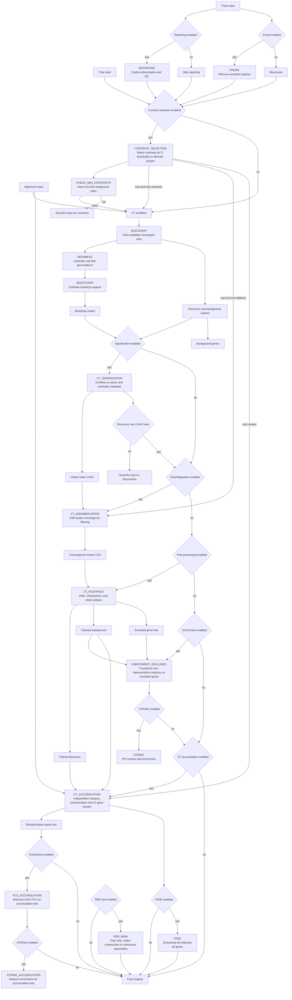

# PHYLOPHERE


```text
 PPP   H   H  Y   Y  L     L   Y   Y
 P  P  H   H   Y Y   L     L    Y Y
 PPP   HHHHH    Y    L     L     Y
 P     H   H    Y    L     L     Y
 P     H   H    Y    LLLL  LLLL  Y
```

A **Nextflow DSL2 pipeline** to run phylogenetic comparative workflows for genome–phenome analyses, centered on CAAStools-based CAAS/CAAP discovery and extended with downstream significance, disambiguation, post-processing, enrichment, and accumulation analyses.

---

## Why PhyloPhere

PhyloPhere provides:

- Reproducible orchestration of CAAStools modules (`discovery`, `resample`, `bootstrap`) in Nextflow.
- Integration with trait preprocessing and contrast selection.
- Extended downstream modules not present in vanilla CAAStools runs:
  - `ct_signification`
  - `ct_disambiguation`
  - `ct_postproc`
  - `enrichment` (clusterProfiler ORA / Wilcoxon-AUC FCS) and `string` PPI network analysis
  - `ct_accumulation`
- Optional RERConverge workflow support (`build_trait`, `build_tree`, `build_matrix`, `continuous`).
- Both **end-to-end integrated** execution and **standalone module-by-module** execution.

---

## Attribution

This project builds on and extends major prior tools and contributions:

- **CAAStools** (linudz): https://github.com/linudz/caastools
- **CAAP/isCAAP extensions in this codebase** (property-based convergence and group-aware logic, including `iscaap` handling in accumulation/randomization paths).
- **CAAP grouping follows the same logic described in:** Chen, S., & Zou, Z. (2025). *Detecting Convergence of Amino Acid Physicochemical Properties Underlying the Organismal Adaptive Convergent Evolution*. *Molecular Ecology Resources*, 25(1), e70052. https://doi.org/10.1111/1755-0998.70052
- **RERConverge** (partial integration in PhyloPhere).
- **María Sánchez Bermúdez** (diet/ethanol phenotype project definitions and test-use scenarios integrated in runner workflows).

Please cite resources listed in [`docs/CITATIONS.md`](docs/CITATIONS.md).

---

## What changed vs original `linudz/caastools`

Compared with standalone CAAStools usage, PhyloPhere adds:

1. **Workflow orchestration in Nextflow DSL2** with profile/config-driven execution.
2. **Integrated trait preprocessing** (`reporting`, `contrast_selection`, optional pruning, CI-aware grouping).
3. **CAAP-aware pipeline plumbing** across discovery/signification/postproc/accumulation (including CAAP groups and `iscaap`-aware downstream logic).
4. **Disambiguation stage** (`ct_disambiguation`) with ASR modes:
   - `precomputed` (cache-backed)
   - `compute`
5. **Post-processing modes**:
   - `filter` (single selected parameters)
   - `exploratory` (parameter sweep)
6. **Functional enrichment modules**:
   - ORA (clusterProfiler) on post-processing excluded genes
   - STRING enrichment and PPI network context
   - Wilcoxon-AUC Functional Classification Score (FCS) enrichment
7. **Accumulation module** (`ct_accumulation`) with independent category randomizations (`us`, `gs1`–`gs4`) to avoid double counting positions. Per-group empirical p-values are combined downstream using Fisher's method, followed by BH FDR correction.
8. **Integrated + standalone dual model** with robust fallback logic from channels to explicit file inputs.

### Core CT upgrades in PhyloPhere (vs classic CT usage)

- **Pair-aware mode (`miss_pair`)**
  Missing-data filtering can enforce pair consistency between FG/BG when thresholds are aligned, reducing artifacts from asymmetrically missing taxa.
- **Conservation-aware mode (`max_conserved`)**
  Instead of requiring strict zero overlap, CT can tolerate limited overlap between FG/BG amino-acid states (or CAAP groups), while still requiring informative side-specific change. This is useful for biologically conservative substitutions where complete disjointness is too strict.
- **CAAP mode (`caap_mode`)**
  Discovery/Bootstrap can run on amino-acid property groupings (GS1–GS4 + US handling), not only exact residue identity. This extends classic CAAS into **property-level convergence** and is propagated downstream (signification, postproc, accumulation, `iscaap`-aware logic).
- **Optimized permulations / bootstrap execution**
  PhyloPhere CT implements multiple practical optimizations for large runs:
  - chunked resample generation / ingestion (`chunk_size`)
  - directory-based `resample_out` support (not only legacy single-file input)
  - discovery-guided bootstrap filtering (`discovery_out`) so bootstrap tests only discovered positions/schemes
  - substantial reduction in total tests (documented in code/help as speedup-oriented optimization)

---

## Runner GUI

Instead of hand-editing `SBATCH_run_phenotypes_primates.sh` / `run_phenotype_single_primates.sh`,
a multi-tab desktop GUI (PySide6) can generate that script pair from a form: one tab per pipeline
module, a phenotype-catalogue table for SLURM array batches, local/slurm resource presets, and
save/load of the whole configuration as a JSON project file. Dataset paths can be validated (and
browsed) against a remote HPC cluster over SSH instead of the local filesystem — set a host in the
General tab (needs passwordless key-based auth already working).

```bash
./run_gui.sh                 # launches the GUI (uses the phylophere env automatically)
./install_gui_launcher.sh    # optional: adds a desktop/application-menu entry
```

Requires the `phylophere` environment (`./environment/install_env.sh`) — it already pins PySide6
and Jinja2, so no separate GUI install step is needed. Source: [`gui/`](gui/); tests: [`tests/gui/`](tests/gui/).

## End-to-end workflow (sequential integrated run)

Typical integrated chain:

1. `reporting` (optional phenotype exploration)
2. `contrast_selection`
3. `ct_tool=discovery,resample,bootstrap`
4. `ct_signification`
5. `ct_disambiguation`
6. `ct_postproc`
7. `enrichment` (clusterProfiler ORA on excluded genes) and optionally `string` (STRING enrichment)
8. `ct_accumulation`
9. `enrichment` (Wilcoxon-AUC FCS on accumulation results) and optionally `string` (STRING PPI on accumulation results)

### Example integrated run

```bash
nextflow run main.nf -profile local \
  --my_traits <traits.csv> \
  --traitname <trait_column> \
  --tree <tree.nwk> \
  --alignment <alignment_dir> \
  --ct_tool "discovery,resample,bootstrap" \
  --reporting \
  --contrast_selection \
  --ct_signification \
  --ct_disambiguation \
  --ct_postproc \
  --enrichment --string \
  --ct_accumulation \
  --outdir <results_dir>
```

---

## Pipeline overview (Mermaid)


```mermaid
flowchart TD
  A[Traits input] --> B{Reporting enabled}
  A --> P{Prune enabled}
  T[Tree input] --> C
  ALI[Alignment input] --> D
 
  B -->|yes| B1[REPORTING<br/>Explore phenotypes and QC]
  B -->|no| B0[Skip reporting]
 
  P -->|yes| P1[PRUNE<br/>Remove excluded species]
  P -->|no| P0[Skip prune]
 
  B1 --> C
  B0 --> C
  P1 --> C
  P0 --> C
 
  C{Contrast selection enabled} -->|yes| C1[CONTRAST_SELECTION<br/>Select contrasts by CI thresholds or discrete groups]
  C -->|no| D
 
  C1 --> C2[CHECK_MIN_CONTRASTS<br/>Stop if too few foreground pairs]
  C2 -->|pass| D
  C2 -->|fail| X1[Graceful stop low contrasts]
 
  D[CT workflow] --> D1[DISCOVERY<br/>Find candidate convergent sites]
  D1 --> D2[RESAMPLE<br/>Generate null trait permutations]
  D2 --> D3[BOOTSTRAP<br/>Estimate empirical support]
 
  C1 -->|trait and tree channels| D
  D1 --> D1A[Discovery and background outputs]
  D3 --> D3A[Bootstrap output]
 
  D1A --> E{Signification enabled}
  D3A --> E
  E -->|yes| E1[CT_SIGNIFICATION<br/>Combine p-values and summary metadata]
  E -->|no| F
 
  E1 --> E1A[Global meta CAAS]
  E1 --> E2{Discovery has CAAS rows}
  E2 -->|no| X2[Graceful stop no discoveries]
  E2 -->|yes| F
 
  F{Disambiguation enabled} -->|yes| F1[CT_DISAMBIGUATION<br/>ASR-aware convergence filtering]
  F -->|no| G
  E1A --> F1
  C1 -->|trait and tree fallback| F1
  F1 --> F1A[Convergence master CSV]
 
  G{Post processing enabled} -->|yes| G1[CT_POSTPROC<br/>Filter, characterize, and clean outputs]
  G -->|no| H
  F1A --> G1
  D1A --> G1B[Background genes]
  G1 --> G1C[Filtered discovery]
  G1 --> G1D[Cleaned background]
  G1 --> G1E[Excluded gene lists]
 
  H{Enrichment enabled} -->|yes| H1[ENRICHMENT_EXCLUDED<br/>Functional over-representation analysis on excluded genes]
  H -->|no| I
  G1D --> H1
  G1E --> H1
  H1 --> H2{STRING enabled}
  H2 -->|yes| H3[STRING<br/>PPI context and enrichment]
  H2 -->|no| I
 
  I{CT accumulation enabled} -->|yes| I1[CT_ACCUMULATION<br/>Independent category randomization test for gene burden]
  I -->|no| K[Final outputs]
  G1C --> I1
  G1D --> I1
  C1 -->|trait context| I1
  ALI --> I1
  I1 --> I2[Randomization gene lists]
 
  I2 --> J{Enrichment enabled}
  J -->|yes| J1[FCS_ACCUMULATION<br/>Wilcoxon-AUC FCS on accumulation lists]
  J -->|no| K
  J1 --> J2{STRING enabled}
  J2 -->|yes| J3[STRING_ACCUMULATION<br/>Network enrichment for accumulation lists]
  J2 -->|no| K
 
  I1 --> S{FADE enabled}
  S -->|no| K
  S -->|yes| S2[FADE<br/>Directional AA selection<br/>all genes]
  S2 --> K
 
  R{RER tool enabled} -->|no| K
  R -->|yes| R1[RER_MAIN<br/>Trait, tree, matrix construction & continuous association]
  R1 --> K
```

This diagram reflects the actual **integrated channel flow** plus the same module boundaries you can invoke in **standalone file-input mode**.

---

## Run by modules (standalone / selective execution)

You can run specific modules without full chaining.

### CT only

```bash
nextflow run main.nf -profile local \
  --ct_tool "discovery,resample,bootstrap" \
  --alignment <alignment_dir> \
  --caas_config <traitfile.tab> \
  --tree <tree.nwk> \
  --traitvalues <boot_traitfile.tab> \
  --outdir <results_dir>
```

### Signification standalone

```bash
nextflow run main.nf -profile local \
  --ct_signification \
  --discovery_input <discovery.tab> \
  --bootstrap_input <bootstrap.tab|bootstrap_dir> \
  --background_input <background_genes.txt|dir> \
  --outdir <results_dir>
```

### Disambiguation standalone

```bash
nextflow run main.nf -profile local \
  --ct_disambiguation \
  --ct_disambig_caas_metadata <global_meta_caas.tsv> \
  --caas_config <traitfile.tab> \
  --tree <tree.nwk> \
  --ct_disambig_asr_mode precomputed \
  --ct_disambig_asr_cache_dir <asr_cache_dir> \
  --outdir <results_dir>
```

### Post-processing standalone

```bash
nextflow run main.nf -profile local \
  --ct_postproc \
  --discovery_input <caas_convergence_master.csv> \
  --background_input <background_genes.txt|dir> \
  --caas_postproc_mode filter \
  --outdir <results_dir>
```

### Enrichment/STRING standalone

```bash
nextflow run main.nf -profile local \
  --enrichment --string \
  --enrichment_gene_lists_input <gene_lists_dir> \
  --enrichment_background_input <cleaned_background_main.txt|dir> \
  --outdir <results_dir>
```

### CT accumulation standalone

```bash
nextflow run main.nf -profile local \
  --ct_accumulation \
  --accumulation_caas_input <filtered_discovery.tsv> \
  --accumulation_background_input <cleaned_background_main.txt|dir> \
  --alignment <alignment_dir> \
  --caas_config <traitfile.tab> \
  --outdir <results_dir>
```

### FADE standalone (Directional selection analysis)

```bash
nextflow run main.nf -profile local \
  --fade \
  --my_traits <traits.csv> \
  --traitname <trait_column> \
  --tree <tree.nwk> \
  --outdir <results_dir>
```

### VEP standalone (Pathogenicity characterization)

```bash
nextflow run main.nf -profile local \
  --vep \
  --vep_caas_input <filtered_discovery.tsv> \
  --outdir <results_dir>
```

### CAAS Scoring standalone (Composite integration)

```bash
nextflow run main.nf -profile local \
  --scoring \
  --scoring_postproc_input <filtered_discovery.tsv> \
  --scoring_fade_summary_top <fade_summary_top.tsv> \
  --scoring_fade_summary_bottom <fade_summary_bottom.tsv> \
  --scoring_rer_input <rerconverge_summary.tsv> \
  --scoring_accum_dir <accumulation_dir> \
  --scoring_vep_primateai <primateai_scores.tsv> \
  --outdir <results_dir>
```

---

## Main modules in one sentence each

- **REPORTING**: Builds exploratory phenotype reports (distribution, phylogenetic context, and QC plots).
- **CONTRAST_SELECTION**: Defines high/low phenotype contrast groups, optionally using pruning and CI-aware logic.
- **CT (discovery/resample/bootstrap)**: Detects candidate convergent substitutions and tests them against permutation-based null distributions.
- **CT_SIGNIFICATION**: Combines discovery and bootstrap evidence into significance summaries and meta tables (e.g., `global_meta_caas.tsv`).
- **CT_DISAMBIGUATION**: Uses ASR-informed logic to separate true convergent events from ambiguous patterns and exports convergence master tables.
- **CT_POSTPROC**: Filters and characterizes CAAS/CAAP outputs (filter or exploratory mode), producing cleaned sets for downstream analyses.
- **ENRICHMENT**: Runs ORA (clusterProfiler) on postproc excluded genes, or Wilcoxon-AUC FCS on scoring/accumulation results.
- **STRING**: Runs STRING enrichment/network-context analysis on selected gene sets.
- **CT_ACCUMULATION**: Tests whether CAAS burden accumulates in genes more than expected by chance via permutation.
- **FADE**: Performs directional amino acid selection analysis (e.g. using PAML/BUSTED-like models) on all genes.
- **VEP**: Validates and maps pathogenicity scores (e.g., PrimateAI-3D) to convergence positions.
- **SCORING**: Computes composite CAAS scoring at position-level and gene-level, integrating multiple pipeline signals.
- **RER_MAIN**: Runs integrated RERConverge steps (trait, tree, matrix construction and continuous association mode).

---

## Composite CAAS Scoring Framework

PhyloPhere integrates multiple independent evidence lines (CT convergence, FADE selection, RER continuous association, accumulation, and VEP characterization) into unified position-level and gene-level scores.

### 1. Mathematical Formulation

#### A. Position-Level CAAS Score (`CAAS_score`)
For each alignment position, the composite `CAAS_score` is calculated as the weighted sum of row-level CAAS scores (`caas_row`) across all biochemically grouped schemes:

\[\text{CAAS\_score} = \sum_{\text{schemes}} \text{caas\_row} \times \text{scheme\_weight}\]

Where the biochemical groupings are mapped to weights:
- **US, GS1, GS2, GS3, GS4**: Weight = `0.2` each (maximum achievable sum = `1.0`).

For each biochemically grouped scheme, the row-level CAAS score (`caas_row`) is the product of two orthogonal, non-deciled evidence axes on a raw `[0,1]` scale:

1. **Phenotype Evolution Axis (`phen_score`)**: Permulation evidence derived from the bootstrap permutation test:
   \[\text{phen\_score} = 1 - \text{pvalue\_boot}\]
   A lower permutation p-value indicates a stronger phenotype-partition association, representing robust evolutionary signal.
2. **Position Evolution Axis (`asr_score` / `asr_path_score`)**: The ancestral state reconstruction (ASR) path score, which is count-aware (i.e. scales up with the number of independent evolutionary transitions/replication events).

> [!NOTE]
> The hypergeometric p-value (`Pvalue`) is deliberately excluded from the core score and acts instead as a significance gate (`gate_sig` / `gate_fdr`).

#### B. Gene-Level Scores
To summarize positional results at the gene level:
- **Global Gene Score**: Calculated as the **90th percentile** of position-level `CAAS_score` values across all positions in the gene:
  \[\text{Gene\_CAAS\_Score} = \text{quantile}(\text{CAAS\_score}, 0.90)\]
- **Directional Gene Scores**: Sliced by the direction of phenotype change:
  - `gene_caas_score_top`: 90th percentile of positions with top-direction or both-direction changes (`change_side` in `{"top", "both"}`).
  - `gene_caas_score_bottom`: 90th percentile of positions with bottom-direction or both-direction changes (`change_side` in `{"bottom", "both"}`).

---

### 2. Metric and Column Definitions

#### Position-Level Outputs (`position_scores.tsv`)

| Column Name | Metric / Concept | Range / Format | Description |
| :--- | :--- | :--- | :--- |
| `CAAS_score` | Composite Score | `[0, 1]` | The primary score aggregating boot/ASR evidence across biochemical schemes. |
| `phen_score` | Phenotype Evolution | `[0, 1]` | Permulation evidence: \(1 - \text{pvalue\_boot}\). |
| `asr_score` | Position Evolution | `[0, 1]` | Upstream path score combining transition count and MRCA/derived consistency. |
| `Pvalue` | Hypergeometric | `[0, 1]` | Discovery-stage Fisher's exact p-value (display-only). |
| `Pvalue_hyp_fdr` | Hypergeometric FDR | `[0, 1]` | BH-adjusted hypergeometric p-value. |
| `change_side` | Directionality | `top`, `bottom`, `both`, `none` | Direct direction of the change relative to trait values. |
| `gate_sig` | Significance Gate | Boolean | `TRUE` if `Pvalue` < 0.05. |
| `gate_fdr` | FDR Gate | Boolean | `TRUE` if `Pvalue_hyp_fdr` < 0.05. |

#### Gene-Level Outputs (`gene_scores.tsv`)

| Column Name | Metric / Concept | Range / Format | Description |
| :--- | :--- | :--- | :--- |
| `gene_caas_score` | Global Gene Score | `[0, 1]` | 90th percentile of `CAAS_score` across all positions. |
| `gene_caas_score_top` | Top Gene Score | `[0, 1]` or `NA` | 90th percentile of `CAAS_score` across top-direction positions. |
| `gene_caas_score_bottom` | Bottom Gene Score | `[0, 1]` or `NA` | 90th percentile of `CAAS_score` across bottom-direction positions. |
| `gene_rand_score` | Accumulation Score | `[0, +inf)` | Fisher-combined log-likelihood score (\(-\log_{10}(\text{Fisher } p)\)) from accumulation randomizations. |
| `accum_significant` | Accumulation FDR | Boolean | `TRUE` if BH FDR-adjusted Fisher's combined p-value < 0.05. |
| `rer_min_pval` | RERConverge Sig | `[0, 1]` | Minimum p-value (permulated or adjusted) from RERConverge continuous association. |
| `rer_acceleration` | RER direction | `accelerated`, `decelerated`, `neutral` | Phenotypic association direction (based on Rho). |
| `fade_max_bf_top` | FADE Top | Numeric | Maximum Bayes Factor for selection in the top direction. |
| `fade_max_bf_bottom` | FADE Bottom | Numeric | Maximum Bayes Factor for selection in the bottom direction. |
| `fade_significant_top` | FADE Top Sig | Boolean | `TRUE` if `fade_max_bf_top` \(\ge\) 100. |
| `fade_significant_bottom`| FADE Bottom Sig | Boolean | `TRUE` if `fade_max_bf_bottom` \(\ge\) 100. |

---

### 3. Downstream Slices & Functional Enrichment

The scoring module exports two key formats for downstream analysis:

#### A. The 9 Ranked Gene Lists (`gene_lists/slice_*.tsv`)
Used primarily for STRING network PPI enrichment. The slices are defined by slicing across **3 Directions** and **3 Significance Gates**:

1. **Directions**:
   - `global`: All positions.
   - `top`: Top-direction positions (characterised by selection in FADE and positive RER correlation).
   - `bottom`: Bottom-direction positions (characterised by selection in FADE and negative RER correlation).
2. **Significance Gates**:
   - `all`: Unfiltered (full ranked list).
   - `sig`: Nominal significance gate (\(P < 0.05\)).
   - `fdr`: FDR significance gate (\(\text{BH } FDR < 0.05\)).

Each slice output contains the following annotations:
- `is_fade`: `TRUE` if the gene exhibits strong selection (Bayes Factor \(\ge\) 100) in the matching direction.
- `is_rer`: `TRUE` if the gene is significantly associated with the trait in RERConverge with the matching direction (Rho directionality).
- `is_accum`: `TRUE` if the gene is significantly enriched in CAAS burden.

#### B. FCS stats (`fcs_stats.tsv`)
Used by clusterProfiler FCS (Functional Classification Scores) to run Wilcoxon-AUC enrichment. Contains global, top, and bottom scores along with boolean flags for FADE, RERConverge, and accumulation significance.

#### C. Threshold Enrichment Curves (`gene_threshold_enrichment.tsv` & `pos_threshold_enrichment.tsv`)
Tests whether progressively tighter thresholds on the composite `CAAS_score` enrich for independent signals (RER significance, FADE significance, or Accumulation significance). For each threshold decile (`top100`, `top50`, `top25`, `top10`, `top5`, `top1`):
- Fisher's Exact Test is run to calculate the **Odds Ratio** and **p-value** of overlap between the thresholded set and the independent tool signals.
- This helps evaluate whether the composite score is successfully prioritizing biologically validated, highly-selected genes.

---

### 4. Stress Tests and Diagnostics (`--stress true`)

To evaluate the mathematical robustness of the composite score, setting `--stress true` outputs several diagnostic files:
- **`position_score_stress_variants.tsv`**: Computes leave-one-axis-out (LOO) scoring variants, such as dropping the permutation axis (`CAAS_no_significance`) or dropping the ASR axis (`CAAS_no_asr`).
- **`position_score_stress_summary.tsv`**: Reports the standard deviation of ranks across variants to identify positions with unstable scoring.
- **`position_score_stress_correlations.tsv`**: Measures Pearson/Spearman correlations between LOO variants and the main `CAAS_score`.
- **`position_score_stress_top_overlap.tsv`**: Computes Jaccard overlaps and smaller-set overlaps for the top-N% (10%, 5%, 1%, and top-25) positions across the variants.
- **`position_score_stress_latent_loadings.tsv`**: Computes a PCA over the raw inputs (variability, pattern, and ASR deciles) and outputs component loadings and proportion of variance explained.

---

---

## Key options by module

### Global/common

- `--outdir`
- `--my_traits`, `--traitname`, `--tree`
- `--reporting`, `--contrast_selection`
- `--secondary_trait`, `--branch_trait`, `--n_trait`, `--c_trait`

### CT (`--ct_tool`)

- `discovery|resample|bootstrap` (comma-separated)
- `--alignment`, `--caas_config`, `--traitvalues`, `--cycles`, `--chunk_size`
- batching: `--ct_discovery_batch_size`, `--ct_bootstrap_batch_size`
- Thresholds: `--maxbggaps`, `--maxfggaps`, `--maxgaps`, `--maxbgmiss`, `--maxfgmiss`, `--maxmiss`, `--max_conserved`
- CAAP mode: `--caap_mode`

For cluster runs, PhyloPhere can batch multiple genes into a single Nextflow task for `discovery` and `bootstrap` to reduce scheduler overhead. The `slurm` profile enables non-1 defaults for these parameters, while local runs keep them at `1`.

Batch execution uses staged TSV manifests plus reusable runner scripts instead of expanding one shell command per gene directly into the Nextflow task body. This keeps Seqera task script payloads bounded even for large batches.

### Signification

- `--discovery_input`, `--bootstrap_input`, `--background_input`
- significance threshold options from config (`alpha_threshold`, export flags)

### Disambiguation

- `--ct_disambig_caas_metadata`
- `--ct_disambig_asr_mode (precomputed|compute)`
- `--ct_disambig_asr_cache_dir`
- `--ct_disambig_posterior_threshold`

### Post-processing

- `--caas_postproc_mode (filter|exploratory)`
- `--filter_minlen`, `--filter_maxcaas`
- exploratory sweep: `--minlen_values`, `--maxcaas_values`
- gene filtering controls (`gene_filter_mode`, thresholds)

### Enrichment / STRING

- `--enrichment`, `--string`
- `--enrichment_gene_lists_input`, `--enrichment_background_input`
- ORA, STRING, and FCS FDR/top thresholds and DB parameters in `conf/enrichment.config`

### CT accumulation

- `--ct_accumulation`
- `--accumulation_caas_input`
- `--accumulation_background_input`
- `--accumulation_n_randomizations`
- `--accumulation_randomization_type (naive|matched)`

### FADE (Selection)

- `--fade`
- `--selection_prep_only` (runs only preparation scripts without full FADE)
- parameters in `conf/fade.config`

### VEP (Pathogenicity)

- `--vep`
- `--vep_caas_input`
- `--vep_primateai_db` (defaults to PrimateAI-3D database path)

### SCORING (Composite)

- `--scoring`
- inputs and thresholds in `conf/scoring.config`

### RERConverge

- `--rer_tool "build_trait,build_tree,build_matrix,continuous"`
- inputs in `conf/rerconverge.config`

For detailed help:

```bash
nextflow run main.nf --help
nextflow run main.nf --ct_tool discovery --help
nextflow run main.nf --ct_tool resample --help
nextflow run main.nf --ct_tool bootstrap --help
```

---

## Runners included in this repository

### `run_phenotypes.sh`

Main multi-phenotype runner with two explicit scenario classes:

1. **Pruned-secondary (cancer project)**
   - paired primary/secondary phenotype runs
   - pruning lists
   - CI-aware contrast selection (`n_trait`/`c_trait`)
2. **Simple (diet/ethanol project, María Sánchez Bermúdez)**
   - no pruning
   - no `n_trait`/`c_trait`
   - serial trait runs

Also includes **toy vs full** toggles (`IS_TOY`) controlling cycles/randomizations.

### `run_scripts/test_stress.sh`

Comprehensive stress matrix:
- integrated runs
- standalone runs per module
- ASR mode variants (compute/precomputed)
- optional cleanup/input staging

### `run_scripts/test_integrated_pipeline.sh`

Integrated end-to-end validation in both:
- `filter` mode
- `exploratory` mode

---

## Monitoring with Nextflow Tower (important)

If you enable Tower, **you must provide your own API token**.

In `conf/common.config`:

```groovy
tower {
    accessToken = "INSERTCOIN"  // replace with your own token
    enabled = false
}
```

To use Tower safely:

1. Replace `INSERTCOIN` with your token.
2. Set `enabled = true` or run with `-with-tower` as desired.

Do not commit private production tokens.

---

## Installation / execution notes

- Recommended: run with Nextflow + container profile (`local`, `singularity`, `apptainer`, `slurm` as configured).
- Main config files:
  - `nextflow.config`
  - `conf/common.config`
  - `conf/ct.config`
  - `conf/ct_postproc.config`
  - `conf/ct_disambiguation.config`
  - `conf/enrichment.config`
  - `conf/ct_accumulation.config`
  - `conf/rerconverge.config`

---

## License

See [LICENSE](LICENSE).

## Additional docs

- [Citations](docs/CITATIONS.md)
- [CAAP mode notes](docs/CAAP_MODE.md)
- [Multi-phenotype methods](docs/METHODS_multi_phenotype.md)
