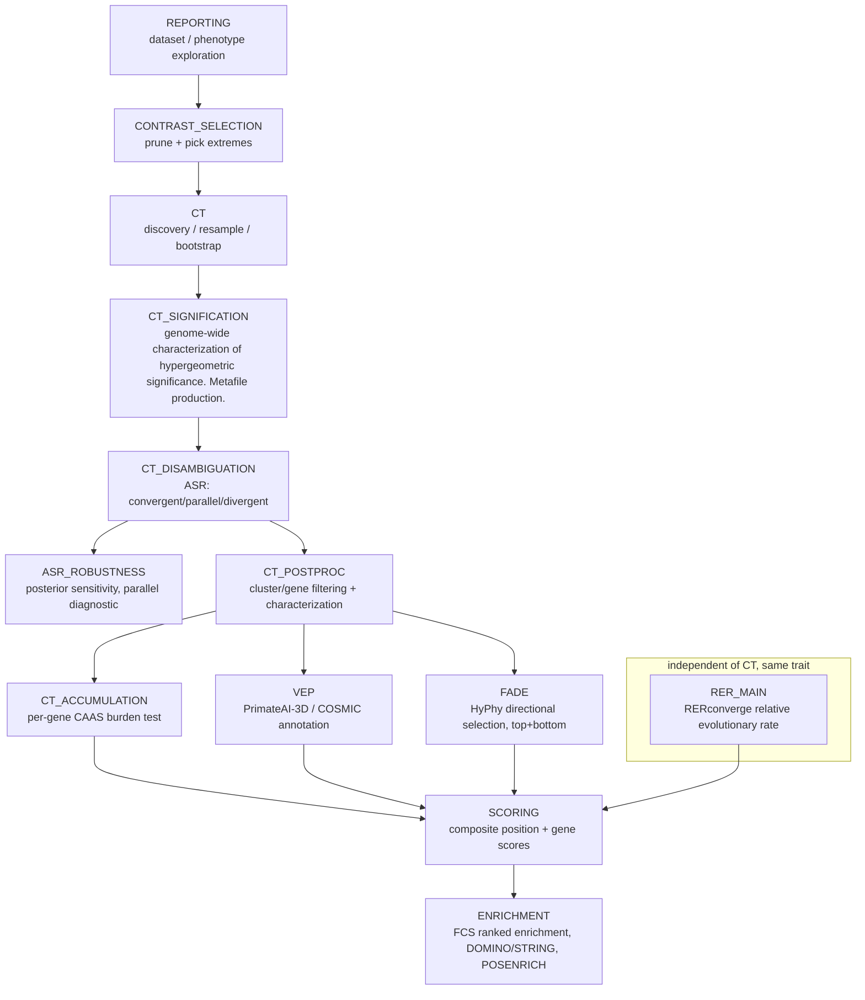

# PhyloPhere

A Nextflow pipeline for phylogenetic comparative genomics: it takes a multiple
sequence alignment, a species tree, and a phenotype, and asks *which genes and
which amino acid positions evolved differently in species that carry the
extreme values of that phenotype*. It combines convergent-substitution
detection, ancestral-state reconstruction, relative evolutionary rate,
directional selection scanning, and composite scoring/enrichment into one
reproducible, resumable pipeline — runnable from the CLI, a desktop GUI, or
Seqera Platform.

- **Repository:** https://github.com/nozerorma/PhyloPhere
- **License:** GNU GPL v3 ([LICENSE](LICENSE))
- **Requires:** Nextflow ≥ 22.10 (DSL2), a container engine (Singularity/Apptainer) or the bundled conda environment

---

## Table of contents

1. [Quickstart](#quickstart)
2. [Workflow](#workflow)
3. [Modules](#modules)
4. [Configuration reference](#configuration-reference)
5. [Resource allocation](#resource-allocation)
6. [Desktop GUI](#desktop-gui)
7. [Running on Seqera Platform](#running-on-seqera-platform)
8. [Contributions & acknowledgements](#contributions--acknowledgements)
9. [License](#license)
10. [Additional docs](#additional-docs)

---

## Quickstart

```bash
# 1. set up the environment (conda/mamba env named "phylophere")
./environment/install_env.sh

# 2. run a minimal end-to-end analysis
nextflow run main.nf \
  --my_traits       traits.csv \
  --traitname       my_phenotype \
  --tree            species.nwk \
  --alignment       alignments/ \
  --caas_config     caas_config.tab \
  --contrast_selection \
  --ct_tool         discovery,resample,bootstrap \
  --ct_disambiguation --ct_postproc --ct_accumulation \
  --scoring --enrichment \
  -profile slurm \
  --outdir out/
```

The "core" chain — CT, `--ct_disambiguation`, `--ct_postproc`,
`--ct_accumulation`, `--vep` — runs by default (see [Configuration
reference](#configuration-reference)); `--scoring`, `--enrichment`,
`--fade`, `--rer_tool` and `--contrast_selection` are opt-in and default to
off, so a first-time user should not expect scoring, enrichment, FADE, or RER
output without explicitly requesting them. `--help` always prints the general
overview, followed by detail for every module currently enabled by your
flags — i.e. help for the run you're about to launch:

```bash
nextflow run main.nf --help                       # overview + help for the default-on chain
nextflow run main.nf --help --scoring --enrichment --fade --rer_tool continuous
```

Prefer a form over flags? See the [Desktop GUI](#desktop-gui) section — it
exposes every parameter below across a set of tabs and generates the launch
scripts for you (single run, multi-phenotype local loop, or a Slurm array job).

---

## Workflow

PhyloPhere runs as a single Nextflow entry point (`main.nf`) that conditionally
composes named sub-workflows based on `params.*` toggles — there is no
`-entry` dispatch, and one invocation processes **one phenotype at a time**
(multi-phenotype sweeps are handled by looping invocations, e.g. via the GUI's
generated Slurm array script). Any stage can also be run **standalone** from a
precomputed input of its upstream stage (the `*_from` / `*_input` /
`*_dir` parameters throughout the config), which is how individual reports get
re-rendered without re-running the whole chain.


```mermaid
flowchart TD
    A[REPORTING\ndataset / phenotype exploration] --> B[CONTRAST_SELECTION\nprune + pick extremes]
    B --> C[CT\ndiscovery / resample / bootstrap]
    C --> D[CT_SIGNIFICATION\ngenome-wide characterization of hypergeometric significance. Metafile production.]
    D --> E[CT_DISAMBIGUATION\nASR: convergent/parallel/divergent]
    E --> E2[ASR_ROBUSTNESS\nposterior sensitivity, parallel diagnostic]
    E --> F[CT_POSTPROC\ncluster/gene filtering + characterization]
    F --> G[CT_ACCUMULATION\nper-gene CAAS burden test]
    F --> H[VEP\nPrimateAI-3D / COSMIC annotation]
    F --> I[FADE\nHyPhy directional selection, top+bottom]
    subgraph independent[independent of CT, same trait]
      J[RER_MAIN\nRERconverge relative evolutionary rate]
    end
    G --> K[SCORING\ncomposite position + gene scores]
    H --> K
    I --> K
    J --> K
    K --> L[ENRICHMENT\nFCS ranked enrichment, DOMINO/STRING, POSENRICH]
```

Execution order as wired in `main.nf`:

1. **REPORTING** (`--reporting`) — optional preliminary trait/tree exploration reports; skipped if `--contrast_selection` is also set (it produces its own reports).
2. **CONTRAST_SELECTION** (`--contrast_selection`) — pruning + independent-contrasts extreme selection; aborts cleanly via `--min_contrasts` if too few foreground pairs exist.
3. **CT** (`--ct_tool discovery,resample,bootstrap`) — CAAStools discovery/resample/bootstrap.
4. **CT_SIGNIFICATION** — genome-wide significance/FDR of discovered CAAS (runs whenever bootstrap ran, or standalone via `--bootstrap_from`).
5. **CT_DISAMBIGUATION** (`--ct_disambiguation`) — ASR-based convergent/parallel/divergent classification.
6. **CT_POSTPROC** (`--ct_postproc`) — cluster/gene filtering, background cleanup, characterization report; also fans out **ASR_ROBUSTNESS** in parallel as an independent posterior-confidence diagnostic.
7. **CT_ACCUMULATION** (`--ct_accumulation`), **VEP** (`--vep`), **FADE** (`--fade`), **RER_MAIN** (`--rer_tool`) — four largely independent evidence-generating stages that can run in any combination.
8. **SCORING** (`--scoring`) — integrates all of the above into composite position- and gene-level scores; optionally triggers **CAAS_PERMULATION** for a genome-wide permutation null (`--caas_permulation_enrichment`).
9. **ENRICHMENT** (`--enrichment`, nested under `--scoring`) — FCS ranked gene-set enrichment, DOMINO active-module + STRING functional enrichment, and POSENRICH position-level enrichment.

On completion, `workflow.onComplete` (in `main.nf`, backed by `lib/WorkflowMap.groovy`) writes `workflow_map.html` into `--outdir` — a visual summary of which stages ran and links to every HTML report/output directory produced.

Reports are numbered chronologically across the whole run (`1.Dataset_exploration` …
`15.Comparison_report`) so the numeric prefix always tells you where
a report sits in the pipeline, regardless of which modules were enabled. When
`--prune_data` is set, report 2 is produced twice — `2.Phenotype_exploration_complete.html`
(whole species pool) and `2.Phenotype_exploration_pruned.html` (species-pruned pool,
rendered from `0.Data_pruning.Rmd`, whose artifacts still publish under
`data_exploration/0.Data-pruning/`).

---

## Modules

### CT — convergent substitution discovery
Runs CAAStools' discovery, resample, and bootstrap tools over per-gene
alignments to detect Candidate Amino Acid Substitutions (CAAS): positions
where the phenotype's extremes carry distinct, convergent amino acids.
Inputs: `--alignment`, `--caas_config`/`--traitvalues`, `--tree`. Supports
batching large gene sets into fewer Nextflow tasks (`--ct_discovery_batch_size`,
`--ct_bootstrap_batch_size`) and a `--toy_mode`/`--toy_n` subsampling mode for
quick smoke tests. Gated by `--ct_tool` (comma list of `discovery,resample,bootstrap`).

### CONTRAST_SELECTION — trait/tree preprocessing
Prunes the alignment/tree to the species with usable trait data and selects
foreground/background extremes via an independent-contrasts algorithm, with
optional Jeffreys-CI-aware composition for population-count traits
(`--n_trait`/`--c_trait`). Enforces `--min_contrasts` before letting CT run.

### CT_SIGNIFICATION — genome-wide significance
Computes FDR-corrected statistical significance of discovered CAAS from the
bootstrap permutation output. Can run standalone from `--discovery_from` +
`--background_input` + `--bootstrap_from`; exits cleanly if zero CAAS were
discovered.

### CT_DISAMBIGUATION — convergence classification
Uses ancestral state reconstruction (ASR) plus significance metadata to
classify each CAAS as convergent, parallel, or divergent relative to the
phenotype tree topology (`--ct_disambig_convergence_mode focal_clade|mrca`).
Standalone via `--signification_from` + `--caas_config`/`--tree`.

### CT_POSTPROC — filtering & characterization
Applies cluster/gene-level filtering (`--caas_postproc_mode filter|exploratory`),
cleans the gene background, and renders the Characterization report. Also
triggers **ASR_ROBUSTNESS**, an independent diagnostic that stress-tests the
disambiguation posterior threshold (τ = 0.90/0.95/0.99) without altering the
main data path. Emits gene lists consumed by FADE's `gene_set` mode.

### CT_ACCUMULATION — per-gene CAAS burden
Permutation test for whether a gene accumulates more CAAS than expected by
chance, run once per direction (top/bottom/all). Requires `--alignment` and
`--gene_ensembl_file`; standalone via `--accumulation_caas_input`.

### VEP — pathogenicity annotation
Annotates filtered CAAS positions with PrimateAI-3D pathogenicity scores and
COSMIC somatic-mutation evidence, each skipped independently if its database
parameter is empty.

### FADE — directional selection
Runs HyPhy FADE, a Bayesian branch-site model, to detect accelerated or
decelerated amino-acid selection on phenotype-extreme branches — always both
"top" and "bottom" directions. Alignment prep is shared once across both
directions (`SELECTION_PREP`). A precomputed-JSON path
(`--fade_json_dir_top`/`bottom`) renders the report without rerunning HyPhy.

### RER_MAIN (RERconverge) — relative evolutionary rate
Computes branch-length deviations correlated with the trait, auto-routing to
continuous or binary correlation (`--rer_trait_mode auto|continuous|binary`).
Emits a permulation null consumed later by SCORING/ENRICHMENT for
permutation-corrected p-values. `--rer_continuous_file` renders the report
standalone from a precomputed RDS.

### SCORING — composite integration
Combines CT_POSTPROC (CAAS), FADE, RERconverge, CT_ACCUMULATION, and VEP into
unified position-level and gene-level composite scores. See [Composite CAAS
scoring framework](#composite-caas-scoring-framework) below for the full
formulation. Also wires in **CAAS_PERMULATION** — a genome-wide permutation
null built by replaying permuted labelings through disambiguation — when
`--caas_permulation_enrichment` is set.

### ENRICHMENT — functional & network enrichment
Runs FCS (a ranked, Wilcoxon-AUC, GMT-based enrichment engine — the single
enrichment engine now used for both CAAS and RER gene rankings), an
orthogonal cross-module Comparison report, optional DOMINO active-module
detection + STRING functional enrichment (`--scoring_ami`), and optional
POSENRICH position-level Fisher-exact enrichment (`--posenrich`) integrating
UCR/FUBAR/domain-variability/PrimateAI-3D/COSMIC evidence per position.
Universe files are module-specific (`--rer_universe_file`,
`--fade_universe_file`) rather than shared.

### Upstream Data Preparation: Ortholog Characterizator
Position-level characterization layers integrated by VEP (`--vep_map_dir`), SCORING, and POSENRICH (including MAP alignment-to-protein coordinate mappings, HyPhy FUBAR site selection, UCR ultraconserved regions, and amino-acid domain variability files) are generated using the dedicated [Ortholog Characterizator](https://github.com/nozerorma/ortholog_characterizator.git) workflow:
- **Repository:** https://github.com/nozerorma/ortholog_characterizator.git
- **Generated Input Files:**
  - `vep_map_dir` — per-gene MAP files mapping alignment columns to canonical protein residue positions.
  - `fubar_sites_file` — per-site HyPhy FUBAR pervasive selection statistics.
  - `ucr_positions_file` — genomic ultraconserved region (UCR) position mappings.
  - `domain_variability_file` — domain variability scores per alignment position.

### REPORTING — preliminary exploration
Standalone trait/tree exploration and optional tip-name curation/pruning,
independent of CT; feeds pruned trait/tree into CONTRAST_SELECTION/FADE when
run with `--reporting`.

---

## Composite CAAS Scoring Framework

PhyloPhere integrates multiple independent evidence lines (CT convergence,
FADE selection, RER continuous association, accumulation, and VEP
characterization) into unified position-level and gene-level scores.

### Position-level score (`CAAS_score`)

For each alignment position, the composite `CAAS_score` is the weighted sum of
row-level CAAS scores (`caas_row`) across biochemically grouped schemes
(US, GS1–GS4, weight `0.2` each, max sum `1.0`). Each `caas_row` is the
product of two orthogonal `[0,1]` evidence axes:

1. **Phenotype evolution axis** — `phen_score = 1 - pvalue_boot` (permutation evidence; lower p ⇒ stronger signal).
2. **Position evolution axis** — `asr_score`/`asr_path_score`, the ancestral-state-reconstruction path score, which is count-aware (scales with the number of independent evolutionary transitions).

> The hypergeometric p-value (`Pvalue`) is deliberately excluded from the core
> score and instead acts as a significance gate (`gate_sig`/`gate_fdr`).

### Gene-level scores

- **Global gene score**: 90th percentile of position-level `CAAS_score` across the gene.
- **Directional gene scores** (`gene_caas_score_top`/`_bottom`): 90th percentile restricted to positions changing in that direction (or "both").

### Key output columns

**`position_scores.tsv`**: `CAAS_score`, `phen_score`, `asr_score`, `Pvalue`,
`Pvalue_hyp_fdr`, `change_side`, `gate_sig`, `gate_fdr`.

**`gene_scores.tsv`**: `gene_caas_score` (+ `_top`/`_bottom`), `gene_rand_score`
(Fisher-combined accumulation signal), `accum_significant`, `rer_min_pval`,
`rer_acceleration`, `fade_max_bf_top`/`_bottom`, `fade_significant_top`/`_bottom`.

### Downstream slices & enrichment inputs

- **`gene_lists/slice_*.tsv`** (9 ranked lists = 3 directions `{global,top,bottom}` × 3 significance gates `{all,sig,fdr}`) — the ranked lists FCS/DOMINO consume, each annotated with `is_fade`/`is_rer`/`is_accum` flags.
- **`fcs_stats.tsv`** — the merged per-gene score table FCS runs ranked enrichment against.
- **`gene_threshold_enrichment.tsv` / `pos_threshold_enrichment.tsv`** — Fisher's-exact odds-ratio/p-value curves testing whether tighter `CAAS_score` thresholds (top100/50/25/10/5/1) enrich for independent RER/FADE/accumulation significance.

### Stress diagnostics (`--scoring_stress true`)

Leave-one-axis-out scoring variants (`position_score_stress_variants.tsv`),
rank-stability summaries, LOO-vs-main correlations, top-N% Jaccard overlaps,
and a PCA over raw score inputs with component loadings — a robustness check
on the composite formulation, not a scientific output in itself.

---

## Configuration reference

Every `params.*` below lives in `conf/*.config`, `includeConfig`-loaded from `nextflow.config`.
Following the layout of the Desktop GUI, parameters in each module are categorized into **Common Use (Essential) Parameters** (the core inputs and switches needed for standard runs) and **Advanced Parameters** (fine-tuning, threshold adjustments, and debug options).

---

### `conf/common.config` — Core Paths, Reporting & Workflow Toggles

#### Common Use (Essential) Parameters
These parameters define the primary input data files, phenotype target, and module execution toggles.

| Parameter | Default | Purpose & Description |
|---|---|---|
| `outdir` | `$baseDir/out` | Main directory where execution results, HTML reports, and published outputs will be written. |
| `workDir` | `$baseDir/out/work` | Nextflow intermediate execution directory storing task work folders. |
| `my_traits` | `""` | **Required.** Path to the CSV file containing species phenotype trait data. |
| `alignment` | `""` | **Required.** Path to the multiple sequence alignment (MSA) directory or `.tar.gz` archive. |
| `tree` | `""` | **Required.** Path to the reference species tree in Newick format. |
| `traitname` | `""` | **Required.** Column header name in `my_traits` corresponding to the phenotype to analyze. |
| `tax_id` | `""` | Path to the NCBI taxonomy ID mapping file (`taxid` to species name). |
| `reporting` | `true` | Enables generation of HTML exploratory and summary reports via RMarkdown. |
| `sp_colname` | `"species"` | Name of the column in `my_traits` containing species names matching the tree tips. |
| `clade_name` | `"primates"` | Focal clade name for report titles and taxonomic grouping (e.g. `primates`). |
| `taxon_of_interest` | `"family"` | Taxonomic rank of interest for clade summaries (e.g. `family`, `order`). |
| `scoring` | `false` | Main toggle to enable the Composite Scoring integration module (`--scoring`). |
| `vep` | `true` | Enables VEP pathogenicity annotation (PrimateAI-3D and COSMIC scores). |
| `enrichment` | `false` | Main toggle to enable the FCS ranked gene-set enrichment module (`--enrichment`). |
| `posenrich` | `true` | Enables position-level Fisher-exact enrichment analysis (`--posenrich`). |
| `fade` | `false` | Main toggle to enable HyPhy FADE directional selection scanning (`--fade`). |
| `rer_tool` | `""` | Enables RERconverge relative evolutionary rate analysis (`"continuous"` or `"build_trait"`). |
| `contrast_selection` | `false` | Enables automatic independent-contrasts extreme selection for continuous phenotypes. |

#### Advanced Parameters

<details>
<summary>Click to view Advanced Parameters for common.config</summary>

| Parameter | Default | Purpose |
|---|---|---|
| `help` | `false` | Show overview/module help and exit. |
| `ali_format` | `"fasta"` | Alignment file format (default `fasta`). |
| `ali_sp_names` | `""` | Precomputed flat file listing species names present across alignments (speeds startup). |
| `gene_ensembl_file` | `""` | Mapping file from Ensembl gene IDs to gene symbols. |
| `seed` | `"1998"` | Random seed for reproducible permutations and sampling. |
| `toy_mode` / `toy_n` | `false` / `200` | Subsamples `N` random alignments for quick end-to-end smoke testing. |
| `n_trait` / `c_trait` | `""` | Total sample size (`n_trait`) and case count (`c_trait`) for prevalence/frequency phenotypes. |
| `secondary_trait` / `branch_trait` | `""` | Optional secondary trait column for reports / trait column for branch coloring. |
| `discrete_method` | `"quintile"` | Method for discrete phenotype categorization (`quartile`, `quintile`, `decile`, `median_sd`, `parameterized`). |
| `top_quantile` / `bottom_quantile` | `"0.90"` / `"0.10"` | Upper and lower quantiles used when `discrete_method = "parameterized"`. |
| `contrast_max_iter` | `"3"` | Maximum iteration depth for contrast selection. |
| `min_contrasts` | `3` | Minimum foreground contrast pairs required to proceed with CT analysis. |
| `prune_data` / `prune_list` | `""` / `""` | Flags and species list files for species-level dataset pruning. |
| `ct_disambiguation` | `true` | Toggle for CT ancestral-state reconstruction (ASR) disambiguation stage. |
| `ct_postproc` | `true` | Toggle for CT cluster filtering and background cleanup stage. |
| `ct_accumulation` | `true` | Toggle for CT gene-level CAAS burden accumulation stage. |

</details>

---

### `conf/ct.config` — CAAStools Discovery, Resampling & Bootstrap

#### Common Use (Essential) Parameters
These parameters govern Candidate Amino Acid Substitution (CAAS) discovery and resampling hypotheses.

| Parameter | Default | Purpose & Description |
|---|---|---|
| `ct_tool` | `"discovery,resample,bootstrap"` | Defines which CAAStools execution stages to run (`discovery`, `resample`, `bootstrap`). |
| `patterns` | `"1,2,3"` | Comma-separated list of CAAS substitution patterns to search for. |
| `min_divergent_fraction` | `0.5` | Minimum fraction of foreground/background pairs that must show amino-acid divergence (0.5 = at least 50%). |
| `caap_mode` | `true` | Enables CAAP (Candidate Amino Acid Properties) grouping mode based on physicochemical properties. |
| `perm_strategy` | `"BM"` | Permutation strategy for background null generation: `"BM"` (Brownian Motion) or `"FGBG"` (FG/BG swap). |
| `perms_cycles` | `"100"` | Number of resampling cycles used to evaluate significance. |
| `caas_full_perms` | `1000` | Number of full-pool permulations generated for the CAAS FCS null. |
| `fgsize` / `bgsize` | `"6"` / `"6"` | Foreground and background species sizes when using random strategy. |
| `traitvalues` | `""` | Path to trait values file when using Brownian Motion (`BM`) permutation strategy. |

#### Advanced Parameters

<details>
<summary>Click to view Advanced Parameters for ct.config</summary>

| Parameter | Default | Purpose |
|---|---|---|
| `publish_intermediates` | `false` | Publishes intermediate discovery and resampling files for debugging. |
| `ct_discovery_batch_size` | `25` | Number of genes batched per discovery task to reduce scheduler overhead. |
| `ct_bootstrap_batch_size` | `10` | Number of genes batched per bootstrap task. |
| `caas_config` | `""` | Path to custom CAAStools configuration file. |
| `max_bg_gaps_fraction` / `max_fg_gaps_fraction` / `max_gaps_fraction` | `0.0` | Gap tolerance fractions allowed in background, foreground, or overall. |
| `max_bg_miss_fraction` / `max_fg_miss_fraction` / `max_miss_fraction` | `0.0` | Missing-data tolerance fractions allowed. |
| `miss_pair` | `true` | Enforces missing-pair matching in paired mode. |
| `chunk_size` | `"500"` | Maximum number of resampled groups per output file. |
| `include_b0` | `false` | Includes the main hypothesis ($B_0$) in output tables. |
| `discovery_from` / `resample_from` / `bootstrap_from` | `""` | Input directory paths to resume execution from a precomputed CT stage. |
| `alpha_threshold` | `0.05` | Alpha level for statistical significance tests. |
| `export_groups` / `export_perm_discovery` | `false` | Debug options to export raw group structures or permuted discovery tables. |

</details>

---

### `conf/scoring.config` — Composite Scoring Integration

#### Common Use (Essential) Parameters

| Parameter | Default | Purpose & Description |
|---|---|---|
| `scoring_gene_top_pct` | `0.10` | Top percentile fraction of genes extracted for candidate lists (0.10 = top 10%). |
| `scoring_position_top_pct` | `0.10` | Top percentile fraction of positions extracted for downstream position enrichment. |
| `scoring_weight_caas` | `1.0` | Relative weight assigned to the CAAS score component. |
| `scoring_weight_rer` | `1.0` | Relative weight assigned to the RERconverge component. |
| `scoring_weight_fade` | `1.0` | Relative weight assigned to the FADE directional selection component. |
| `scoring_weight_vep` | `1.0` | Relative weight assigned to the VEP pathogenicity component. |
| `scoring_rer_direction` | `"both"` | Direction filter for RERconverge correlation (`"accelerated"`, `"decelerated"`, `"both"`). |

#### Advanced Parameters

<details>
<summary>Click to view Advanced Parameters for scoring.config</summary>

| Parameter | Default | Purpose |
|---|---|---|
| `scoring_ami` | `true` | Enables downstream DOMINO Active Module Identification and STRING analysis. |
| `scoring_string` | `true` | Enables STRING DB integration for module functional term enrichment. |
| `scoring_compare_fdr` / `scoring_compare_top_n` | `0.15` / `20` | Significance FDR and top-N gene count for cross-tool comparison reports. |
| `scoring_stress` / `scoring_stress_top_n` | `true` / `25` | Enables leave-one-axis-out stress testing and top-N stability checks. |
| `scoring_stress_rank_metric` | `"spearman"` | Correlation metric used in scoring stress tests (`spearman`, `kendall`, `pearson`). |
| `scoring_window_size_bp` | `1000000` | Genomic window size (bp) for genomic overlap reporting. |
| `scoring_postproc_input`, `scoring_fade_summary_top/bottom`, `scoring_rer_input`, `scoring_accum_dir`, `scoring_vep_primateai`, `scoring_vep_cosmic`, `scoring_fade_site_top/bottom`, `scoring_background_input`, `caas_perms_file` | `""` | Standalone input file/directory fallbacks when running SCORING independently. |

</details>

---

### `conf/enrichment.config` — Gene-Set & Position Enrichment

#### Common Use (Essential) Parameters

| Parameter | Default | Purpose & Description |
|---|---|---|
| `string_db_dir` | `""` | Path to local directory containing pre-downloaded STRING DB cache files. |

#### Advanced Parameters

<details>
<summary>Click to view Advanced Parameters for enrichment.config</summary>

| Parameter | Default | Purpose |
|---|---|---|
| `gmt_dir` | `""` | Path to directory containing custom `.gmt` gene set files for FCS enrichment. |
| `string_species` | `9606` | NCBI taxonomy ID for STRING DB mapping (default 9606 for human). |
| `domino_network_score_thr` | `700` | STRING combined-score threshold for edges included in DOMINO network construction. |
| `domino_slice_thr` | `0.3` | Relevance threshold for DOMINO network slicing. |
| `domino_module_thr` | `0.05` | Bonferroni-corrected p-value cutoff for accepting DOMINO active modules. |
| `fcs_min_genes` | `5` | Minimum gene set size required for FCS enrichment evaluation. |
| `fcs_fdr` | `0.15` | Benjamini-Hochberg FDR threshold for FCS gene-set significance. |
| `fcs_pperm_thr` | `0.025` | Permulation p-value threshold for filtering phylogenetic non-independence. |
| `fcs_top_n` | `20` | Number of top-ranked gene sets highlighted in report tables. |
| `rer_permulation_enrichment` / `caas_permulation_enrichment` | `true` | Enables RER and CAAS permulation null distributions for FCS enrichment. |
| `posenrich_min_size` / `posenrich_max_size` | `5` / `0` | Position set size boundaries for POSENRICH (0 = un-capped). |
| `posenrich_padj_thr` | `0.15` | Adjusted p-value threshold for POSENRICH position enrichment. |
| `posenrich_fold_thr` | `1.5` | Fold-enrichment/depletion ratio threshold for POSENRICH. |
| `posenrich_background_file` | `""` | Optional static background override file. |
| `domain_variability_file`, `ucr_positions_file`, `fubar_sites_file`, `egg_members_file`, `egg_annotations_file` | `""` | Upstream position annotation files (generated by `ortholog_characterizator`). |

</details>

---

### `conf/fade.config` — HyPhy FADE Directional Selection Scanning

#### Common Use (Essential) Parameters

| Parameter | Default | Purpose & Description |
|---|---|---|
| `fade_model` | `"LG"` | Protein substitution matrix used by HyPhy FADE (default `LG`, matching ASR). |

#### Advanced Parameters

<details>
<summary>Click to view Advanced Parameters for fade.config</summary>

| Parameter | Default | Purpose |
|---|---|---|
| `selection_prep_batch_size` | `500` | Number of genes batched per alignment-prep task. |
| `fade_batch_size` | `200` | Number of genes batched per HyPhy FADE execution task. |
| `fade_mode` | `"all"` | Selection scope: `"all"` (all alignment genes) or `"gene_set"` (CAAS-hit genes only). |
| `fade_postproc_top` / `fade_postproc_bottom` | `""` | Standalone CAAS gene list inputs for `gene_set` mode. |
| `fade_bf_threshold` | `100` | Bayes Factor threshold for identifying sites under directional selection (BF $\ge 100$). |
| `lg_dat_path` | `.../lg.dat` | Path to substitution matrix file staged into HyPhy work directories. |
| `fade_method` | `"Variational-Bayes"` | Inference method (`"Variational-Bayes"`, `"Collapsed-Gibbs"`, `"Metropolis-Hastings"`). |
| `fade_grid` | `20` | Grid resolution for posterior probability estimation. |
| `fade_chains` / `fade_chain_length` / `fade_burn_in` / `fade_samples` | `5` / `2000000` / `1000000` / `1000` | MCMC-specific sampling parameters (used when method != Variational-Bayes). |
| `fade_concentration` | `0.5` | Dirichlet concentration prior parameter. |
| `fade_min_genes_for_heatmap` | `2` | Minimum genes with significant sites needed to render report heatmaps. |
| `fade_universe_file` | `""` | FADE tested-gene background universe file for FCS enrichment. |
| `fade_json_dir_top` / `fade_json_dir_bottom` | `""` | Precomputed `*.FADE.json` directories for rendering reports without running HyPhy. |

</details>

---

### `conf/rerconverge.config` — RERconverge Relative Evolutionary Rate

#### Common Use (Essential) Parameters

| Parameter | Default | Purpose & Description |
|---|---|---|
| `rer_trait_mode` | `"auto"` | Phenotype routing mode: `"auto"` (auto-detect continuous vs binary), `"continuous"`, or `"binary"`. |

#### Advanced Parameters

<details>
<summary>Click to view Advanced Parameters for rerconverge.config</summary>

| Parameter | Default | Purpose |
|---|---|---|
| `gene_trees` | `.../geneTrees.txt` | File listing paths to per-gene phylogenetic trees. |
| `trait_out` / `trees_out` / `matrix_out` | — | Output file paths for intermediate RER objects (`build_trait`, `build_trees`, `build_matrix`). |
| `rer_minsp` | `"15"` | Minimum number of species required per gene tree. |
| `winsorizeRER` / `winsorizeTrait` | `"3"` / `"3"` | Winsorization quantile cutoffs for RER relative rates and trait values. |
| `rer_perm_batches` / `rer_perms_per_batch` | `10` / `100` | Permutation batches and iterations per batch for Brownian Motion null generation. |
| `rer_binary_clade` | `"all"` | Branch marking strategy for binary traits (`"all"`, `"ancestral"`, `"terminal"`). |
| `rer_min_pos` | `2` | Minimum independent foreground lineages required per gene. |
| `rer_pval_threshold` | `0.05` | P-value threshold for report tables. |
| `rer_pval_column` | `"p.perm"` | P-value column used for filtering (`"p.perm"` or `"pval"`). |
| `rer_top_n_labels` | `20` | Top N genes labeled on correlation plots. |
| `rer_transform` | `"ha_logit"` | Trait transformation method (`"ha_logit"`, `"logit"`, `"arcsin"`, `"log10"`, `"none"`). |
| `rer_perms_file` / `rer_continuous_file` | `""` | Standalone inputs for precomputed permulations or RER summary objects. |
| `rer_universe_file` | `""` | RER tested-gene background universe file for FCS enrichment. |
| `rer_gene_scores` | `""` | Optional SCORING `fcs_stats.tsv` file for cross-module flag annotations. |

</details>

---

### `conf/ct_accumulation.config` — CAAS Burden Accumulation

#### Common Use (Essential) Parameters
*(Main toggle `ct_accumulation` lives in `conf/common.config`)*

#### Advanced Parameters

<details>
<summary>Click to view Advanced Parameters for ct_accumulation.config</summary>

| Parameter | Default | Purpose |
|---|---|---|
| `accumulation_caas_input` | `""` | Standalone `filtered_discovery.tsv` input file. |
| `accumulation_background_input` | `""` | Standalone background gene list or directory. |
| `accumulation_entropy_dir` | `""` | Directory containing Valdar entropy (`.entropy.tsv`) files per gene. |
| `accumulation_n_randomizations` | `1000000` | Number of randomizations for gene burden permutation test. |
| `accumulation_randomization_type` | `"cons_decile"` | Randomization strategy (`"cons_decile"` or `"naive"`). |
| `accumulation_seed` | `1998` | Random seed for accumulation permutations. |
| `accumulation_fdr` | `0.1` | Benjamini-Hochberg FDR cutoff for significant accumulation. |
| `accumulation_pval_threshold` / `accumulation_report_pval_threshold` | `0.05` | P-value significance thresholds. |

</details>

---

### `conf/ct_disambiguation.config` — Ancestral State Reconstruction Disambiguation

#### Common Use (Essential) Parameters
*(Main toggles `ct_disambiguation` and `ct_postproc` live in `conf/common.config`)*

#### Advanced Parameters

<details>
<summary>Click to view Advanced Parameters for ct_disambiguation.config</summary>

| Parameter | Default | Purpose |
|---|---|---|
| `signification_from` | `""` | Standalone signification output directory input. |
| `ct_disambig_asr_mode` | `"precomputed"` | ASR source mode (`"precomputed"` or `"compute"`). |
| `ct_disambig_asr_model` | `"lg"` | Substitution matrix model used for ASR reconstruction. |
| `ct_disambig_asr_cache_dir` | `""` | Directory containing precomputed ASR state files. |
| `ct_disambig_convergence_mode` | `"focal_clade"` | Convergence classification mode (`"focal_clade"` per-pair MRCA vs `"mrca"` all-pairs MRCA). |
| `ct_disambig_posterior_threshold` | `0.1` | Canonical posterior probability threshold ($\tau = 0.10$). |
| `ct_disambig_max_tasks_per_child` | `50` | Worker task recycling cap for memory hygiene. |
| `asr_robustness` | `true` | Enables parallel ASR robustness sensitivity diagnostic module. |

</details>

---

### `conf/vep.config` — Variant Effect Predictor Annotation

#### Common Use (Essential) Parameters
*(Main toggle `vep` lives in `conf/common.config`)*

#### Advanced Parameters

<details>
<summary>Click to view Advanced Parameters for vep.config</summary>

| Parameter | Default | Purpose |
|---|---|---|
| `vep_caas_input` | `""` | Standalone CAAS input file. |
| `vep_map_dir` | `""` | Directory containing per-gene MAP files (generated by `ortholog_characterizator`). |
| `vep_primateai_db` | `""` | Path to PrimateAI-3D pathogenicity score database TSV. |
| `cosmic_db` | `""` | Path to COSMIC Mutant Census database TSV. |

</details>

---

## Resource allocation

`conf/resources.config` sets per-process CPU/memory/time via Nextflow
`withLabel` blocks (generic labels like `process_low`, `process_medium`,
`process_reporting`) and `withName` blocks (process-specific overrides, e.g.
`RER_TREES`, `FADE_BATCHED`). Root-level caps — `params.max_memory` (64 GB),
`params.max_cpus` (64), `params.max_time` (5 days) — clamp any request that
exceeds them via `check_max()` in `nextflow.config`; the `slurm` profile
raises these to 128 GB / 128 cpus / 960 h, the `local` profile lowers them to
12 GB / 8 cpus / 5 days.

```groovy
withLabel:process_low {
    cpus = { 1 }; memory = { 500.MB }; time = { 2.h }
}
withName: 'FADE_BATCHED' {
    cpus = { 8 }; memory = { 16.GB * task.attempt }; time = { 12.h * task.attempt }
}
```

Many blocks scale memory/time with `task.attempt`, paired with
`errorStrategy = 'retry'`, so a process that OOMs or times out retries with
more headroom automatically.

> **Gotcha:** a `withName` block always overrides a `withLabel` block for the
> same process, even if the label would grant more resources — Nextflow picks
> the more specific match silently. When tuning resources for your own
> cluster, always check both blocks for a process you're changing; a stale
> `withName` override is the classic cause of an inexplicable OOM despite a
> generous label.

To adapt this for your own hardware: raise/lower `max_memory`/`max_cpus`/`max_time`
(globally or per-profile), and edit the `withName` blocks for the heaviest
processes (`RER_TREES`, `FADE_RUN`/`FADE_BATCHED`, `BOOTSTRAP_BATCHED`,
`DISCOVERY_BATCHED`) to match your queue's real ceilings.

---

## Desktop GUI

`gui/` is a PySide6 (Qt6) desktop application — not a pipeline executor, but a
**config-and-launch-script generator**. It exposes essentially every
parameter above across 12 tabs and renders two Jinja2-templated shell
scripts (a local multi-phenotype loop and a Slurm array job) that you run
yourself; it never invokes Nextflow or submits jobs directly.

**Install & launch:**

```bash
./environment/install_env.sh    # one-time; env already pins PySide6 + Jinja2
./run_gui.sh                    # launches the GUI
```

`run_gui.sh` auto-detects `micromamba`/`mamba`/`conda` and patches `PATH`
before running `<tool> run -n phylophere python -m gui.main`, so it also
works from a desktop launcher with a bare session `PATH`. Optionally install
a menu entry with `./install_gui_launcher.sh` (writes a `.desktop` file so
PhyloPhere shows up in your app menu — safe to re-run after moving the repo).

The PhyloPhere Desktop GUI provides a visual configuration interface for designing multi-phenotype comparative runs, validating paths, and generating execution scripts.

**Core GUI Functionalities:**

- **Project & Workspace Management:** Create (`Ctrl+N`), save (`Ctrl+S`), and reload JSON project templates. Set display identity and local/remote workspace root directories on the **General** tab.
- **Phenotype Catalogue Table:** Add and edit phenotypes on the **Runtime** tab. Each row specifies the trait name, tree file, species list, foreground/background target definitions, and optional per-phenotype pruning lists.
- **Module Configuration Tabs:** Dedicated tabs for **CAAS**, **Disambiguation**, **Accumulation**, **RERconverge**, **FADE**, **VEP**, **Scoring**, and **Enrichment**. Parameters are organized into Essential/Common and Advanced groups.
- **Stage Reuse & Precomputed Runs:** The **Precomputed Run** tab allows reusing existing stage outputs across phenotypes (e.g. CAAS discovery, resample, bootstrap, or downstream enrichment outputs) to bypass redundant upstream execution.
- **Validation & Script Generation:** Validate all specified file paths locally or over SSH (`Ctrl+Shift+V`). Generate ready-to-execute sequential local scripts (`run_phenotypes_local.sh`) and HPC cluster array scripts (`SBATCH_run_phenotypes.sh`) with `Ctrl+G`.
- **Internationalization:** Instant GUI translation across English, Spanish, Catalan, French, Italian, and German, plus direct access to this README viewer dialog (`File > Readme`).

---

## Running on Seqera Platform (Monitoring)

PhyloPhere includes built-in run monitoring integration with Seqera Platform (Tower).

`conf/common.config` defines:

```groovy
tower {
    accessToken = new File("$baseDir/token.tk").exists()
                    ? new File("$baseDir/token.tk").text.trim()
                    : (System.getenv('TOWER_ACCESS_TOKEN') ?: "")
    enabled = new File("$baseDir/token.tk").exists() || System.getenv('TOWER_ACCESS_TOKEN')
}
```

To enable live monitoring for your run:

```bash
# Option A: save your token to token.tk (gitignored, owner-only permissions)
echo "your-seqera-access-token" > token.tk
chmod 600 token.tk

# Option B: set TOWER_ACCESS_TOKEN environment variable
export TOWER_ACCESS_TOKEN="your-seqera-access-token"
```

When you launch your run (`nextflow run main.nf ...`), execution progress, resource utilization, and timeline reports will stream live to your Seqera Platform dashboard.

---

## Contributions & acknowledgements

PhyloPhere integrates and builds upon several key computational methods and databases:
- **[CAAStools](https://github.com/linudz/caastools)** — Convergent amino acid substitution discovery (Barteri et al., 2022).
- **[CAAP Grouping](https://doi.org/10.1111/1755-0998.14052)** — Amino acid properties-based grouping (Chen & Zou, 2025).
- **[RERconverge](https://github.com/nclark-lab/RERconverge)** — Relative evolutionary rate correlation analysis (Kowalczyk et al., 2019).
- **[HyPhy FADE](https://www.hyphy.org)** — Directional amino-acid selection analysis (Kosakovsky Pond et al., 2021).
- **[PrimateAI-3D](https://www.science.org/doi/10.1126/science.abn7829)** — 3D protein structure-based variant pathogenicity scores (Gao et al., 2023).
- **[COSMIC](https://cancer.sanger.ac.uk/cosmic)** — Catalogue Of Somatic Mutations In Cancer (Tate et al., 2019).
- **[DOMINO](https://github.com/Shamir-Lab/DOMINO)** — Active module identification in protein networks (Levi et al., 2021).
- **[STRING DB](https://string-db.org)** — Protein-protein interaction network & functional enrichment database (Szklarczyk et al., 2023).
- **[Ortholog Characterizator](https://github.com/nozerorma/ortholog_characterizator.git)** — Upstream position-level characterization pipeline.

See [docs/CITATIONS.md](docs/CITATIONS.md) for full literature citations.

**Contributors:**
- Fabio Barteri (fabio.barteri@upf.edu) — CAAStools original author; general inquiries
- Alejandro Valenzuela (alejandro.valenzuela@upf.edu)
- Xavier Farré (xfarrer@igtp.cat)
- David de Juan (david.juan@upf.edu)
- Miguel Ramón (miguel.ramon@upf.edu) — Nextflow pipeline (PhyloPhere)
- Maria Sanchez Bermudez — Phenotype and test-scenario dataset contributions

Issues and pull requests are welcome at
https://github.com/nozerorma/PhyloPhere — please include the module(s)
involved and, where relevant, the `workflow_map.html` from your run.

---

## License

GNU General Public License v3.0 — see [LICENSE](LICENSE).

---

## Additional docs

- [Citations](docs/CITATIONS.md)
- [CAAP mode notes](docs/CAAP_MODE.md)
- [Multi-phenotype methods](docs/METHODS_multi_phenotype.md)
- [ASR path score design](docs/ASR_PATH_SCORE.md)
- [CAAS permulation-excess null](docs/CAAS_PERMULATION_EXCESS.md)
- [CAAS permulation runtime notes](docs/CAAS_PERMULATION_RUNTIME.md)
- [Enrichment report orchestration](docs/ENRICHMENT_REPORT_ORCHESTRATION.md)
