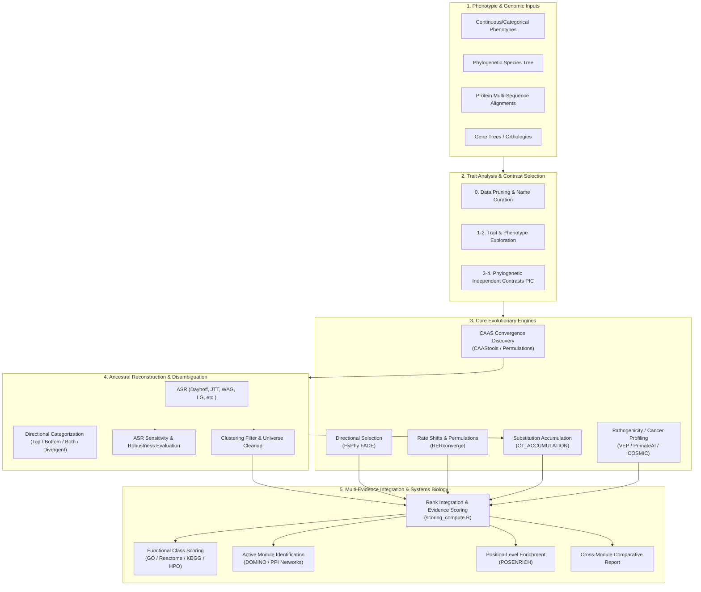
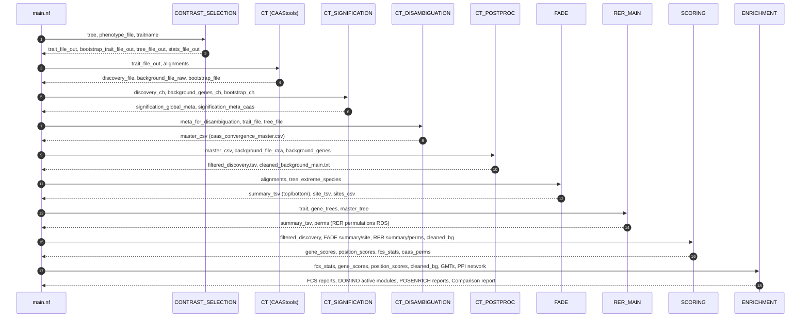

# PhyloPhere Methodological Archive: Entry 00
# Pipeline Architecture, Multi-Evidence Framework & Global Orchestration

**Author / Specification**: Miguel Ramon Alonso (`miguel.ramon@upf.edu`)  
**Framework**: Nextflow (DSL2) v21.04.0+  
**Containerization**: Apptainer / Singularity (`docker://miralnso/phylophere:latest`)  
**Target Publication**: Methodological Reference / Comparative Genomics Systems Paper  

---

## 1. Scientific Rationale & Multi-Evidence Evolutionary Paradigm

PhyloPhere is an end-to-end computational and statistical framework designed for large-scale **Phenome-Genome comparative evolutionary analyses**. High-throughput sequencing across hundreds of vertebrate and mammalian genomes provides unprecedented power to investigate the molecular basis of phenotypic adaptations. However, detecting genotype-phenotype associations across species is fraught with severe statistical and biological confounders:

1. **Phylogenetic Pseudoreplication & Inertia**: Lineages sharing common ancestry share character states by descent rather than convergent adaptation. Standard non-phylogenetic statistical tests yield high rates of false positives.
2. **Heterogeneous Evolutionary Signatures**: Adaptive evolution acts across distinct molecular modalities:
   - *Episodic amino acid substitutions* matching phenotypic divergence (Convergent Amino Acid Substitutions, CAAS).
   - *Rate shifts in sequence evolution* across entire genes or pathways (Relative Evolutionary Rates, RER).
   - *Directional selection biases* driving substitution towards specific physicochemical amino acid targets (HyPhy FADE).
   - *Polygenic substitution accumulation* dispersed across multiple phylogenetic contrasts (Contrast Accumulation).
3. **Ancestral State Uncertainty**: Ambiguity in ancestral sequence reconstruction (ASR) can generate spurious convergent calls depending on the amino acid substitution matrix and phylogenetic topology assumed.
4. **Multiple Hypothesis Testing & Polygenic Dilution**: Testing tens of thousands of orthologous genes across dozens of species requires rigorous empirical null distributions that accurately preserve phylogenetic branch correlation structures.

PhyloPhere resolves these challenges through a unified, multi-layered comparative framework. It couples independent phylogenetic contrast generation, rigorous Ancestral State Reconstruction (ASR), directional molecular classification, empirical phylogenetic permulations, functional class scoring (FCS), active protein network module identification (DOMINO), and multi-evidence rank integration into a single reproducible pipeline.



---

## 2. Nextflow DSL2 Architecture & Pipeline Topology

PhyloPhere is implemented in modular **Nextflow DSL2** (`main.nf`), separating pipeline orchestration, workflow encapsulation, subworkflow execution, and process definitions.

### 2.1 Directory Structure & Layout

```
PhyloPhere/
├── main.nf                      # Master DSL2 orchestration script
├── nextflow.config              # Top-level configuration, profiles, and runtime environment
├── lib/
│   └── WorkflowMap.groovy       # Groovy helper generating standalone interactive HTML workflow map
├── conf/
│   ├── common.config            # Global input parameters, flags, directories
│   ├── resources.config         # Dynamic CPU/Memory limits, error strategies, retries
│   ├── ct.config                # CAAStools discovery, resampling, bootstrap parameters
│   ├── ct_disambiguation.config # Ancestral sequence reconstruction and classification
│   ├── ct_postproc.config       # Window-based cluster filtering and background cleanup
│   ├── ct_accumulation.config   # Polygenic contrast accumulation null simulations
│   ├── fade.config              # HyPhy FADE directional selection parameters
│   ├── rerconverge.config       # RERconverge rate correlation and permulation options
│   ├── vep.config               # Ensembl VEP, PrimateAI, and COSMIC parameters
│   ├── scoring.config           # Multi-evidence fusion weights and FDR thresholds
│   └── enrichment.config        # FCS, DOMINO, and Position enrichment parameters
├── workflows/                   # Top-level named workflows invoked by main.nf
│   ├── reporting.nf             # Trait exploration and dataset reporting
│   ├── contrast_selection.nf    # PIC trait pairing and validation
│   ├── ct.nf                    # CAAStools CAAS discovery engine
│   ├── ct_signification.nf      # Empirical bootstrap p-value estimation
│   ├── ct_disambiguation.nf     # ASR disambiguation and directional classification
│   ├── asr_robustness.nf        # ASR model sensitivity analysis
│   ├── ct_postproc.nf           # Post-processing filters and background definition
│   ├── ct_accumulation.nf       # Trait contrast accumulation
│   ├── fade.nf                  # HyPhy FADE directional selection
│   ├── rerconverge.nf           # RERconverge rate shift analysis
│   ├── vep.nf                   # VEP/PrimateAI/COSMIC annotation
│   ├── scoring.nf               # Multi-evidence scoring and ranking
│   ├── enrichment.nf            # FCS, DOMINO, POSENRICH, and Cross-Tool comparison
│   └── help.nf                  # Command-line help and usage documentation
└── subworkflows/                # Isolated computational modules and local scripts
```

---

## 3. Global Orchestration & Channel Dependency Graph

Execution in `main.nf` is completely modular: users can trigger the full end-to-end pipeline or run individual modules in isolation or downstream from precomputed outputs.

### 3.1 Channel Wiring & Data Lineage in `main.nf`

The data lineage between upstream modules and downstream consumers is managed through strict channel typing, value channel isolation, and graceful null fallbacks:



### 3.2 Precomputed Input Resolution & Re-entrancy

PhyloPhere supports full checkpointing and modular execution. When running downstream modules (e.g., `--scoring` or `--enrichment`) without rerunning upstream computationally intensive steps (e.g., `--ct_tool` or `--fade`), `main.nf` implements robust fallback logic:

1. **Precomputed FADE Resolution**: If `--fade` is not set but `--fade_json_dir_top` or `--fade_json_dir_bottom` is supplied, `main.nf` invokes `FADE_REPORT_PRECOMP_TOP/BOTTOM` and `FADE_JSON_TO_CSV_PRECOMP_TOP/BOTTOM` to reconstruct summary TSVs, site-level tables, and position CSVs on the fly.
2. **Precomputed RER Resolution**: If `--rer_continuous_file` is supplied without running live tree estimation, `RER_MAIN` renders reports directly from the precomputed RDS object.
3. **Precomputed Permulation Discovery**: When re-running disambiguation over precomputed CAAStools runs, `main.nf` scans `--resample_from`, `--discovery_from`, `--background_input`, `--signification_from`, and `${params.outdir}` to locate cycle-stratified `*.bootstrap.discovery.output` files.
4. **Universe Fallbacks**: The global background gene universe (`pp_cleaned_bg`) is prioritized from live `CT_POSTPROC`, then checked against `--background_input`, `--scoring_background_input`, `--accumulation_background_input`, and `${scoring_postproc_input}/cleaned_background_main.txt`.

---

## 4. Execution Profiles & Compute Environment Management

Pipeline portability across local workstations and High-Performance Computing (HPC) clusters is governed by `nextflow.config` and containerization directives:

### 4.1 Profiles

- **`local`**: Executes all tasks on the local node utilizing a pooled thread model. Configured with dynamic CPU and memory detection (default fallback: 32 CPUs, 64 GB RAM).
- **`slurm`**: Native cluster execution submitting Nextflow processes as individual SLURM batch jobs. Configured with queue partitions (e.g., `haswell`), batch array sizing (`ct_discovery_batch_size = 100`, `ct_bootstrap_batch_size = 25`), max memory (128 GB), and walltime limits (up to 960 hours).
- **`apptainer` / `singularity`**: Strict isolation running within `miralnso-phylophere-latest.img`.
  - Auto-mounts host filesystems (`apptainer.autoMounts = true`).
  - Cache directory redirection (`apptainer.cacheDir`) to high-capacity storage.
  - Native pre-pulling (`ociAutoPull = false`) to bypass AppArmor unprivileged user namespace restrictions on modern Linux kernels (e.g., Ubuntu 24.04).

### 4.2 Environmental Isolation

To prevent host-level Python packages or user R libraries from contaminating containerized execution, `nextflow.config` enforces strict environment sanitization:
```groovy
env {
    PYTHONNOUSERSITE = 1
    R_PROFILE_USER   = "/.Rprofile"
    R_ENVIRON_USER   = "/.Renviron"
}
process.shell = ['/bin/bash', '-euo', 'pipefail']
```

---

## 5. Global Lifecycle Hooks & The Interactive Workflow Map

PhyloPhere features an automated reporting architecture managed by `WorkflowMap.groovy` (located in `lib/`).

Upon workflow completion (success or failure), the `workflow.onComplete` hook builds an interactive, standalone HTML document (`workflow_map.html`) and completion marker (`workflow_html.done`) in the root publication directory:

```groovy
workflow.onComplete {
    def outdirAbs = new File(params.outdir ?: "${workflow.projectDir}/out").canonicalPath
    def ctx = WorkflowMap.buildCtx(outdirAbs, params, workflow)
    def html = WorkflowMap.buildWorkflowMapHtml(ctx)
    new File(outdirAbs, 'workflow_map.html').text = html
    new File(outdirAbs, 'workflow_html.done').text = "status=ok\n..."
}
```

### 5.1 Pipeline Stage Tracking in Workflow Map

The workflow map tracks 18 distinct analytical milestones across three functional categories:
1. **Pre/Post-Processing (`#0EA5E9`)**: Data Pruning, Contrast Selection, CT Post-Processing, VEP Characterization.
2. **Core Processes (`#F97316`)**: CAAStools (Discovery/Bootstrap), CT Disambiguation, CT Accumulation, RERconverge, HyPhy FADE.
3. **Reporting & Systems Integration (`#7C3AED`)**: Dataset Reporting, Phenotype Reporting, CT Signification, ASR Robustness, CAAS Scoring, Functional Enrichment (FCS), Active Module Identification (AMI / DOMINO), Position Enrichment (POSENRICH), Cross-Module Comparison.

---

## 6. Comprehensive CLI Parameter Matrix

Below is the master specification of global parameters available in `main.nf` and `conf/common.config`:

| CLI Parameter | Type | Default | Description & Behavioral Impact |
|---|---|---|---|
| `--help` | Boolean | `false` | Prints the comprehensive parameter reference manual and exits. |
| `--traitname` | String | `null` | Target phenotype name; matches phenotype file column and tags output directories. |
| `--tree` | Path | `null` | Master species phylogenetic tree in Newick format. |
| `--my_traits` | Path | `null` | Master phenotype table (TSV/CSV/tab) containing species identifiers and quantitative/binary measurements. |
| `--alignment` | Path | `null` | Directory containing orthologous protein sequence alignments (FASTA/Phylip). |
| `--outdir` | Path | `./out` | Root directory where all final publication tables, HTML reports, and RDS objects are written. |
| `--toy_mode` | Boolean | `false` | Enables rapid testing mode by randomly sampling `toy_n` alignments. |
| `--toy_n` | Integer | `50` | Number of alignments sampled when `--toy_mode` is active. |
| `--seed` | Integer | `1998` | Global pseudo-random number generator seed ensuring full computational reproducibility. |
| `--reporting` | Boolean | `false` | Runs exploratory trait analysis and renders pruning and distribution HTML reports. |
| `--contrast_selection` | Boolean | `false` | Executes phylogenetic independent contrast pairing and generates CAAStools trait files. |
| `--ct_tool` | String | `""` | Comma-separated list of CAAStools modules to run (`discovery`, `resample`, `bootstrap`). |
| `--ct_disambiguation` | Boolean | `false` | Executes ancestral sequence reconstruction and directional CAAS categorization. |
| `--ct_postproc` | Boolean | `false` | Executes cluster filtering, gene filtering, and background cleanup. |
| `--ct_accumulation` | Boolean | `false` | Runs contrast accumulation analysis and randomization null simulations. |
| `--fade` | Boolean | `false` | Runs HyPhy FADE directional selection across foreground and background lineages. |
| `--rer_tool` | Boolean | `false` | Runs RERconverge relative evolutionary rate correlation analysis. |
| `--vep` | Boolean | `false` | Runs Variant Effect Predictor, PrimateAI pathogenicity mapping, and COSMIC mutation profiling. |
| `--scoring` | Boolean | `false` | Integrates evidence across CAAS, FADE, RER, and Accumulation into ranked scores. |
| `--enrichment` | Boolean | `false` | Runs FCS, DOMINO active module identification, and position-level enrichment. |
| `--publish_intermediates`| Boolean | `false` | If `true`, saves intermediate per-gene alignment files and unconcatenated batch outputs. |

---

## 7. Master Output Directory Hierarchy

When a complete pipeline run finishes, outputs are organized under `params.outdir` as follows:

```
${params.outdir}/
├── workflow_map.html                     # Standalone interactive pipeline report & navigation hub
├── workflow_html.done                     # Status marker file
├── html_reports/                          # All compiled self-contained Quarto/RMarkdown HTML reports
│   ├── 1.Dataset_exploration.html
│   ├── 2.Phenotype_exploration_complete.html
│   ├── 2.Phenotype_exploration_pruned.html
│   ├── 3.CI-composition.html
│   ├── 4.Independent_contrasts.html
│   ├── 5.RERconverge_report.html
│   ├── 6.FADE_report_top.html
│   ├── 6.FADE_report_bottom.html
│   ├── 7.CT_signification.html
│   ├── 8.Characterization_report.html
│   ├── 9.ASR_robustness.html
│   ├── 10.Accumulation_report.html
│   ├── 11.Scoring_report.html
│   ├── 12.FCS_scoring.html
│   ├── 12.FCS_rer.html
│   ├── 13.AMI_analysis.html
│   ├── 14.Position_enrichment_report.html
│   └── 15.Comparison_report.html
├── data_exploration/                      # PIC trait pairing, trees, and species pruning tables
├── caastools/                             # Consolidated discovery.tab, resample.tab, bootstrap.tab
├── signification/                         # Empirical p-values and meta_caas.tsv / global_meta_caas.tsv
├── ct_disambiguation/                     # caas_convergence_master.csv and per-model ASR outputs
├── asr_robustness/                        # Model stability diagnostics and sensitivity matrices
├── postproc/                              # filtered_discovery.tsv, cleaned_background_main.txt
├── accumulation/                          # Contrast accumulation statistics and null distributions
├── selection/fade/                        # FADE JSONs, site tables, and directional gene lists
├── rerconverge/                           # RER rate statistics, RDS objects, and permulation matrices
├── vep/                                   # PrimateAI and COSMIC overlap tables
├── scoring/                               # Multi-evidence gene and position score tables, STRING slices
├── fcs/                                   # FCS pathway enrichment tables (GO, Reactome, KEGG, HPO)
├── ami/                                   # DOMINO active modules, PPI subgraphs, and network plots
├── posenrich/                             # Position-level functional and domain enrichment tables
└── compare/                               # Multi-tool intersection and concordance matrices
```
