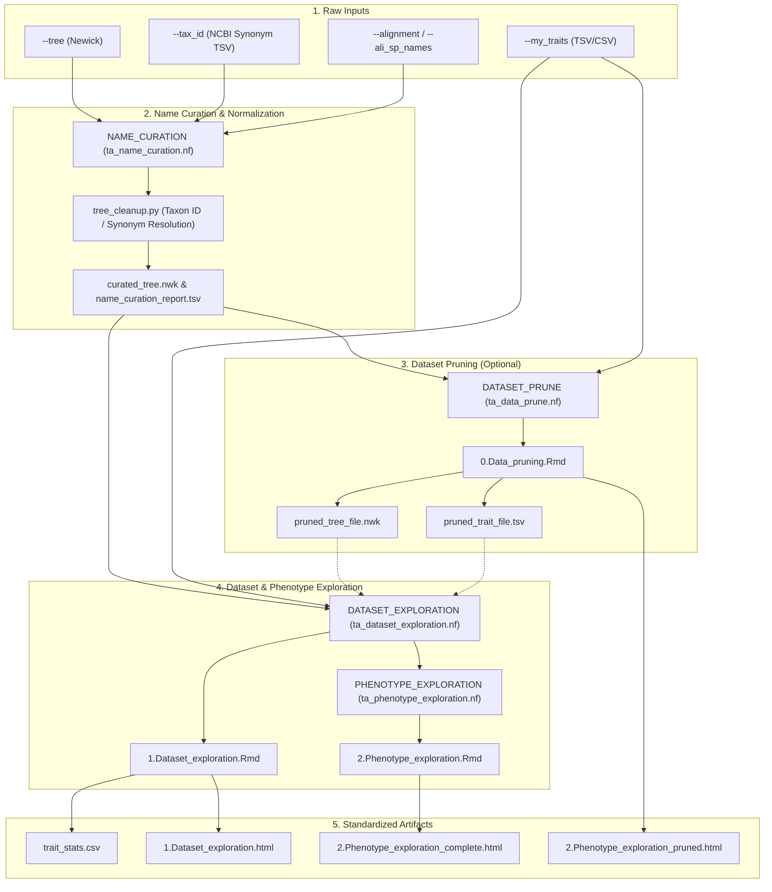

# PhyloPhere Methodological Archive: Entry 01
# Workflow: Trait Reporting & Dataset Exploration (`reporting.nf`)

**Author / Specification**: Miguel Ramon Alonso (`miguel.ramon@upf.edu`)  
**Workflow File**: `workflows/reporting.nf`  
**Subworkflows Consumed**: `subworkflows/TRAIT_ANALYSIS/` (`ta_name_curation.nf`, `ta_data_prune.nf`, `ta_dataset_exploration.nf`, `ta_phenotype_exploration.nf`)  
**Associated HTML Reports**: `1.Dataset_exploration.html`, `2.Phenotype_exploration_complete.html`, `2.Phenotype_exploration_pruned.html`  
**Target Publication**: Comparative Phenomics & Evolutionary Methodologies  

---

## 1. Scientific & Methodological Rationale

Phenotypic data across non-model species presents substantial challenges:
1. **Taxonomic Incongruence & Synonymy**: Species designations in public databases (e.g., AnAge, PanTHERIA, VertLife) frequently diverge from genome assembly and alignment headers (e.g., NCBI taxon IDs, Ensembl gene trees, TOGA orthology sets). Uncurated species trees lead to silent sample loss or incorrect phylogenetic contrast pairing.
2. **Missing Data & Phylogenetic Sparsity**: Not all species with sequenced genomes possess phenotypic measurements, and vice-versa. Systematic dataset pruning is required to intersect trees and phenotypes without distorting phylogenetic branch topologies.
3. **Phenotypic Distribution Asymmetry & Outliers**: Quantitative morphological or physiological measurements often span multiple orders of magnitude (e.g., longevity quotient, body mass, metabolic rates). Identifying distribution modalities, skewness, and clade-specific variances is essential before continuous or discrete discretization.

The `REPORTING` workflow provides an exploratory, quality-assurance layer. It curates taxonomic nomenclature against orthology alignments, filters lineages by data availability or user-specified prune lists, and generates statistical diagnostics of phenotype distributions.



---

## 2. Nextflow DSL2 Workflow Architecture

### 2.1 Process Execution Graph & Channel Wiring

`REPORTING` is invoked in `main.nf` when `--reporting` is enabled (and `--contrast_selection` is false; if `--contrast_selection` is true, contrast selection internally incorporates the exploration steps):

```groovy
workflow REPORTING {
    // 1. Mandatory input assertions
    assert params.my_traits : "Reporting workflow requires --my_traits."
    assert params.tree      : "Reporting workflow requires --tree."

    def trait_file   = file(params.my_traits)
    def tree_file_ch = Channel.value(file(params.tree))

    // 2. Name curation step: resolves tree tip labels against alignment headers
    if (params.ali_sp_names || params.alignment) {
        def tax_id_ch = params.tax_id ? Channel.value(file(params.tax_id)) : Channel.value(file('NO_FILE'))
        name_curation_out = NAME_CURATION(tree_file_ch, tax_id_ch)
        tree_file_ch = name_curation_out.curated_tree
    }

    // 3. Optional data pruning vs direct exploration
    if (params.prune_data) {
        prune_out = DATASET_PRUNE(trait_file, tree_file_ch)
        dataset_exploration_out = DATASET_EXPLORATION(trait_file, tree_file_ch, prune_out.pruned_results_dir)
        phenotype_out = PHENOTYPE_EXPLORATION(trait_file, tree_file_ch, dataset_exploration_out.results_dir)
    } else {
        dataset_exploration_out = DATASET_EXPLORATION(trait_file, tree_file_ch, file('NO_FILE'))
        phenotype_out = PHENOTYPE_EXPLORATION(trait_file, tree_file_ch, dataset_exploration_out.results_dir)
    }

    emit:
        dataset_out       = phenotype_out.results_dir
        stats_file        = dataset_exploration_out.stats_file
        pruned_trait_file = prune_out.pruned_trait_file // (if prune_data=true)
        pruned_tree_file  = prune_out.pruned_tree_file  // (if prune_data=true)
}
```

---

## 3. Subworkflow Deconstruction & Algorithmic Details

### 3.1 Subworkflow: `NAME_CURATION` (`ta_name_curation.nf`)

- **Objective**: Reconciles discrepancies between phylogenetic tree tip labels, phenotypic table species names, and alignment FASTA headers.
- **Components**:
  1. `DERIVE_ALI_SP_NAMES`: Extracts unique species headers from alignment files via `grep -rh "^>" | sed 's/^>//' | sort -u`. (Bypassed if `--ali_sp_names` is pre-supplied).
  2. `TREE_CLEANUP` (`tree_cleanup.py`):
     - Parses the input Newick tree using `ete3` / `Bio.Phylo`.
     - Maps tip labels to NCBI Taxonomy IDs via `--tax_id`.
     - Matches translated taxonomy IDs to the canonical alignment species set.
     - Prunes tips that have zero sequence coverage in the alignment corpus.
     - Re-serializes the sanitized Newick tree (`curated_tree.nwk`) and outputs a full audit table (`name_curation_report.tsv`).

### 3.2 Subworkflow: `DATASET_PRUNE` (`ta_data_prune.nf`)

- **Objective**: Eliminates confounding clades, domesticated breeds, outliers, or user-blacklisted lineages prior to contrast estimation.
- **Engine**: `0.Data_pruning.Rmd` (rendered via `rmarkdown::render`).
- **Algorithmic Logic**:
  1. Filters the phenotype matrix by `--clade_name`, `--taxon_of_interest`, `--prune_list`, and `--prune_list_secondary`.
  2. Subsets the phylogenetic tree using `ape::drop.tip()` to match the pruned species set.
  3. Re-evaluates tree ultrametricity and branch length positivity.
  4. Exports `pruned_trait_file.tsv`, `pruned_tree_file.nwk`, and `pruned_trait_stats.csv`.
  5. Compiles `2.Phenotype_exploration_pruned.html`.

### 3.3 Subworkflow: `DATASET_EXPLORATION` (`ta_dataset_exploration.nf`)

- **Objective**: Provides comprehensive dataset-level summaries and sample size audits.
- **Engine**: `1.Dataset_exploration.Rmd`.
- **Mathematical & Statistical Diagnostics**:
  1. Computes total species overlap between tree tips ($N_{\text{tree}}$) and trait rows ($N_{\text{trait}}$):
     $$N_{\text{intersect}} = |T_{\text{tips}} \cap S_{\text{traits}}|$$
  2. Generates summary statistics for quantitative variables: sample mean ($\mu$), median ($\tilde{x}$), standard deviation ($\sigma$), interquartile range ($\text{IQR}$), skewness ($\gamma_1$), and kurtosis ($\beta_2$).
  3. Renders phylogenetic tree topology plots overlaid with taxonomic orders, families, and phenotypic completeness heatmaps.
  4. Publishes `trait_stats.csv` to `data_exploration/1.Data-exploration/1.Species_distribution/`.

### 3.4 Subworkflow: `PHENOTYPE_EXPLORATION` (`ta_phenotype_exploration.nf`)

- **Objective**: Detailed visual and mathematical characterization of the focal phenotype distribution across lineages.
- **Engine**: `2.Phenotype_exploration.Rmd`.
- **Key Analyses**:
  1. Density plots, empirical cumulative distribution functions (ECDF), and Shapiro-Wilk normality tests.
  2. Discretization benchmarking:
     - **Quartile Split**: Lower bound ($Q_1 \le 0.25$), Upper bound ($Q_4 \ge 0.75$).
     - **Decile Split**: Extreme lower ($D_1 \le 0.10$), Extreme upper ($D_{10} \ge 0.90$).
     - **Custom Quantiles**: Controlled via `--top_quantile` and `--bottom_quantile`.
  3. Phylogenetic signal estimation:
     - **Pagel's $\lambda$**: Tests whether trait evolution adheres to Brownian motion along the tree ($\lambda = 1$) or is phylogenetically independent ($\lambda = 0$).
     - **Blomberg's $K$**: Quantifies whether relatives resemble each other more ($K > 1$) or less ($K < 1$) than expected under Brownian motion.
  4. Compiles `2.Phenotype_exploration_complete.html`.

---

## 4. Parameter Space & Configuration Reference

| Parameter | Type | Default | Description |
|---|---|---|---|
| `--my_traits` | Path | *Required* | Path to master trait table (TSV/CSV) containing species and phenotypic values. |
| `--tree` | Path | *Required* | Path to species tree in Newick format. |
| `--traitname` | String | *Required* | Column name of the primary phenotype to explore. |
| `--tax_id` | Path | `null` | Two-column TSV mapping NCBI Taxonomy IDs to species binomials. |
| `--ali_sp_names` | Path | `null` | Precomputed list of species labels present in alignment headers. |
| `--prune_data` | Boolean | `false` | If `true`, executes `DATASET_PRUNE` before exploratory reporting. |
| `--prune_list` | String | `""` | Comma-separated list of species to prune from analysis. |
| `--clade_name` | String | `""` | Restricts analysis to a specific monophyletic clade. |
| `--taxon_of_interest` | String | `""` | Highlights a specific taxon in phylogenetic distribution plots. |
| `--discrete_method` | String | `'quartile'` | Discretization method (`'quartile'`, `'decile'`, `'custom'`). |
| `--top_quantile` | Float | `0.75` | Upper quantile threshold for foreground classification. |
| `--bottom_quantile` | Float | `0.25` | Lower quantile threshold for background classification. |

---

## 5. Artifact Schemas & Published Outputs

### 5.1 `name_curation_report.tsv`
```tsv
original_tip_label	tax_id	canonical_ali_name	status	comment
Homo_sapiens	9606	Homo_sapiens	KEPT	Direct match to alignment header
Pan_troglodytes_verus	9598	Pan_troglodytes	RENAMED	Subspecies mapped to species binomial
Mus_spretus	10096	NA	PRUNED	Taxon missing from alignment set
```

### 5.2 `trait_stats.csv`
```csv
trait,n_species,mean,sd,median,iqr,min,max,skewness,kurtosis,pagel_lambda,blomberg_k
MaximumLongevity_yrs,128,24.3,18.7,16.5,19.2,2.1,122.5,1.84,6.21,0.88,0.74
```

### 5.3 Output Directory Tree
```
${params.outdir}/
├── html_reports/
│   ├── 1.Dataset_exploration.html
│   ├── 2.Phenotype_exploration_complete.html
│   └── 2.Phenotype_exploration_pruned.html
├── name_curation/
│   ├── curated_tree.nwk
│   └── name_curation_report.tsv
└── data_exploration/
    ├── 0.Data-pruning/
    │   ├── pruned_trait_file.tsv
    │   ├── pruned_tree_file.nwk
    │   └── pruned_trait_stats.csv
    └── 1.Data-exploration/
        └── 1.Species_distribution/
            ├── trait_stats.csv
            ├── original_trait_file.tsv
            └── original_tree_file.nwk
```
