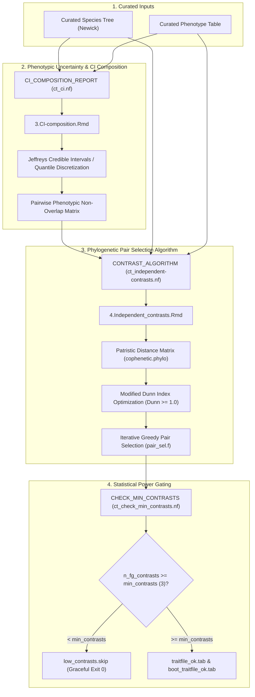

# PhyloPhere Methodological Archive: Entry 02
# Workflow: Contrast Selection & Phylogenetic Independent Pairing (`contrast_selection.nf`)

**Author / Specification**: Miguel Ramon Alonso (`miguel.ramon@upf.edu`)  
**Workflow File**: `workflows/contrast_selection.nf`  
**Subworkflows Consumed**: `subworkflows/TRAIT_ANALYSIS/` (`ct_ci.nf`, `ct_independent-contrasts.nf`, `ta_name_curation.nf`, `ta_data_prune.nf`, `ta_dataset_exploration.nf`), `subworkflows/CT/` (`ct_check_min_contrasts.nf`)  
**Associated HTML Reports**: `3.CI-composition.html`, `4.Independent_contrasts.html`  
**Target Publication**: Comparative Phenomics, Phylogenetic Independent Contrasts & Statistical Genetics  

---

## 1. Scientific & Methodological Rationale

A foundational premise of evolutionary comparative genomics is that species do not represent independent data points due to shared phylogenetic ancestry (Felsenstein, 1985). Treating each lineage independently inflates type-I error rates. 

To detect Convergent Amino Acid Substitutions (CAAS), lineages must be organized into **phylogenetically independent contrast pairs**:
- **Intra-Pair Proximity**: Within each pair, the foreground (phenotype positive / high) species and background (phenotype negative / low) species should share a recent common ancestor (small patristic distance) to minimize neutral sequence divergence.
- **Intra-Pair Phenotypic Divergence**: The two species must exhibit stark phenotypic separation with non-overlapping measurement confidence intervals.
- **Inter-Pair Evolutionary Independence**: The phylogenetic distance separating any two contrast pairs must strictly exceed the evolutionary divergence within each pair, ensuring each contrast represents an independent evolutionary transition.

`CONTRAST_SELECTION` automates this optimization using an iterative graph-theoretic clustering algorithm based on a **Modified Dunn Index** on patristic distance matrices.



---

## 2. Nextflow DSL2 Workflow Architecture

### 2.1 Process Execution & Channel Wiring

`CONTRAST_SELECTION` is invoked in `main.nf` via `--contrast_selection`:

```groovy
workflow CONTRAST_SELECTION {
    assert params.my_traits : "Contrast selection workflow requires --my_traits."
    assert params.tree      : "Contrast selection workflow requires --tree."

    def trait_file   = file(params.my_traits)
    def tree_file_ch = Channel.value(file(params.tree))

    // 1. Mandatory Name Curation
    if (params.ali_sp_names || params.alignment) {
        def tax_id_ch = params.tax_id ? Channel.value(file(params.tax_id)) : Channel.value(file('NO_FILE'))
        name_curation_out = NAME_CURATION(tree_file_ch, tax_id_ch)
        tree_file_ch = name_curation_out.curated_tree
    }

    // 2. Exploration & Data Pruning Branching
    // (Generates dataset_out results directory and baseline statistics)

    // 3. Phenotypic Composition & Credible Interval Analysis
    ci_composition_out = CI_COMPOSITION_REPORT(trait_file, tree_file_ch, dataset_out)

    // 4. Optimization of Independent Contrasts
    contrast_out = CONTRAST_ALGORITHM(trait_file, tree_file_ch, ci_composition_out.results_dir)

    // 5. Minimum-Contrast Statistical Gate
    check_out = CHECK_MIN_CONTRASTS(
        contrast_out.trait_file_out,
        contrast_out.bootstrap_trait_file_out
    )

    emit:
        trait_file_out           = check_out.traitfile_out
        bootstrap_trait_file_out = check_out.boot_traitfile_out
        tree_file_out            = contrast_out.tree_file_out
        stats_file_out           = contrast_stats_file
        contrast_results_dir     = contrast_out.contrast_results_dir
        low_contrasts_skip       = check_out.skip_flag
}
```

---

## 3. Mathematical & Algorithmic Deconstruction

### 3.1 Phenotypic Confidence Intervals & Overlap Assessment (`ct_ci.nf` / `3.CI-composition.Rmd`)

Phenotypic values are rarely point estimates without variance. PhyloPhere evaluates phenotypic uncertainty based on data type:

#### 1. Proportions & Frequencies (Count Data)
When sample size columns (`--n_trait`, `--c_trait`) are available, PhyloPhere constructs **Jeffreys Bayesian Credible Intervals** using the uninformative Jeffreys prior $\text{Beta}(0.5, 0.5)$:
$$P(\theta \mid k, n) \sim \text{Beta}\left(k + \frac{1}{2}, n - k + \frac{1}{2}\right)$$
For a significance level $\alpha = 0.05$, the lower bound $L$ and upper bound $U$ are:
$$L = I_{\alpha/2}^{-1}\left(k + 0.5, n - k + 0.5\right), \quad U = I_{1 - \alpha/2}^{-1}\left(k + 0.5, n - k + 0.5\right)$$
Two species $A$ and $B$ form a valid candidate contrast only if their intervals are disjoint:
$$\max(L_A, L_B) > \min(U_A, U_B) \implies [L_A, U_A] \cap [L_B, U_B] = \emptyset$$

#### 2. Continuous Traits (Empirical Quantiles)
For continuous morphological or physiological parameters without replicate counts, lineages are classified into extreme upper ($Q_{\text{top}}$) and lower ($Q_{\text{bottom}}$) quantiles:
$$\text{Top Lineages: } x_i \ge F_X^{-1}(q_{\text{top}}), \quad \text{Bottom Lineages: } x_j \le F_X^{-1}(q_{\text{bottom}})$$
Trait divergence between candidate species is calculated as $\Delta x_{ij} = |x_i - x_j|$.

---

### 3.2 Patristic Distance & Modified Dunn Index Optimization (`selection_algorithm.R`)

#### 1. Patristic Distance Calculation
Let $T = (V, E, w)$ be the phylogenetic tree where $w(e)$ denotes the evolutionary branch length of edge $e$. The pairwise patristic distance $d(s_1, s_2)$ between species $s_1$ and $s_2$ is the sum of branch lengths along the unique path connecting them:
$$d(s_1, s_2) = \sum_{e \in \text{path}(s_1, s_2)} w(e)$$
Computed using `ape::cophenetic.phylo(subtree)`.

#### 2. Modified Dunn Index Formulation
To ensure phylogenetic independence between selected pairs, each pair $C_k = \{s_{k,1}, s_{k,2}\}$ is treated as a 2-element cluster. The **Modified Dunn Index** for cluster $C_k$ relative to all other clusters $\{C_1, \dots, C_m\} \setminus \{C_k\}$ is defined as:
$$\text{Dunn}(C_k) = \frac{\min_{j \neq k} \delta(C_k, C_j)}{\Delta(C_k)}$$
Where:
- $\delta(C_k, C_j) = \min_{u \in C_k, v \in C_j} d(u, v)$ is the minimum inter-cluster patristic distance between pair $k$ and pair $j$.
- $\Delta(C_k) = d(s_{k,1}, s_{k,2})$ is the intra-cluster diameter (patristic distance between the paired species).

**Independence Criterion**: A candidate pair $C_k$ is valid if and only if:
$$\text{Dunn}(C_k) \ge 1.0$$
This guarantees that the evolutionary divergence separating pair $C_k$ from any existing contrast exceeds the internal evolutionary divergence between its paired species.

#### 3. Iterative Greedy Selection Algorithm (`pair_sel.f`)

```
Algorithm: Phylogenetic Independent Contrast Pair Selection
Inputs: Patristic distance matrix D, Candidate overlap pairs O, Trait table T, Max iterations K
Output: Set of independent contrast pairs P

1: Sort candidate pairs in O by:
     Primary: Patristic distance d(s1, s2) ASCENDING
     Secondary: Trait difference |x1 - x2| DESCENDING
     Tertiary: Combined sample size (n1 + n2) DESCENDING (if available)
2: P <- { First pair in sorted O (Cluster 1) }
3: iteration <- 1
4: while iteration < K do
5:     candidate_evaluations <- []
6:     for each candidate pair (u, v) in O not in P do
7:         Assign temporary cluster ID = iteration + 1
8:         Compute Dunn(candidate) across P U {(u, v)}
9:         Record (u, v, Dunn, |x_u - x_v|)
10:    end for
11:    best_candidate <- candidate with max(Dunn), breaking ties by max(|x_u - x_v|)
12:    if Dunn(best_candidate) >= 1.0 then
13:        P <- P U {best_candidate}
14:        iteration <- iteration + 1
15:    else
16:        Break (No remaining candidates satisfy phylogenetic independence)
17:    end if
18: end while
19: return P
```

---

### 3.3 Statistical Power Gating (`CHECK_MIN_CONTRASTS`)

CAAS discovery requires statistical power across multiple convergent events. An analysis with fewer than 3 independent contrasts lacks statistical power and inflates permutation variance.

- `CHECK_MIN_CONTRASTS` inspects `traitfile.tab`.
- If $N_{\text{fg}} = \sum \mathbf{1}_{(\text{label} = 1)} < \text{params.min\_contrasts}$ (default 3):
  1. Writes `low_contrasts.skip` to `${params.outdir}`:
     ```tsv
     trait=MyPhenotype	n_contrasts=2	min_required=3
     ```
  2. Does **not** emit `traitfile_ok.tab` or `boot_traitfile_ok.tab`.
  3. All downstream CT, Signification, Disambiguation, and Scoring modules are safely bypassed.
  4. Nextflow terminates cleanly with exit code `0`.

---

## 4. Parameter Space & Configuration Reference

| Parameter | Type | Default | Description |
|---|---|---|---|
| `--contrast_selection` | Boolean | `false` | Enables full independent contrast selection pipeline. |
| `--min_contrasts` | Integer | `3` | Minimum number of foreground contrast pairs required to proceed to CAAStools. |
| `--discrete_method` | String | `'decile'` | Discretization threshold mode (`'decile'`, `'quartile'`, `'custom'`). |
| `--top_quantile` | Float | `0.90` | Upper quantile threshold for foreground lineage definition. |
| `--bottom_quantile` | Float | `0.10` | Lower quantile threshold for background lineage definition. |
| `--n_trait` | String | `""` | Column name for sample size / trials (enables Jeffreys CI). |
| `--c_trait` | String | `""` | Column name for event counts / successes (enables Jeffreys CI). |
| `--contrast_max_iter` | Integer | `3` | Maximum number of contrast pairs to select. |

---

## 5. Artifact Schemas & Published Outputs

### 5.1 `traitfile.tab` (CAAStools Configuration Format)
Headerless 3-column tab-delimited file consumed directly by CAAStools:
```tsv
Homo_sapiens	1	1
Pan_troglodytes	0	1
Loxodonta_africana	1	2
Procavia_capensis	0	2
Balaenoptera_musculus	1	3
Hippopotamus_amphibius	0	3
```
- **Column 1**: Species identifier matching alignment FASTA headers.
- **Column 2**: Trait state (`1` = Foreground / Target phenotype, `0` = Background / Reference phenotype).
- **Column 3**: Contrast pair index ($1, 2, \dots, K$).

### 5.2 `boot_traitfile.tab`
Single-column list of all species included in any contrast pair, used for permutation resampling:
```tsv
Homo_sapiens
Pan_troglodytes
Loxodonta_africana
Procavia_capensis
Balaenoptera_musculus
Hippopotamus_amphibius
```

### 5.3 Output Directory Tree
```
${params.outdir}/
├── html_reports/
│   ├── 3.CI-composition.html
│   └── 4.Independent_contrasts.html
└── data_exploration/
    └── 2.CT/
        ├── 1.Traitfiles/
        │   ├── traitfile.tab
        │   └── traitfile_ok.tab
        ├── 2.Bootstrap_traitfiles/
        │   ├── boot_traitfile.tab
        │   └── boot_traitfile_ok.tab
        └── 3.Tree/
            └── pruned_tree_file.nwk
```
