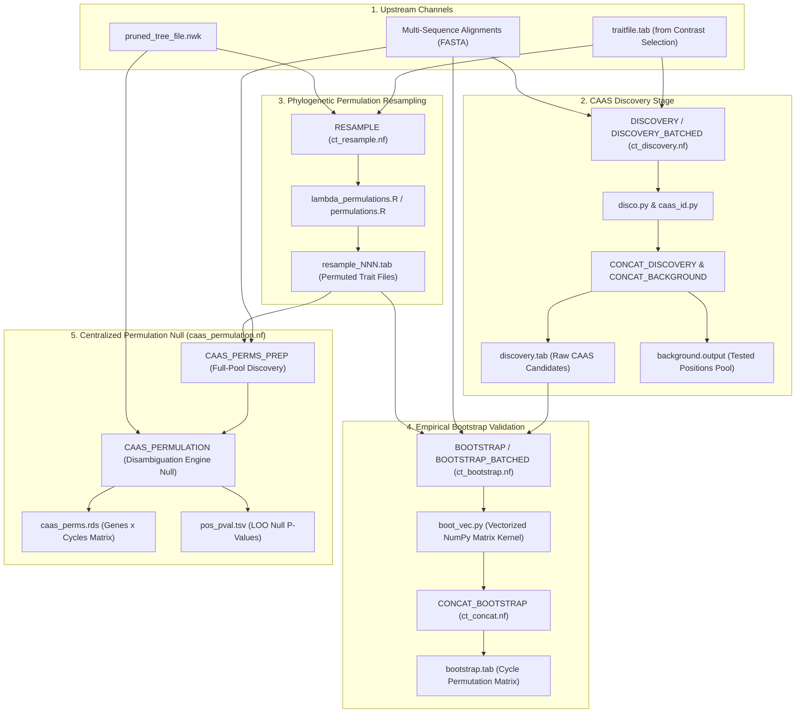

# PhyloPhere Methodological Archive: Entry 03
# Workflow: CAAS Discovery, Resampling & Permulation Null Models (`ct.nf`)

**Author / Specification**: Miguel Ramon Alonso (`miguel.ramon@upf.edu`)  
**Workflow File**: `workflows/ct.nf`  
**Subworkflows Consumed**: `subworkflows/CT/` (`ct_discovery.nf`, `ct_resample.nf`, `ct_bootstrap.nf`, `ct_concat.nf`, `caas_permulation.nf`)  
**Core Python Modules**: `disco.py`, `boot.py`, `boot_vec.py`, `caas_id.py`, `caap_id.py`, `alimport.py`, `pindex.py`, `runslice.py`, `hyper.py`  
**Core R Engines**: `lambda_permulations.R`, `permulations.R`, `count_diverging_pairs.R`  
**Target Publication**: Molecular Biology and Evolution, Convergent Genomics & Statistical Methods  

---

## 1. Scientific & Methodological Rationale

Convergent Amino Acid Substitutions (CAAS) are molecular signatures where independent evolutionary lineages displaying a shared phenotype exhibit identical or biochemically equivalent amino acid states. Detecting authentic CAAS across genome-wide multi-sequence alignments requires:
1. **Pair-Aware Substitution Scanning**: CAAS must be evaluated across the independent phylogenetic contrast pairs defined during contrast selection, ensuring that foreground and background comparisons directly reflect sister-lineage divergences.
2. **Gap & Ambiguity Control**: Alignments frequently contain lineage-specific deletions, insertions, or sequencing errors. PhyloPhere implements pair-aware gap and missing data filters that eliminate alignment artifacts without biasing discovery towards conserved regions.
3. **Phylogeny-Preserving Permulation Nulls**: Randomly shuffling phenotypes across tree tips destroys phylogenetic autocorrelation, creating unrealistic null models that severely underestimate the null substitution rate. PhyloPhere generates phylogenetic permulations under continuous Brownian motion and Pagel's $\lambda$ models to derive empirically grounded null distributions.



---

## 2. Nextflow DSL2 Workflow Architecture

### 2.1 Process Execution Graph

`CT` is triggered in `main.nf` via `--ct_tool`:
- Accepted sub-modules: `--ct_tool "discovery,resample,bootstrap"`
- Execution uses batched process scheduling (`DISCOVERY_BATCHED`, `BOOTSTRAP_BATCHED`) to maximize throughput on HPC clusters.

```groovy
workflow CT {
    take:
        trait_file_in
        bootstrap_trait_file_in
        tree_file_in

    main:
        // 1. Channelize alignments with optional toy_mode subsampling
        align_tuple = Channel.fromList(allFiles.collect { f -> tuple(f.baseName, f) })

        // 2. CAAS Discovery
        if (toolsToRun.contains('discovery')) {
            discovery_out = DISCOVERY_BATCHED(discovery_batches, trait_file_out)
            CONCAT_DISCOVERY(discovery_out.discovery_out.collect())
            CONCAT_BACKGROUND(discovery_out.background_out.collect())
        }

        // 3. Trait Permulation Resampling
        if (toolsToRun.contains('resample')) {
            resample_dir_out = RESAMPLE(nw_tree, caas_config, trait_values)
            CONCAT_RESAMPLE(resample_dir_out)
        }

        // 4. Empirical Bootstrap Permutation Testing
        if (toolsToRun.contains('bootstrap')) {
            bootstrap_in = align_with_discovery.combine(resample_dir_out)
            bootstrap_out = BOOTSTRAP_BATCHED(bootstrap_batches, trait_file_out)
            bootstrap_concat_out = CONCAT_BOOTSTRAP(ctBootstrapOut.collect())

            // 5. CAAS Permulation-Excess Matrix Generation
            if (params.caas_permulation_enrichment) {
                perms_prep = CAAS_PERMS_PREP(align_tuple, trait_file_out, resample_dir_out)
            }
        }

    emit:
        discovery_file       = CONCAT_DISCOVERY.out.discovery_concat
        background_file      = CONCAT_BACKGROUND.out.background_concat
        background_file_raw  = background_raw_out
        background_genes     = CONCAT_BACKGROUND.out.background_genes
        bootstrap_file       = CONCAT_BOOTSTRAP.out.bootstrap_concat
        caas_perm_discovery  = perms_prep.perm_discovery
        caas_resample_subset = perms_prep.resample_subset
}
```

---

## 3. Core Computational & Algorithmic Modules

### 3.1 CAAS Pattern Recognition Engine (`caas_id.py` & `disco.py`)

For each alignment column (amino acid position $p$), the engine extracts amino acids across all species in the active trait file, grouping them into foreground ($\mathcal{A}_{\text{FG}}$) and background ($\mathcal{A}_{\text{BG}}$) residue sets:
$$\mathcal{A}_{\text{FG}} = \{a_{s, p} \mid s \in S_{\text{FG}}, a_{s, p} \neq '-'\}, \quad \mathcal{A}_{\text{BG}} = \{a_{s, p} \mid s \in S_{\text{BG}}, a_{s, p} \neq '-'\}$$

#### 1. Pattern Classification Matrix
PhyloPhere classifies position patterns into four discrete evolutionary classes:

| Pattern ID | Name | Formal Condition | Evolutionary Interpretation |
|---|---|---|---|
| **Pattern 1** | *Strict Homogeneous Parallel* | $|\mathcal{A}_{\text{FG}}| = 1 \land |\mathcal{A}_{\text{BG}}| = 1 \land \mathcal{A}_{\text{FG}} \cap \mathcal{A}_{\text{BG}} = \emptyset$ | Identical convergent substitution across all foreground lineages against a fixed background. |
| **Pattern 2** | *Homogeneous Target / Heterogeneous Background* | $|\mathcal{A}_{\text{FG}}| = 1 \land |\mathcal{A}_{\text{BG}}| > 1 \land \mathcal{A}_{\text{FG}} \cap \mathcal{A}_{\text{BG}} = \emptyset$ | Convergence to a specific amino acid in foreground lineages from diverse ancestral states. |
| **Pattern 3** | *Heterogeneous Target / Homogeneous Background* | $|\mathcal{A}_{\text{FG}}| > 1 \land |\mathcal{A}_{\text{BG}}| = 1 \land \mathcal{A}_{\text{FG}} \cap \mathcal{A}_{\text{BG}} = \emptyset$ | Diverse derived amino acids in foreground departing from a conserved background residue. |
| **Pattern 4** | *General Divergent Convergence* | $|\mathcal{A}_{\text{FG}}| > 1 \land |\mathcal{A}_{\text{BG}}| > 1 \land \mathcal{A}_{\text{FG}} \cap \mathcal{A}_{\text{BG}} = \emptyset$ | Multi-state divergence between foreground and background clades. |

#### 2. Conserved Pair Relaxation (`--max_conserved`)
Under strict mode (`max_conserved = 0`), zero overlap is tolerated ($\mathcal{A}_{\text{FG}} \cap \mathcal{A}_{\text{BG}} = \emptyset$). When `--max_conserved = k > 0`, the engine permits up to $k$ contrast pairs to share the same residue between paired species, accommodating lineage-specific reversions or incomplete lineage sorting.

#### 3. Pair-Aware Gap & Missing Data Filters
To avoid counting spurious substitutions caused by missing sequence in one pair partner, `--miss_pair` enforces paired completeness:
- If species $s_{\text{FG}, i}$ is missing or gapped, its paired partner $s_{\text{BG}, i}$ must be excluded from that position's pattern calculation.

---

### 3.2 Hypergeometric Statistical Significance (`hyper.py`)

For each candidate CAAS position, an analytical upper-tail Fisher's Exact / Hypergeometric test is computed against the amino acid background distribution:
$$P(X \ge k) = \sum_{i=k}^{\min(n, K)} \frac{\binom{K}{i} \binom{N - K}{n - i}}{\binom{N}{n}}$$
Where:
- $N$: Total number of ungapped species in alignment.
- $K$: Total occurrences of the candidate amino acid across all species.
- $n$: Number of foreground species.
- $k$: Occurrences of candidate amino acid in the foreground set.

---

### 3.3 Phylogenetic Permulation & Resampling Engine (`lambda_permulations.R`)

To construct an empirical null distribution preserving the phylogenetic tree covariance, `RESAMPLE` generates $B$ permulated trait configurations:

1. **Continuous Brownian Motion Permulation**:
   Simulates continuous trait evolution along tree $T$ under Pagel's $\lambda$ covariance:
   $$\mathbf{Y} \sim \mathcal{N}\left(\mu \mathbf{1}, \sigma^2 \mathbf{V}(\lambda)\right), \quad \mathbf{V}(\lambda)_{ij} = \begin{cases} d(r, \text{mrca}(i, j)) \cdot \lambda & i \neq j \\ d(r, i) & i = j \end{cases}$$
2. **Quantile Re-Discretization**: Lineages in simulation cycle $b \in \{1, \dots, B\}$ are assigned to permuted foreground ($FG_b$) and background ($BG_b$) sets following the identical quantile thresholds applied to the empirical trait.
3. **Partitioned Storage**: Permutations are exported into partitioned files `resample_001.tab`, `resample_002.tab`, ..., `resample_NNN.tab` to enable parallel worker scaling during the bootstrap phase.

---

### 3.4 Vectorized Bootstrap Testing (`boot_vec.py`)

The `BOOTSTRAP` step recalculates CAAS pattern occurrences across all $B$ permulated cycles. To achieve extreme throughput across 20,000+ genes:
- Alignment columns are converted into integer NumPy arrays ($\mathbb{Z}^{S \times L}$).
- Permuted trait sets are broadcast as boolean index masks.
- Intersection, pattern counting, and non-overlap tests are evaluated via vectorized tensor reductions:
  $$\text{OverlapMatrix}_{b, p} = \left(\mathbf{M}_{\text{FG}, b} \otimes \mathbf{A}\right) \odot \left(\mathbf{M}_{\text{BG}, b} \otimes \mathbf{A}\right)$$
- Emits per-cycle substitution counts into `bootstrap.tab`.

---

## 4. Parameter Space & Configuration Reference

| Parameter | Type | Default | Description |
|---|---|---|---|
| `--ct_tool` | String | `""` | Comma-separated execution targets: `discovery`, `resample`, `bootstrap`. |
| `--ct_discovery_batch_size`| Integer | `1` (local) / `100` (slurm) | Number of alignments bundled per discovery job. |
| `--ct_bootstrap_batch_size`| Integer | `1` (local) / `25` (slurm) | Number of alignments bundled per bootstrap job. |
| `--max_fg_gaps` | Integer / String | `'0'` | Maximum allowed gaps in foreground species. |
| `--max_bg_gaps` | Integer / String | `'0'` | Maximum allowed gaps in background species. |
| `--max_overall_gaps` | Integer / String | `'NO'` | Maximum allowed gaps across all species combined. |
| `--max_fg_miss` | Integer / String | `'0'` | Maximum allowed missing species in foreground. |
| `--max_bg_miss` | Integer / String | `'0'` | Maximum allowed missing species in background. |
| `--miss_pair` | Boolean | `true` | Enforces pair-aware missing/gap symmetry. |
| `--max_conserved` | Integer | `0` | Number of tolerated conserved pairs (relaxation parameter). |
| `--caap_mode` | Boolean | `false` | Enables Convergent Amino Acid Property mode (biochemical clusters). |
| `--cycles` | Integer | `1000` | Number of phylogenetic permulation cycles for bootstrap testing. |
| `--caas_permulation_enrichment`| Boolean | `false` | Enables full-pool permulation matrix extraction for downstream scoring. |

---

## 5. Artifact Schemas & Published Outputs

### 5.1 `discovery.tab`
```tsv
Gene	Position	Pattern	P_value	FG_AAs	BG_AAs	FG_Species	BG_Species
TP53	175	1	0.00042	R,R,R	H,H,H	Homo_sapiens,Loxodonta_africana,Balaenoptera_musculus	Pan_troglodytes,Procavia_capensis,Hippopotamus_amphibius
```

### 5.2 `background.output`
Comprehensive list of all tested amino acid positions passing coverage and gap thresholds:
```tsv
TP53	1
TP53	2
...
TP53	393
```

### 5.3 `bootstrap.tab`
Matrix recording CAAS occurrences for each gene across permulation cycles:
```tsv
Gene	Cycle	N_CAAS	Positions
TP53	1	0	None
TP53	2	1	175
TP53	3	0	None
...
TP53	1000	0	None
```

### 5.4 Output Directory Tree
```
${params.outdir}/
├── caastools/
│   ├── discovery.tab
│   ├── background.output
│   ├── resample.tab
│   └── bootstrap.tab
└── caas_permulation/
    ├── resample_perms.tab
    ├── perm_disc/
    │   ├── discovery_batch_00001.bootstrap.discovery.output
    │   └── discovery_batch_00002.bootstrap.discovery.output
    └── caas_perms.rds
```
