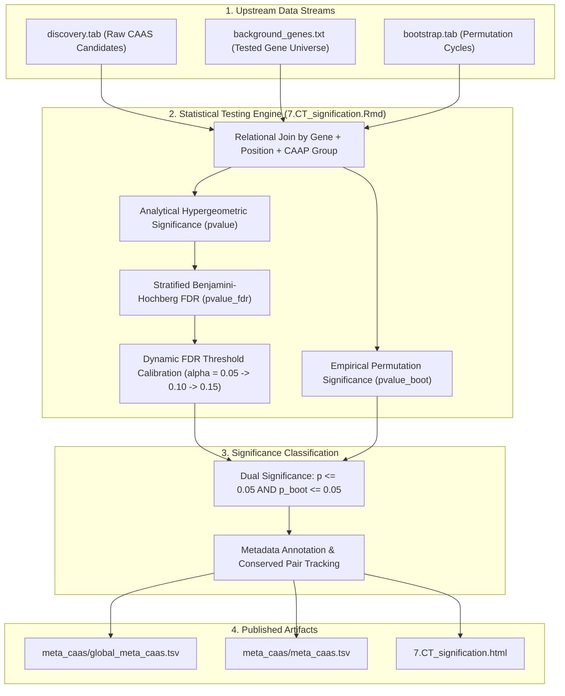

# PhyloPhere Methodological Archive: Entry 04
# Workflow: CAAS Statistical Significance & Signification (`ct_signification.nf`)

**Author / Specification**: Miguel Ramon Alonso (`miguel.ramon@upf.edu`)  
**Workflow File**: `workflows/ct_signification.nf`  
**Subworkflows Consumed**: `subworkflows/CT_SIGNIFICATION/` (`ctpp_signification.nf`)  
**Associated HTML Reports**: `7.CT_signification.html`  
**Key Outputs**: `global_meta_caas.tsv`, `meta_caas.tsv`  
**Target Publication**: Biometrical Genetics, Statistical Genomics & Evolutionary Bioinformatics  

---

## 1. Scientific & Methodological Rationale

Raw Convergent Amino Acid Substitution (CAAS) candidates identified across multi-sequence alignments contain false positives generated by:
1. **Background Sequence Conservation**: Positions highly conserved across all vertebrates trivially appear convergent if foreground lineages happen to share the conserved state.
2. **Phylogenetic Branch-Length Biases**: Clades with long internal branches accumulate more neutral substitutions by chance.
3. **Multiple Hypothesis Testing**: Across millions of aligned amino acid positions, standard unadjusted significance thresholds generate hundreds of spurious candidate sites.

The `CT_SIGNIFICATION` workflow integrates two independent statistical testing regimes:
- **Analytical Hypergeometric Upper-Tail Test**: Quantifies whether the observed concentration of a residue in foreground species is statistically enriched relative to the background species sequence pool.
- **Empirical Phylogenetic Permutation Test**: Directly compares candidate positions against the $B$ phylogenetic permulation null cycles generated by `BOOTSTRAP`, estimating empirical p-values ($p_{\text{boot}}$) that preserve tree covariance.
- **Biochemical Scheme-Aware FDR Correction**: Applies Benjamini-Hochberg (BH) false discovery rate adjustments stratified by amino acid biochemical property group (`caap_group`).



---

## 2. Nextflow DSL2 Workflow Architecture

### 2.1 Process Execution Graph

`CT_SIGNIFICATION` executes automatically whenever bootstrap outputs are produced or standalone via `--bootstrap_from`:

```groovy
workflow CT_SIGNIFICATION {
    take:
        discovery_input_channel
        background_genes_channel
        bootstrap_input_channel

    main:
        // 1. Resolve Discovery Channel (Live vs --discovery_from fallback)
        // 2. Resolve Global Background Genes Channel (Live vs --background_input fallback)
        // 3. Resolve Bootstrap Permutations (Live vs --bootstrap_from directory/file)

        // 4. Non-empty data guard: terminates gracefully if discovery contains 0 candidates
        def discovery_file_nonempty = discovery_with_counts
            .filter { f, row_count ->
                if (row_count <= 1) {
                    exit 0, "No CAAS discoveries found (header-only discovery file: ${f}). Stopping pipeline gracefully."
                }
                return true
            }

        // 5. Execute R Markdown statistical signification engine
        signification_results = CAAS_SIGNIFICATION_REPORT(
            discovery_file_nonempty,
            global_background_genes,
            bootstrap_files
        )

    emit:
        signification_report      = signification_results.report
        signification_meta_caas   = signification_results.meta_caas
        signification_global_meta = signification_results.global_meta_caas
}
```

---

## 3. Mathematical & Statistical Formulation

### 3.1 Dual Significance Model

A candidate substitution at gene $g$, position $p$ is evaluated under two distinct statistical hypotheses:

#### 1. Hypergeometric Test ($p_{\text{hyp}}$)
Tests the null hypothesis ($H_0$) that foreground species are randomly drawn from the set of all aligned species with respect to amino acid identity:
$$P(X \ge k) = 1 - \sum_{i=0}^{k-1} \frac{\binom{K}{i}\binom{N - K}{n - i}}{\binom{N}{n}}$$
Where $N$ is total ungapped species, $K$ is total species exhibiting the target residue, $n$ is foreground species count, and $k$ is foreground target residue count.

#### 2. Empirical Permutation Test ($p_{\text{boot}}$)
Tests the null hypothesis ($H_0$) that the observed CAAS pattern arose by neutral phylogenetic drift along the tree topology. Calculated across $B$ permulation cycles:
$$p_{\text{boot}} = \frac{\sum_{b=1}^{B} \mathbf{1}\left(k_b \ge k_{\text{obs}}\right) + 1}{B + 1}$$
Where $k_{\text{obs}}$ is the observed number of foreground matches, and $k_b$ is the number of matches obtained under permulation cycle $b$.

#### 3. Dual Significance Criterion
A position is flagged as statistically significant (`is_significant = TRUE`) if and only if:
$$p_{\text{hyp}} \le 0.05 \quad \land \quad p_{\text{boot}} \le 0.05$$

---

### 3.2 Dynamic False Discovery Rate (FDR) Calibration

Because multiple testing burden varies drastically across datasets, PhyloPhere applies a **Dynamic FDR Escalation Strategy**:
1. Within each biochemical scheme ($g \in \text{caap\_group}$), Benjamini-Hochberg adjusted values are computed:
   $$q_i = \min_{j \ge i} \left( \frac{m \cdot p_{(j)}}{j} \right)$$
2. The operational significance threshold $\alpha_{\text{FDR}}$ is selected dynamically:
   $$\alpha_{\text{FDR}} = \begin{cases} 0.05 & \text{if } \exists i : q_i \le 0.05 \\ 0.10 & \text{if } (\forall i : q_i > 0.05) \land (\exists i : q_i \le 0.10) \\ 0.15 & \text{otherwise} \end{cases}$$
This prevents zero-discovery bottlenecks in underpowered comparative cohorts while maintaining controlled false discovery limits.

---

## 4. Parameter Space & Configuration Reference

| Parameter | Type | Default | Description |
|---|---|---|---|
| `--discovery_from` | Path | `null` | Precomputed `discovery.tab` or directory of discovery outputs. |
| `--bootstrap_from` | Path | `null` | Precomputed `bootstrap.tab` or directory of bootstrap permutation files. |
| `--background_input` | Path | `null` | Precomputed background gene list or directory. |
| `--caap_mode` | Boolean | `false` | Enables group-aware multi-scheme significance evaluation. |
| `--alpha` | Float | `0.05` | Nominal significance threshold for dual hypothesis testing. |

---

## 5. Artifact Schemas & Published Outputs

### 5.1 `global_meta_caas.tsv` / `meta_caas.tsv`
Comprehensive position-level metadata file linking discovery features, empirical statistics, and significance flags:
```tsv
Gene	Position	GenePos	pattern	pvalue	pvalue_boot	occurrences	total	pvalue_fdr	alpha_fdr	is_significant	sig_hyp	sig_perm	sig_hyp_fdr	caap_group	FG_AAs	BG_AAs	FG_Species	BG_Species
TP53	175	TP53@175	1	0.00042	0.00199	2	1000	0.01250	0.05	TRUE	TRUE	TRUE	TRUE	US	R,R,R	H,H,H	Homo_sapiens,Loxodonta_africana,Balaenoptera_musculus	Pan_troglodytes,Procavia_capensis,Hippopotamus_amphibius
```

### 5.2 Output Directory Tree
```
${params.outdir}/
├── html_reports/
│   └── 7.CT_signification.html
└── signification/
    ├── meta_caas/
    │   ├── global_meta_caas.tsv
    │   └── meta_caas.tsv
    └── CAAS_signification_files/
        ├── significance_volcano_plots.png
        └── empirical_pvalue_distributions.png
```
