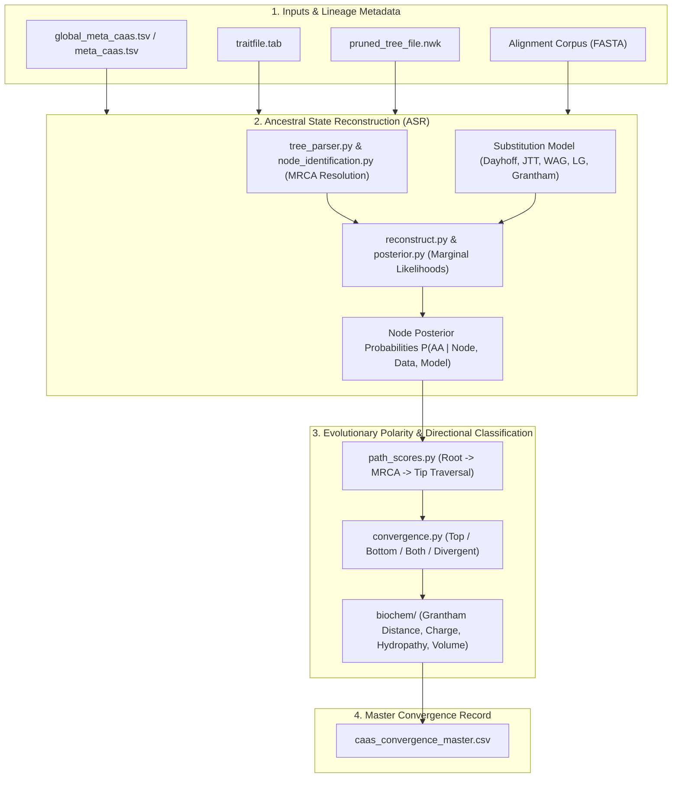
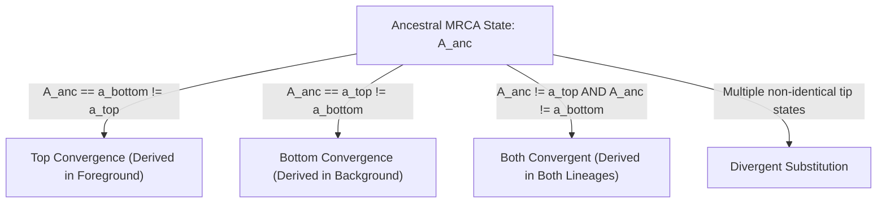

# PhyloPhere Methodological Archive: Entry 05
# Workflow: Ancestral State Reconstruction & CAAS Disambiguation (`ct_disambiguation.nf`)

**Author / Specification**: Miguel Ramon Alonso (`miguel.ramon@upf.edu`)  
**Workflow File**: `workflows/ct_disambiguation.nf`  
**Subworkflows Consumed**: `subworkflows/CT_DISAMBIGUATION/` (`ct_disambiguation.nf`)  
**Core Python Engines**: `disambiguation_main.py`, `disambiguation_perms_main.py`, `reaggregate_perm_scores.py`  
**Core Modules**: `asr/` (`reconstruct.py`, `posterior.py`, `tree_parser.py`, `node_identification.py`), `convergence/` (`convergence.py`, `patterns.py`), `biochem/` (`grantham.py`, `charge.py`, `polarity.py`, `volume.py`, `hydropathy.py`)  
**Key Output**: `ct_disambiguation/caas_convergence_master.csv`  
**Target Publication**: Systematic Biology, Molecular Evolution & Phylogenetics  

---

## 1. Scientific & Methodological Rationale

When a sequence alignment column displays amino acid differences between foreground and background contrast pairs, alignment-based scanning alone cannot determine **which lineage underwent evolutionary change**. A state difference $A \neq B$ between paired sister taxa could represent:
1. **Foreground Adaptation (Top Convergence)**: The ancestral lineage possessed state $B$ (conserved in background), and foreground lineages independently substituted to state $A$ ($B \to A$).
2. **Background Divergence (Bottom Convergence)**: The ancestral lineage possessed state $A$ (conserved in foreground), and background lineages independently substituted to state $B$ ($A \to B$).
3. **Bidirectional Evolution (Both Convergent)**: The ancestral lineage possessed an intermediate state $C$, and both foreground and background lineages independently changed ($C \to A$ and $C \to B$).
4. **Divergent Drift**: Lineages underwent non-convergent random substitutions.

`CT_DISAMBIGUATION` resolves this evolutionary polarity through **Maximum Likelihood Ancestral State Reconstruction (ASR)** across internal tree nodes and Most Recent Common Ancestors (MRCAs).



---

## 2. Nextflow DSL2 Workflow Architecture

### 2.1 Process Execution Graph

`CT_DISAMBIGUATION` runs downstream of `CT_SIGNIFICATION`:

```groovy
workflow CT_DISAMBIGUATION {
    take:
        meta_caas_channel
        trait_file_channel
        tree_file_channel

    main:
        // Execute Python multiprocessing disambiguation engine
        disambig_out = CT_DISAMBIGUATION_RUN(
            meta_caas_channel,
            trait_file_channel,
            tree_file_channel
        )

    emit:
        results_dir = disambig_out.results_dir
        master_csv  = disambig_out.master_csv
}
```

---

## 3. Mathematical & Algorithmic Formulation

### 3.1 Maximum Likelihood Marginal Ancestral State Reconstruction

Let $T = (V, E)$ be the phylogenetic tree with tip data $\mathbf{D}_p$ observed at amino acid position $p$. For any internal node $u \in V_{\text{internal}}$ (e.g., the root $r$, the MRCA of contrast pair $k$, or the MRCA of all foreground lineages), the marginal posterior probability of amino acid state $a \in \{1, \dots, 20\}$ is:
$$P(X_u = a \mid \mathbf{D}_p, T, \mathbf{Q}) = \frac{P(\mathbf{D}_p, X_u = a \mid T, \mathbf{Q})}{\sum_{b=1}^{20} P(\mathbf{D}_p, X_u = b \mid T, \mathbf{Q})}$$
Where:
- $\mathbf{Q} = \mathbf{S} \boldsymbol{\Pi}$ is the instantaneous amino acid substitution rate matrix specified by `--ct_disambig_asr_model` (e.g., Dayhoff, JTT, WAG, LG).
- Transition probabilities along branch $e = (u, v)$ with length $t$ are evaluated via matrix exponentiation:
  $$\mathbf{P}(t) = \exp(\mathbf{Q} t)$$
- Node likelihoods are calculated using Felsenstein's Tree Pruning Algorithm and posterior decoding.

---

### 3.2 Directional Classification Taxonomy

Let:
- $A_{\text{anc}}(k)$ be the reconstructed ancestral amino acid state at the MRCA of contrast pair $k$.
- $a_{\text{top}}(k)$ be the tip state of the foreground (phenotype positive) species in pair $k$.
- $a_{\text{bottom}}(k)$ be the tip state of the background (phenotype negative) species in pair $k$.

PhyloPhere classifies each contrast pair $k$ into one of four directional categories:



| Directional Class | Mathematical Condition Across Pairs | Biological Interpretation |
|---|---|---|
| **`top`** (Convergent Top) | $\forall k: A_{\text{anc}}(k) = a_{\text{bottom}}(k) \land a_{\text{top}}(k) \neq A_{\text{anc}}(k)$ | Derived substitution specifically associated with target phenotype evolution. |
| **`bottom`** (Convergent Bottom) | $\forall k: A_{\text{anc}}(k) = a_{\text{top}}(k) \land a_{\text{bottom}}(k) \neq A_{\text{anc}}(k)$ | Ancestral state preserved in foreground; background lineages diverged. |
| **`both`** (Convergent Both) | $\forall k: A_{\text{anc}}(k) \neq a_{\text{top}}(k) \land A_{\text{anc}}(k) \neq a_{\text{bottom}}(k)$ | Both foreground and background lineages evolved derived residues from an ancestral state. |
| **`divergent`** | Variable / non-identical derived states | Lineages diverged without homoplastic convergence. |

---

### 3.3 Physicochemical Shift Scoring (`biochem/`)

For every ancestral-to-derived substitution step ($A_{\text{anc}} \to a_{\text{derived}}$), PhyloPhere computes structural and physicochemical transition vectors:
1. **Grantham Distance**:
   $$D_{\text{Grantham}}(a_1, a_2) = \sqrt{\alpha (c_1 - c_2)^2 + \beta (p_1 - p_2)^2 + \gamma (v_1 - v_2)^2}$$
   Where $c$ is composition/carbon atom count, $p$ is polarity, $v$ is molecular volume, and $\alpha, \beta, \gamma$ are Grantham weighting coefficients ($1.801, 1.087, 0.034$).
2. **Net Charge Shift**: $\Delta \text{Charge} = \text{Charge}(a_{\text{derived}}) - \text{Charge}(A_{\text{anc}})$.
3. **Hydropathy Shift**: $\Delta \text{Hydropathy} = \text{KD}(a_{\text{derived}}) - \text{KD}(A_{\text{anc}})$ (Kyte-Doolittle index).
4. **Isoelectric Point & Polarity Category Changes**: Classified into Acidic, Basic, Polar Neutral, and Hydrophobic shifts.

---

## 4. Parameter Space & Configuration Reference

| Parameter | Type | Default | Description |
|---|---|---|---|
| `--ct_disambiguation` | Boolean | `false` | Enables ancestral state reconstruction and directional classification. |
| `--ct_disambig_asr_mode` | String | `'fast'` | ASR mode (`'fast'` uses cached tree decodings; `'full'` computes de novo). |
| `--ct_disambig_asr_model` | String | `'Dayhoff'` | Empirical amino acid substitution matrix (`'Dayhoff'`, `'JTT'`, `'WAG'`, `'LG'`). |
| `--ct_disambig_convergence_mode`| String | `'focal_clade'`| Lineage evaluation scope (`'focal_clade'`, `'all_pairs'`). |
| `--ct_disambig_posterior_threshold`| Float | `0.5` | Minimum posterior probability required to accept an ancestral node call. |
| `--ct_disambig_max_tasks_per_child`| Integer | `100` | Process recycling threshold preventing memory leaks during tree parsing. |

---

## 5. Artifact Schemas & Published Outputs

### 5.1 `caas_convergence_master.csv`
Master dataset consolidating all CAAS events, directional categories, ancestral probabilities, and physicochemical transitions:
```csv
gene,position,caap_group,pattern,pvalue,recovery_boot,pvalue_fdr,is_significant,convergence_type,change_top,change_bottom,anc_state_root,anc_state_mrca,grantham_distance_top,charge_diff_top,hydropathy_diff_top,volume_diff_top
TP53,175,US,1,0.00042,0.00199,0.0125,TRUE,convergent_top,convergent,no_change,H,H,29,1,-1.2,15.4
```

### 5.2 Output Directory Tree
```
${params.outdir}/
└── ct_disambiguation/
    ├── caas_convergence_master.csv
    ├── asr_diagnostics.log
    └── per_model_evaluations/
        ├── Dayhoff_posteriors.tsv
        └── JTT_posteriors.tsv
```
