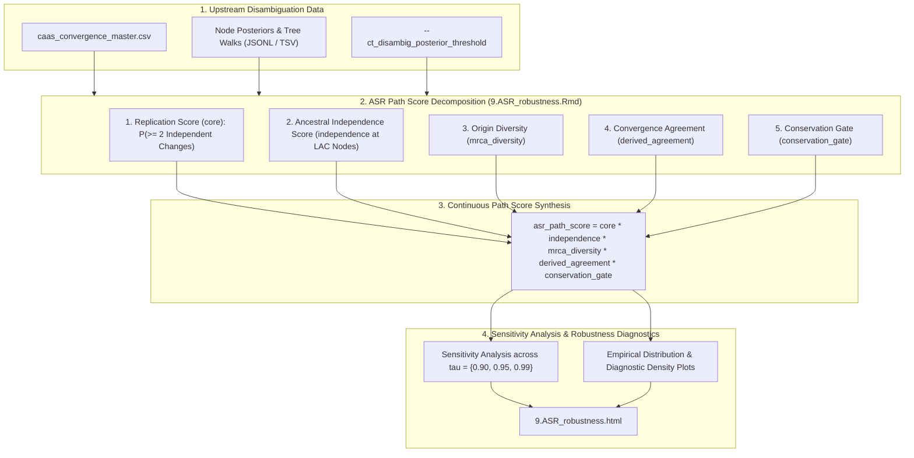

# PhyloPhere Methodological Archive: Entry 06
# Workflow: Ancestral State Reconstruction Robustness & Sensitivity (`asr_robustness.nf`)

**Author / Specification**: Miguel Ramon Alonso (`miguel.ramon@upf.edu`)  
**Workflow File**: `workflows/asr_robustness.nf`  
**Subworkflows Consumed**: `subworkflows/ASR_ROBUSTNESS/` (`asr_robustness.nf`)  
**Associated HTML Report**: `9.ASR_robustness.html`  
**Key Output**: `asr_robustness/tsv/`, `asr_robustness/plots/`  
**Target Publication**: Molecular Phylogenetics and Evolution, Sensitivity Analysis in Evolutionary Models  

---

## 1. Scientific & Methodological Rationale

Ancestral State Reconstruction (ASR) is inherently subject to model uncertainty. Substitution matrices (Dayhoff, JTT, WAG, LG) make varying assumptions regarding amino acid exchangeabilities and equilibrium frequencies. Furthermore, when ancestral branch lengths are long or phylogenetic nodes lack dense taxonomic sampling, Maximum A Posteriori (MAP) reconstructions can exhibit high posterior entropy.

Relying on hard binary posterior probability cutoffs (e.g., $P > 0.5$) risks two failure modes:
1. **False Homoplasy**: Reconstructing an incorrect ancestral state creates an illusion of convergent substitutions when the true state was conserved.
2. **False Rejection**: Rejecting sites with slightly lower posterior confidence ($P = 0.89$) in deep nodes eliminates genuine ancient adaptive substitutions.

`ASR_ROBUSTNESS` addresses these limitations by establishing a **continuous probabilistic path score framework (`asr_path_score`)** that evaluates evolutionary independence, ancestral node entropy, derived residue agreement, and sensitivity across posterior threshold regimes ($\tau \in \{0.90, 0.95, 0.99\}$).



---

## 2. Nextflow DSL2 Workflow Architecture

### 2.1 Process Execution Graph

`ASR_ROBUSTNESS` executes downstream of `CT_DISAMBIGUATION_RUN`, running concurrently with post-processing:

```groovy
workflow ASR_ROBUSTNESS {
    take:
        disambiguation_dir_channel

    main:
        // 1. Resolve disambiguation directory (Live directory or --disambiguation_dir)
        // 2. Extract tarballs if precomputed input is an archive (EXTRACT_DISAMBIG_DIR)
        // 3. Render ASR robustness report
        robustness_output = ASR_ROBUSTNESS_REPORT(disambig_dir_ch, threshold_ch)

    emit:
        report = robustness_output.report // 9.ASR_robustness.html
        tables = robustness_output.tables // tsv/**
        plots  = robustness_output.plots  // plots/**
}
```

---

## 3. Mathematical & Probabilistic Formulation of `asr_path_score`

Rather than applying a binary step function, PhyloPhere models ASR confidence along the tree traversal path as a composite multiplicative continuous metric:
$$\text{ASR\_Path\_Score} = S_{\text{core}} \times S_{\text{independence}} \times S_{\text{mrca\_diversity}} \times S_{\text{derived\_agreement}} \times S_{\text{conservation\_gate}}$$

### 3.1 Score Subcomponents

#### 1. Replication Score ($S_{\text{core}}$)
Calculates the joint combinatorial probability that at least two independent contrast pairs underwent evolutionary change in the specified phenotypic direction (top or bottom):
$$S_{\text{core}} = P(\ge 2 \text{ independent changes}) = 1 - P(0 \text{ changes}) - P(1 \text{ change})$$
Where $P(\text{change}_k) = P(A_{\text{anc}}(k) \neq a_{\text{tip}}(k))$ is derived from the posterior marginal probabilities at the pair's MRCA node.

#### 2. Ancestral Independence Score ($S_{\text{independence}}$)
Penalizes situations where the derived residue was already present at the Lowest Ancestral Clade (LAC) node uniting the contrast pairs, which would indicate a single ancestral substitution inherited by descent rather than true convergence:
$$S_{\text{independence}} = \prod_{u \in \text{LAC}} \left( 1 - P(X_u = a_{\text{derived}}) \right)$$

#### 3. MRCA Diversity Score ($S_{\text{mrca\_diversity}}$)
Quantifies whether convergence originated from identical ancestral states (parallel evolution) or distinct ancestral amino acids (convergent evolution):
$$S_{\text{mrca\_diversity}} = 1 - \frac{1}{|K|} \sum_{k=1}^{|K|} \mathbf{1}(A_{\text{anc}}(k) = A_{\text{consensus}})$$

#### 4. Derived State Agreement Score ($S_{\text{derived\_agreement}}$)
Penalizes divergence among foreground tip residues when classifying sites as strictly convergent:
$$S_{\text{derived\_agreement}} = \max_{a \in \mathcal{A}} \left( \frac{\sum_{k=1}^K \mathbf{1}(a_{\text{top}}(k) = a)}{K} \right)$$

#### 5. Conservation Gate ($S_{\text{conservation\_gate}}$)
Evaluates background control pairs. Deep sequence conservation in outgroup control lineages increases confidence, whereas neutral drift in controls scales the score downwards.

---

### 3.2 Threshold Sensitivity Diagnostics

The companion R Markdown engine (`9.ASR_robustness.Rmd`) computes site retention and classification stability matrices across three strict posterior thresholds:
$$\tau \in \{0.90, 0.95, 0.99\}$$
- Evaluates the proportion of CAAS sites that remain robustly classified as `convergent_top`, `convergent_bottom`, or `convergent_both` under increasing stringency.
- Outputs cumulative frequency tables and distribution plots without altering downstream pipeline execution.

---

## 4. Parameter Space & Configuration Reference

| Parameter | Type | Default | Description |
|---|---|---|---|
| `--ct_disambig_posterior_threshold` | Float | `0.95` | Canonical posterior probability threshold for filtering focal MRCA nodes. |
| `--disambiguation_dir` | Path | `null` | Path to standalone `ct_disambiguation/` directory or `.tar.gz` archive. |
| `--ct_disambig_run_diagnostics` | Boolean | `true` | Enables extraction of per-node posterior JSONL logs for global entropy estimation. |

---

## 5. Artifact Schemas & Published Outputs

### 5.1 `asr_robustness/tsv/asr_path_scores.tsv`
```tsv
gene	position	caap_group	convergence_type	asr_path_score	core_score	independence_score	mrca_diversity_score	derived_agreement_score	conservation_gate_score	min_mrca_posterior
TP53	175	US	convergent_top	0.9421	0.9850	0.9912	0.9500	1.0000	1.0000	0.9845
```

### 5.2 `asr_robustness/tsv/threshold_sensitivity.tsv`
```tsv
threshold	total_sites	retained_sites	pct_retained	convergent_top	convergent_bottom	convergent_both	divergent
tau_0.90	1250	1180	94.4%	620	410	95	55
tau_0.95	1250	1045	83.6%	560	370	75	40
tau_0.99	1250	780	62.4%	420	280	50	30
```

### 5.3 Output Directory Tree
```
${params.outdir}/
├── html_reports/
│   └── 9.ASR_robustness.html
└── asr_robustness/
    ├── tsv/
    │   ├── asr_path_scores.tsv
    │   ├── threshold_sensitivity.tsv
    │   └── per_gene_entropy.tsv
    └── plots/
        ├── asr_path_score_distribution.png
        ├── posterior_threshold_sensitivity_curve.png
        └── subscore_correlation_matrix.png
```
