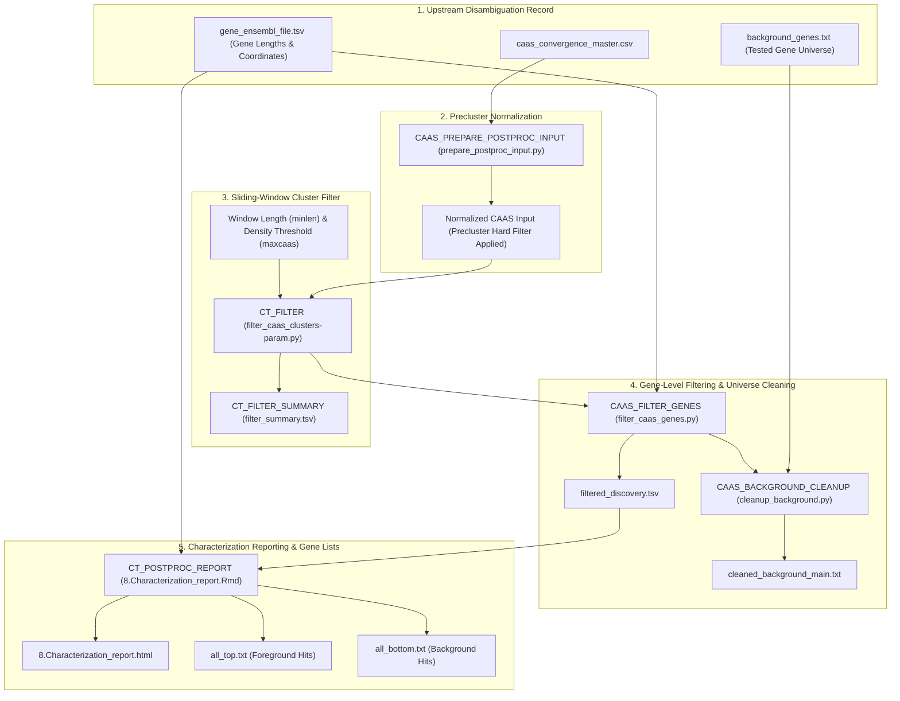

# PhyloPhere Methodological Archive: Entry 07
# Workflow: CAAS Post-Processing, Cluster Filtering & Genomic Universe Cleaning (`ct_postproc.nf`)

**Author / Specification**: Miguel Ramon Alonso (`miguel.ramon@upf.edu`)  
**Workflow File**: `workflows/ct_postproc.nf`  
**Subworkflows Consumed**: `subworkflows/CT_POSTPROC/` (`ctpp_clustfilter.nf`, `ctpp_characterization.nf`), `workflows/asr_robustness.nf`  
**Associated HTML Report**: `8.Characterization_report.html`  
**Key Outputs**: `filtered_discovery.tsv`, `cleaned_background_main.txt`, `all_top.txt`, `all_bottom.txt`  
**Target Publication**: Computational Biology, Quality Control in Phylogenomics  

---

## 1. Scientific & Methodological Rationale

High-throughput multi-sequence alignments across diverse genomes contain localized alignment artifacts:
1. **Alignment Slippage & Exon Misalignments**: Non-homologous sequence stretches or misannotated splice boundaries create artificial dense clusters of divergent residues. A single misaligned 20-amino-acid exon can spuriously contribute 15+ "convergent" sites to a single gene.
2. **Hypervariable & Low-Complexity Regions**: Repeat expansions, tandem duplications, and intrinsically disordered domains accumulate neutral substitutions rapidly, mimicking convergence.
3. **Genomic Universe Distortion**: If artifactual genes are retained in the candidate set but missing from the background universe (or vice-versa), downstream Functional Class Scoring (FCS) and Active Module Identification (AMI / DOMINO) suffer from severe statistical bias.

`CT_POSTPROC` implements a **sliding-window density filter** and **genomic universe reconciliation engine** to purge localized cluster artifacts and establish a pristine gene universe for downstream systems biology.



---

## 2. Nextflow DSL2 Workflow Architecture

### 2.1 Process Execution Graph

`CT_POSTPROC` executes downstream of `CT_DISAMBIGUATION`:

```groovy
workflow CT_POSTPROC {
    take:
        disambiguation_input_channel
        background_files_channel
        background_genes_channel
        bootstrap_input_channel
        disambiguation_dir_channel

    main:
        // 1. Precluster input normalization and removal of low MRCA posterior calls
        prepared_inputs = CAAS_PREPARE_POSTPROC_INPUT(discovery_file_ch)

        // 2. Sliding window cluster filtering (Exploratory sweep vs Single filter mode)
        filter_results = CT_FILTER(param_combinations)
        filter_summary_results = CT_FILTER_SUMMARY(filter_results.filtered_files.collect())

        // 3. Gene-level filtering and background universe cleanup
        gene_filter_results = CAAS_FILTER_GENES(
            prepared_inputs.prepared_discovery,
            gene_ensembl_file,
            cluster_file
        )
        cleaned_backgrounds = CAAS_BACKGROUND_CLEANUP(
            global_background_genes,
            gene_filter_results.removed_genes
        )

        // 4. Characterization report and directional gene list export
        characterization_results = CT_POSTPROC_REPORT(
            prepared_inputs.prepared_discovery,
            filter_summary_results.summary,
            filter_output_dir,
            gene_ensembl_file,
            gene_filter_results.gene_stats
        )

    emit:
        filter_summary              = filter_summary_results.summary
        filtered_discovery          = gene_filter_results.filtered_discovery
        cleaned_background          = cleaned_backgrounds.cleaned_background_main
        enrichment_gene_lists_files = characterization_results.disambiguation_characterization
}
```

---

## 3. Algorithmic & Methodological Deconstruction

### 3.1 Sliding-Window Cluster Density Filtering (`filter_caas_clusters-param.py`)

For each gene alignment $g$, candidate CAAS positions are sorted by coordinate: $p_1 < p_2 < \dots < p_m$.

#### 1. Cluster Definition
A window of length $W = \text{minlen}$ amino acids is evaluated across all positions. For any sub-sequence $[p_i, p_j]$ where $p_j - p_i + 1 \le W$:
- The observed CAAS count is $k = j - i + 1$.
- The local density is:
  $$\rho = \frac{k}{p_j - p_i + 1}$$
- If $\rho > \text{maxcaas}$ (default threshold, e.g., $> 0.10$ substitutions per residue within window $W$), the entire region $[p_i, p_j]$ is flagged as an alignment cluster artifact and purged.

#### 2. Dual Operational Modes
- **`exploratory` Mode**: Evaluates a parameter grid across $\text{minlen} \in \{5, 10, 15, 20\}$ and $\text{maxcaas} \in \{0.05, 0.10, 0.15, 0.20\}$, outputting cluster retention curves to determine optimal thresholds.
- **`filter` Mode**: Applies a single user-defined pair (`--filter_minlen 10`, `--filter_maxcaas 0.10`), emitting the canonical filtered dataset.

---

### 3.2 Gene-Level Quality Control & Length Normalization (`filter_caas_genes.py`)

1. **Length Matching**: Intersects each gene against Ensembl canonical transcript lengths ($L_{\text{gene}}$) from `--gene_ensembl_file`.
2. **Gene Substitution Density**:
   $$\text{Density}_g = \frac{N_{\text{CAAS, retained}}(g)}{L_g}$$
3. **Outlier Elimination**: Eliminates genes exceeding extreme density thresholds ($> 5\sigma$ above genome-wide mean).

---

### 3.3 Genomic Universe Synchronization (`cleanup_background.py`)

For systems biology enrichment tests (Hypergeometric, FCS, DOMINO) to remain unbiased, the **background universe** ($\mathcal{U}_{\text{clean}}$) must precisely mirror the candidate pool:
$$\mathcal{U}_{\text{clean}} = \mathcal{U}_{\text{initial}} \setminus \left( \mathcal{G}_{\text{low\_coverage}} \cup \mathcal{G}_{\text{cluster\_artifact}} \cup \mathcal{G}_{\text{unmapped\_ensembl}} \right)$$
- Generates `cleaned_background_main.txt` containing the exact list of tested, high-quality genes.
- Exports directional gene lists:
  - `all_top.txt`: Genes containing $\ge 1$ significant `convergent_top` or `convergent_both` site.
  - `all_bottom.txt`: Genes containing $\ge 1$ significant `convergent_bottom` or `convergent_both` site.

---

## 4. Parameter Space & Configuration Reference

| Parameter | Type | Default | Description |
|---|---|---|---|
| `--ct_postproc` | Boolean | `false` | Enables CT post-processing and cluster filtering. |
| `--caas_postproc_mode` | String | `'filter'` | Operational mode (`'filter'` for single run; `'exploratory'` for parameter sweep). |
| `--filter_minlen` | Integer | `10` | Sliding window length in amino acids. |
| `--filter_maxcaas` | Float | `0.10` | Maximum allowable CAAS density within window. |
| `--minlen_values` | String | `'5,10,15,20'` | Comma-separated window lengths for exploratory mode. |
| `--maxcaas_values` | String | `'0.05,0.1,0.15,0.2'`| Comma-separated density cutoffs for exploratory mode. |
| `--gene_filter_mode` | String | `'standard'` | Gene filtering mode (`'standard'`, `'strict'`, `'none'`). |
| `--gene_ensembl_file` | Path | *Required* | TSV file mapping Ensembl gene IDs to symbols, genomic lengths, and coordinates. |

---

## 5. Artifact Schemas & Published Outputs

### 5.1 `filtered_discovery.tsv`
Filtered CAAS dataset free of localized cluster artifacts:
```tsv
Gene	Position	pattern	pvalue	pvalue_boot	is_significant	convergence_type	change_top	change_bottom	caap_group
TP53	175	1	0.00042	0.00199	TRUE	convergent_top	convergent	no_change	US
```

### 5.2 `cleaned_background_main.txt`
Single-column list of verified background universe genes:
```
TP53
BRCA1
EGFR
MYC
...
```

### 5.3 Output Directory Tree
```
${params.outdir}/
├── html_reports/
│   └── 8.Characterization_report.html
└── postproc/
    ├── preprocessed/
    │   └── prepared_discovery.tsv
    ├── gene_filtering/
    │   ├── filtered_discovery.tsv
    │   └── removed_genes.tsv
    ├── cleaned_backgrounds/
    │   └── cleaned_background_main.txt
    └── gene_relation_analysis/
        └── txt/
            ├── all_top.txt
            └── all_bottom.txt
```
