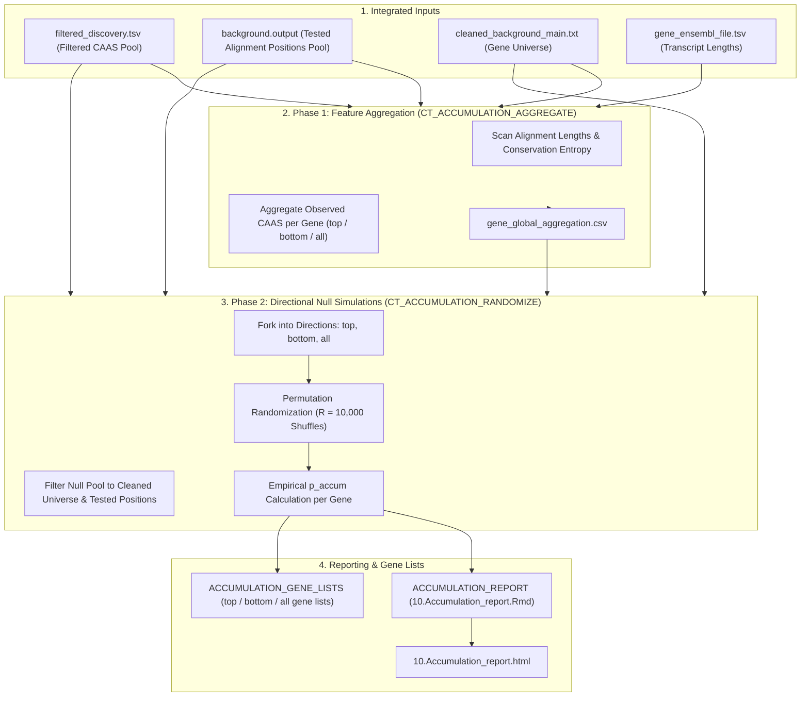

# PhyloPhere Methodological Archive: Entry 08
# Workflow: Contrast Accumulation & Polygenic Randomization (`ct_accumulation.nf`)

**Author / Specification**: Miguel Ramon Alonso (`miguel.ramon@upf.edu`)  
**Workflow File**: `workflows/ct_accumulation.nf`  
**Subworkflows Consumed**: `subworkflows/CT_ACCUMULATION/` (`ctacc_run.nf`, `accum_report.nf`, `accum_gene_lists.nf`)  
**Associated HTML Report**: `10.Accumulation_report.html`  
**Core Python Modules**: `main.py`, `aggregation/concatenate.py`, `randomization/`  
**Target Publication**: Quantitative Genetics, Polygenic Adaptation & Molecular Convergence  

---

## 1. Scientific & Methodological Rationale

Adaptive phenotypic transitions frequently involve **polygenic substitution accumulation**. While single amino acid positions may achieve statistical significance across multiple contrast pairs, evolutionary adaptation can also manifest as an accumulation of multiple distinct substitutions dispersed across a single gene, domain, or pathway, even if individual positions each changed in only one or two contrast pairs.

However, testing for gene-level substitution accumulation introduces major confounding factors:
1. **Gene Length Bias**: Longer coding sequences naturally accumulate more neutral substitutions by chance.
2. **Alignment Coverage & Gapping Heterogeneity**: Genes with higher sequence conservation across clades possess larger pools of eligible tested positions.
3. **Lineage Directionality**: Substitutions driving foreground adaptation (`top`) must be evaluated independently from background lineage divergence (`bottom`) or global sequence turnover (`all`).

`CT_ACCUMULATION` evaluates gene-level substitution burden using an **empirical randomization null model** that redistributes observed substitutions across the eligible pool of tested alignment positions, strictly controlling for gene length, gap structure, and sequence entropy.



---

## 2. Nextflow DSL2 Workflow Architecture

### 2.1 Process Execution Graph

`CT_ACCUMULATION` is triggered via `--ct_accumulation`:

```groovy
workflow CT_ACCUMULATION {
    take:
        caas_channel             // filtered_discovery.tsv from CT_POSTPROC
        background_channel       // cleaned_background_main.txt from CT_POSTPROC
        trait_file_channel       // traitfile from CT / contrast_selection
        tested_positions_channel // background.output (tested positions pool)

    main:
        // 1. Phase 1: Aggregate gene properties, lengths, and observed substitutions
        aggregate_out = CT_ACCUMULATION_AGGREGATE(
            alignment_dir_val,
            genomic_info_ch,
            species_list_val,
            meta_caas_val,
            background_val,
            params.accumulation_entropy_dir ?: ""
        )

        // 2. Phase 2: Directional Randomization (Parallelized across top, bottom, all)
        rand_in = Channel.of("top", "bottom", "all")
            .combine(aggregate_out.global_csv)
            .combine(meta_caas_val)
            .combine(tested_pos_val)
            .combine(bg_universe_val)

        randomize_out = CT_ACCUMULATION_RANDOMIZE(
            rand_in.direction,
            rand_in.global,
            rand_in.caas,
            rand_in.tested,
            rand_in.universe
        )

        // 3. Render HTML Report & Export Directional Gene Lists
        ACCUMULATION_REPORT(randomize_out.results.collect(), aggregate_out.global_csv.collect())
        ACCUMULATION_GENE_LISTS(randomize_out.direction, randomize_out.results)

    emit:
        results      = randomize_out.results
        accum_report = ACCUMULATION_REPORT.out.report
}
```

---

## 3. Mathematical Formulation & Randomization Null Model

### 3.1 Observed Substitution Burden

For each gene $g \in \mathcal{U}_{\text{clean}}$, let:
- $L_g$ be the number of tested, ungapped amino acid positions in gene $g$.
- $K_{\text{obs}}(g, d)$ be the number of observed CAAS substitutions in gene $g$ under directional category $d \in \{\text{top}, \text{bottom}, \text{all}\}$.
- Total observed substitutions across the entire proteome in direction $d$:
  $$K_{\text{total}}(d) = \sum_{g \in \mathcal{U}} K_{\text{obs}}(g, d)$$

---

### 3.2 Position-Stratified Randomization Null

To test whether gene $g$ accumulated significantly more substitutions than expected given its length $L_g$:
1. The total $K_{\text{total}}(d)$ substitutions are randomly redistributed across the eligible pool of $\sum_{g} L_g$ tested positions without replacement:
   $$\mathbb{P}(\text{site } i \text{ receives substitution}) = \frac{1}{\sum_{g'} L_{g'}}$$
2. In simulation cycle $r \in \{1, \dots, R\}$ (where $R = \text{accumulation\_n\_randomizations}$, default 10,000), the simulated count for gene $g$ is $K_{\text{sim}}(g, r, d)$.
3. The empirical upper-tail p-value of substitution accumulation is:
   $$p_{\text{accum}}(g, d) = \frac{\sum_{r=1}^R \mathbf{1}\left(K_{\text{sim}}(g, r, d) \ge K_{\text{obs}}(g, d)\right) + 1}{R + 1}$$
4. Benjamini-Hochberg FDR adjustments ($q_{\text{accum}}$) are applied across all evaluated genes.

---

## 4. Parameter Space & Configuration Reference

| Parameter | Type | Default | Description |
|---|---|---|---|
| `--ct_accumulation` | Boolean | `false` | Enables contrast accumulation analysis. |
| `--accumulation_n_randomizations` | Integer | `10000` | Number of simulation cycles for the empirical null distribution. |
| `--accumulation_randomization_type`| String | `'naive'` | Null model type (`'naive'` length-stratified; `'entropy'` conservation-weighted). |
| `--accumulation_caas_input` | Path | `null` | Precomputed filtered CAAS table for standalone execution. |
| `--accumulation_background_input` | Path | `null` | Precomputed background gene list. |

---

## 5. Artifact Schemas & Published Outputs

### 5.1 `accumulation_top_aggregated_results.csv`
```csv
gene,gene_length,tested_positions,observed_caas,expected_caas,fold_enrichment,p_value_accum,fdr_accum,is_significant
TP53,393,382,4,0.32,12.5,0.0001,0.0042,TRUE
```

### 5.2 Output Directory Tree
```
${params.outdir}/
├── html_reports/
│   └── 10.Accumulation_report.html
└── accumulation/
    ├── aggregation/
    │   └── gene_global_aggregation.csv
    ├── top/
    │   ├── randomization/
    │   │   └── accumulation_top_aggregated_results.csv
    │   └── gene_lists/
    │       └── accumulation_top_significant.txt
    ├── bottom/
    │   ├── randomization/
    │   │   └── accumulation_bottom_aggregated_results.csv
    │   └── gene_lists/
    │       └── accumulation_bottom_significant.txt
    └── all/
        ├── randomization/
        │   └── accumulation_all_aggregated_results.csv
        └── gene_lists/
            └── accumulation_all_significant.txt
```
