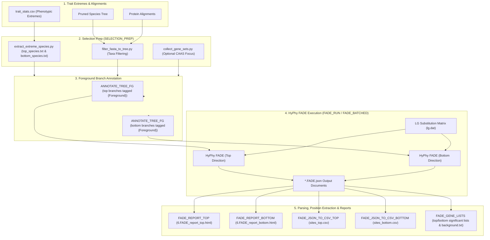

# PhyloPhere Methodological Archive: Entry 09
# Workflow: Directional Selection Analysis via HyPhy FADE (`fade.nf`)

**Author / Specification**: Miguel Ramon Alonso (`miguel.ramon@upf.edu`)  
**Workflow File**: `workflows/fade.nf`  
**Subworkflows Consumed**: `subworkflows/SELECTION/` (`selection_prep.nf`, `selection_utils.nf`), `subworkflows/FADE/` (`fade_run.nf`, `fade_report.nf`, `fade_gene_lists.nf`, `fade_json_to_csv.nf`)  
**Associated HTML Reports**: `6.FADE_report_top.html`, `6.FADE_report_bottom.html`  
**Key Outputs**: `summary_top.tsv`, `summary_bottom.tsv`, `sites_top.csv`, `sites_bottom.csv`  
**Target Publication**: Molecular Biology and Evolution, Directional Selection & Molecular Adaptation  

---

## 1. Scientific & Methodological Rationale

Standard molecular evolution tests (e.g., dN/dS, PAML, BUSTED) test for **non-directional positive selection**, quantifying an accelerated rate of non-synonymous substitutions without regard to which specific amino acid is favored. However, convergent molecular adaptation frequently exerts **directional selection**: evolutionary pressure favoring substitution toward a specific target amino acid state (or physicochemical property) in lineages exhibiting the target phenotype.

PhyloPhere implements **FADE (Fast, Approximate Directional Evolution)** via HyPhy:
1. **Branch-Site Directional Evolution Model**: Tests whether foreground lineages evolving extreme phenotypes experience an elevated substitution rate toward target amino acids ($\theta_{s, k}$) compared to neutral background substitution rates.
2. **Dual-Directional Stratification**: Executes independent evaluations for foreground high-extreme lineages (`top`) and background low-extreme lineages (`bottom`).
3. **Empirical Bayes Factor (BF) Support**: Quantifies statistical support per codon site and target residue ($BF \ge 100$ indicates decisive directional selection).



---

## 2. Nextflow DSL2 Workflow Architecture

### 2.1 Process Execution Graph

`FADE` is triggered via `--fade` and receives pre-filtered alignment channels from `SELECTION_PREP`:

```groovy
workflow FADE {
    take:
        fasta_top_ch      // (gene_id, fasta) for top-direction genes
        fasta_bottom_ch   // (gene_id, fasta) for bottom-direction genes
        tree_ch           // path to phenotype-pruned species tree
        top_species_ch    // path to top_species.txt
        bottom_species_ch // path to bottom_species.txt

    main:
        // 1. Tag target branches with {Foreground} annotations
        annotated_ch = ANNOTATE_TREE_FG_BATCHED(batches_ch)

        // 2. Execute HyPhy FADE across parallelized batches
        fade_results_ch = FADE_BATCHED(batches_ch, lg_dat_ch).fade_json

        // 3. Compile HTML Reports & Extract Directional Summary TSVs
        fade_report_top    = FADE_REPORT_TOP(Channel.value('top'), top_jsons, fg_top_ch)
        fade_report_bottom = FADE_REPORT_BOTTOM(Channel.value('bottom'), bottom_jsons, fg_bottom_ch)

        // 4. Extract Position-Level Bayes Factor CSVs (for POSENRICH & Scoring)
        fade_sites_top    = FADE_JSON_TO_CSV_TOP(Channel.value('top'), top_jsons)
        fade_sites_bottom = FADE_JSON_TO_CSV_BOTTOM(Channel.value('bottom'), bottom_jsons)

        // 5. Generate Directional Gene Lists & Background Universes
        top_lists    = FADE_GENE_LISTS_TOP(Channel.value('top'), fade_report_top.summary_tsv)
        bottom_lists = FADE_GENE_LISTS_BOTTOM(Channel.value('bottom'), fade_report_bottom.summary_tsv)

    emit:
        report_top     = fade_report_top.report
        report_bottom  = fade_report_bottom.report
        summary_top    = fade_report_top.summary_tsv
        summary_bottom = fade_report_bottom.summary_tsv
        site_tsv_top   = fade_report_top.site_tsv
        site_tsv_bottom= fade_report_bottom.site_tsv
        sites_csv_top  = fade_sites_top.sites_csv
        sites_csv_bottom=fade_sites_bottom.sites_csv
}
```

---

## 3. Mathematical Formulation of HyPhy FADE

### 3.1 Directional Substitution Rate Matrix

HyPhy FADE extends standard empirical amino acid substitution models (LG, WAG, JTT) by introducing a site- and residue-specific directional selection parameter $\theta_{s, k}$ on designated foreground branches:

For background branches:
$$q_{ij}^{(s)} = \pi_j \cdot r_{ij}$$

For foreground branches:
$$q_{ij}^{(s, \text{FG})} = \pi_j \cdot r_{ij} \cdot \exp\left(\sum_{k=1}^{20} \mathbf{1}(j = k) \cdot \theta_{s, k}\right)$$
Where:
- $r_{ij}$: Baseline symmetric exchangeability between amino acids $i$ and $j$ (from `lg.dat`).
- $\pi_j$: Stationary equilibrium frequency of target amino acid $j$.
- $\theta_{s, k} > 0$: Log-odds acceleration of substitution toward target amino acid $k$ at alignment position $s$.

---

### 3.2 Empirical Bayes Factor (BF) Estimation

At each position $s$, FADE estimates posterior distributions over $\theta_{s, k}$ using a Dirichlet process mixture model. The **Bayes Factor (BF)** in favor of directional selection toward target residue $k$ is:
$$\text{BF}(s, k) = \frac{P(\text{Data} \mid \theta_{s, k} > 0) / P(\text{Data} \mid \theta_{s, k} = 0)}{P(\text{Prior} \mid \theta_{s, k} > 0) / P(\text{Prior} \mid \theta_{s, k} = 0)}$$
- $\text{BF} \ge 100$: Decisive statistical support for directional selection.
- $\text{BF} \ge 20$: Strong support.

---

## 4. Parameter Space & Configuration Reference

| Parameter | Type | Default | Description |
|---|---|---|---|
| `--fade` | Boolean | `false` | Enables HyPhy FADE directional selection analysis. |
| `--fade_batch_size` | Integer | `1` (local) / `20` (slurm) | Number of gene alignments bundled per FADE job. |
| `--fade_min_bf` | Float | `100.0` | Minimum Bayes Factor threshold for classifying a site as directionally selected. |
| `--lg_dat_path` | Path | `subworkflows/SELECTION/local/dat/lg.dat` | Amino acid substitution matrix file. |
| `--fade_json_dir_top` | Path | `null` | Precomputed JSON directory for top direction (bypasses live run). |
| `--fade_json_dir_bottom` | Path | `null` | Precomputed JSON directory for bottom direction. |

---

## 5. Artifact Schemas & Published Outputs

### 5.1 `summary_top.tsv`
```tsv
Gene	total_sites	directional_sites	max_bf	target_aas	mean_bf
TP53	393	2	245.8	R,K	182.4
```

### 5.2 `sites_top.csv` (Position-Level FADE Evidence)
```csv
gene,position,max_bf,target_aa
TP53,175,245.8,R
TP53,248,118.9,K
```

### 5.3 Output Directory Tree
```
${params.outdir}/
├── html_reports/
│   ├── 6.FADE_report_top.html
│   └── 6.FADE_report_bottom.html
└── selection/fade/
    ├── top/
    │   ├── summary_top.tsv
    │   ├── site_top.tsv
    │   ├── sites_top.csv
    │   ├── gene_lists/
    │   │   ├── significant_genes.txt
    │   │   └── background.txt
    │   └── json/
    │       └── TP53.top.FADE.json
    └── bottom/
        ├── summary_bottom.tsv
        ├── site_bottom.tsv
        ├── sites_bottom.csv
        └── gene_lists/
            ├── significant_genes.txt
            └── background.txt
```
