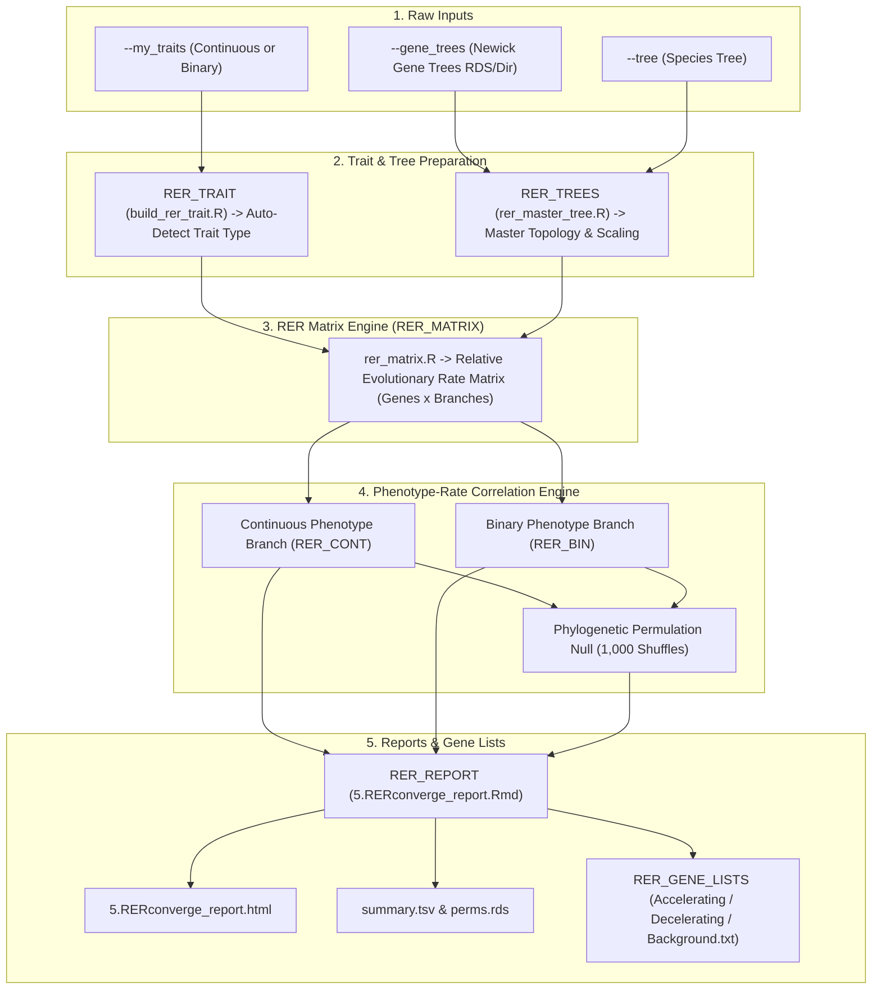

# PhyloPhere Methodological Archive: Entry 10
# Workflow: Relative Evolutionary Rate Convergence Analysis (`rerconverge.nf`)

**Author / Specification**: Miguel Ramon Alonso (`miguel.ramon@upf.edu`)  
**Workflow File**: `workflows/rerconverge.nf`  
**Subworkflows Consumed**: `subworkflows/RERCONVERGE/` (`rer_trait.nf`, `rer_trees.nf`, `rer_matrix.nf`, `rer_cont.nf`, `rer_bin.nf`, `rer_report.nf`, `rer_gene_lists.nf`, `rer_filter_trees.nf`)  
**Associated HTML Report**: `5.RERconverge_report.html`  
**Core R Engines**: `build_rer_trait.R`, `rer_master_tree.R`, `rer_matrix.R`, `continuous_rer.R`, `binary_rer.R`  
**Key Outputs**: `summary.tsv`, `perms.rds`, `rer_results.rds`  
**Target Publication**: Molecular Biology and Evolution, Evolutionary Rate Shifts & Phenome-Genome Association  

---

## 1. Scientific & Methodological Rationale

Phenotypic adaptations do not act exclusively through discrete site substitutions (CAAS); they frequently alter the **rate of sequence evolution across entire genes or biochemical complexes**. For example:
- Evolutionary innovations or functional expansions induce **evolutionary rate acceleration** (positive selection or relaxed constraint).
- Extreme physiological constraints or essentiality induce **evolutionary rate deceleration** (purifying selection).
- Convergence occurs when independent lineages evolving a shared phenotype exhibit coordinated acceleration or deceleration in the same orthologous genes.

However, raw gene branch lengths are confounded by lineage-specific generation times, mutation rates, and demographic history (e.g., rodents evolve faster than primates genome-wide). **RERconverge** (Kowalczyk et al., 2019) corrects for this by estimating **Relative Evolutionary Rates (RER)**: the rate of change in a focal gene along a branch relative to the genome-wide average rate along that same branch.

PhyloPhere provides a fully automated, scalable Nextflow implementation supporting continuous traits, binary traits, and phylogeny-preserving permulations.



---

## 2. Nextflow DSL2 Workflow Architecture

### 2.1 Process Execution Graph

`RER_MAIN` is triggered via `--rer_tool` or standalone via `--rer_continuous_file`:

```groovy
workflow RER_MAIN {
    take:
        traitfile_input
        pp_top_ch
        pp_bottom_ch

    main:
        // 1. Build and polish trait vector; auto-detect continuous vs binary mode
        if (toolsToRun.contains('build_trait')) {
            trait_result  = RER_TRAIT(my_traitfile_ch)
            trait_type_ch = trait_result.trait_type.map { it.text.trim() }
        }

        // 2. Estimate master species tree and project branch scale factors
        if (toolsToRun.contains('build_tree')) {
            masterTrees_out = RER_TREES(my_traitfile_ch, effective_gene_trees_ch, tax_id_ch)
        }

        // 3. Compute genome-wide normalized RER matrix
        if (toolsToRun.contains('build_matrix')) {
            matrix_out_ch = RER_MATRIX(trait_out_ch, masterTrees_out)
        }

        // 4. Auto-route execution: Continuous (RER_CONT) vs Binary (RER_BIN)
        if (toolsToRun.contains('continuous') || toolsToRun.contains('binary')) {
            routed_trait.branch {
                continuous: it[1] == 'continuous'
                binary:     it[1] == 'binary'
            }
            rer_cont_result = RER_CONT(cont_trait_ch, masterTrees_out, matrix_out_ch)
            rer_bin_result  = RER_BIN(bin_trait_ch, masterTrees_out, matrix_out_ch)
        }

        // 5. Render HTML Report and Export Directional Gene Lists
        effective_report = RER_REPORT_CONT(cont_output) // or BIN
        rer_lists = RER_GENE_LISTS(effective_report, gene_scores_ch)

    emit:
        summary_tsv         = rer_report_out
        perms               = rer_perms_out // corStat permulation RDS matrix
        gene_lists_bg       = rer_lists.gene_lists.filter { it.name == 'background.txt' }
        gene_lists_interest = rer_lists.gene_lists.filter { it.name != 'background.txt' }
}
```

---

## 3. Mathematical & Algorithmic Formulation

### 3.1 Relative Evolutionary Rate (RER) Normalization

For gene $g$ on phylogenetic branch $b$:
1. Let $l_{g, b}$ be the estimated amino acid substitution branch length.
2. Let $\bar{L}_b$ be the genome-wide average branch length across all orthologous genes on branch $b$.
3. The expected branch length $\hat{l}_{g, b}$ is modeled via linear regression across all branches:
   $$\hat{l}_{g, b} = \alpha_g + \beta_g \bar{L}_b$$
4. The raw relative rate is the studentized residual:
   $$e_{g, b} = l_{g, b} - \hat{l}_{g, b}$$
5. $e_{g, b}$ values are centered and scaled into the standardized **Relative Evolutionary Rate (RER)**:
   $$\text{RER}_{g, b} = \frac{e_{g, b} - \mu_g}{\sigma_g}$$
   - $\text{RER}_{g, b} > 0$: Accelerated sequence evolution relative to genome-wide expectation.
   - $\text{RER}_{g, b} < 0$: Decelerated sequence evolution (increased constraint).

---

### 3.2 Association Testing & Permulation Null Models

#### 1. Continuous Phenotypes (`continuous_rer.R`)
- Ancestral phenotypic states at internal nodes are projected using Maximum Likelihood / Generalized Least Squares under Brownian motion (`phytools::fastAnc`).
- Phenotypic change along branch $b = (u, v)$ is calculated as $\Delta y_b = y_v - y_u$.
- Association is tested via weighted Pearson or Spearman correlation:
  $$\rho_g = \text{Cor}\left(\text{RER}_{g, \bullet}, \Delta y_{\bullet}\right)$$

#### 2. Binary Phenotypes (`binary_rer.R`)
- Branches are categorized as Foreground ($FG$) or Background ($BG$).
- Association is evaluated via Wilcoxon rank-sum test statistics comparing foreground RERs to background RERs:
  $$W_g = \sum_{b \in FG} \text{Rank}(\text{RER}_{g, b})$$

#### 3. Phylogeny-Preserving Permulations (`perms.rds`)
- Shuffles phenotype paths across the tree while preserving phylogenetic autocorrelation across sister lineages.
- Derives empirical p-values:
  $$p_{\text{perm}}(g) = \frac{\sum_{m=1}^M \mathbf{1}\left(|\rho_{\text{perm}}(g, m)| \ge |\rho_{\text{obs}}(g)|\right) + 1}{M + 1}$$

---

## 4. Parameter Space & Configuration Reference

| Parameter | Type | Default | Description |
|---|---|---|---|
| `--rer_tool` | String | `""` | Comma-separated steps: `build_trait,build_tree,build_matrix,continuous,binary`. |
| `--gene_trees` | Path | *Required* | Path to master gene trees RDS object or Newick directory. |
| `--rer_trait_mode` | String | `'auto'` | Trait mode (`'auto'`, `'continuous'`, `'binary'`). |
| `--rer_n_perms` | Integer | `1000` | Number of permulation cycles for empirical p-value computation. |
| `--rer_min_species` | Integer | `10` | Minimum species representation required per gene tree. |

---

## 5. Artifact Schemas & Published Outputs

### 5.1 `summary.tsv`
```tsv
Gene	Rho	P_value	P_perm	FDR	Direction	N_branches
TP53	0.482	0.00012	0.00099	0.0084	Accelerating	112
BRCA1	-0.514	0.00008	0.00050	0.0062	Decelerating	115
```

### 5.2 Output Directory Tree
```
${params.outdir}/
├── html_reports/
│   └── 5.RERconverge_report.html
└── rerconverge/
    ├── rer_results/
    │   ├── summary.tsv
    │   ├── perms.rds
    │   └── rer_matrix.rds
    └── gene_lists/
        ├── significant_genes.txt
        ├── accelerating_genes.txt
        ├── decelerating_genes.txt
        └── background.txt
```
