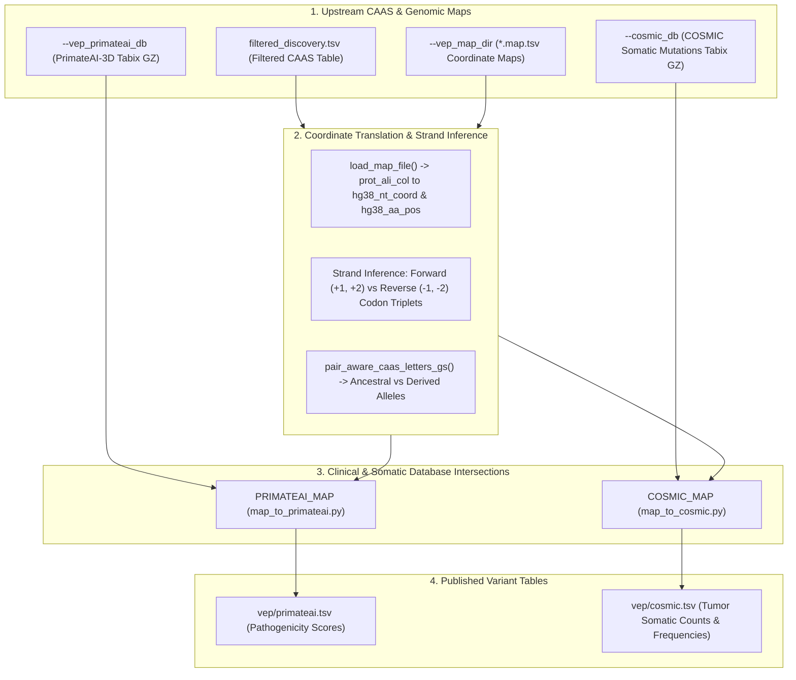

# PhyloPhere Methodological Archive: Entry 11
# Workflow: Variant Effect & Pathogenicity Profiling via PrimateAI-3D and COSMIC (`vep.nf`)

**Author / Specification**: Miguel Ramon Alonso (`miguel.ramon@upf.edu`)  
**Workflow File**: `workflows/vep.nf`  
**Subworkflows Consumed**: `subworkflows/VEP/` (`primateai.nf`, `cosmic.nf`)  
**Core Python Scripts**: `map_to_primateai.py`, `map_to_cosmic.py`  
**Key Outputs**: `vep/primateai.tsv`, `vep/cosmic.tsv`  
**Target Publication**: Human Genetics, Evolutionary Medicine & Cancer Genomics  

---

## 1. Scientific & Methodological Rationale

Understanding the functional consequences of Convergent Amino Acid Substitutions (CAAS) requires translating inter-species evolutionary events into **human clinical and structural contexts**:
1. **Evolutionary Pathogenicity Paradox**: Adaptive substitutions fixed in extreme-phenotype species (e.g., long-lived whales, hypoxia-tolerant mole rats, cancer-resistant elephants) often involve radical physicochemical changes that would be deleterious or pathogenic in humans.
2. **Clinical Variant Impact (PrimateAI-3D)**: PrimateAI-3D uses 3D structural protein representations and millions of benign primate missense variants to predict the clinical pathogenicity ($S_{\text{PAI}} \in [0, 1]$) of human amino acid substitutions. Evaluating CAAS under PrimateAI reveals whether adaptive substitutions target critical functional sites.
3. **Somatic Mutation Recurrence (COSMIC)**: In traits related to longevity, neoplasia, or metabolism, convergent substitutions in non-human mammals frequently mirror known **somatic cancer mutations** in the COSMIC database, pinpointing shared oncogenic pathways and resistance mechanisms.

`VEP` resolves gene alignment coordinates to canonical human genome coordinates (hg38), mapping CAAS substitutions directly against PrimateAI-3D and COSMIC databases.



---

## 2. Nextflow DSL2 Workflow Architecture

### 2.1 Process Execution Graph

`VEP` executes downstream of `CT_POSTPROC` or standalone via `--vep_caas_input`:

```groovy
workflow VEP {
    take:
        caas_input // filtered_discovery.tsv

    main:
        // 1. Resolve CAAS source (Live channel vs --vep_caas_input)
        // 2. Validate MAP coordinate directory (--vep_map_dir)

        // 3. PrimateAI-3D Pathogenicity Mapping
        if (pai_db_file.exists() && pai_db_file.size() > 0) {
            pai_out = PRIMATEAI_MAP(caas_ch, map_dir_ch, pai_db_ch)
            primateai_out = pai_out.primateai_tsv
        }

        // 4. COSMIC Cancer Mutation Mapping
        if (cosmic_db_file.exists() && cosmic_db_file.size() > 0) {
            COSMIC_MAP(caas_ch, map_dir_ch, cosmic_db_ch)
            cosmic_out = COSMIC_MAP.out.cosmic_tsv
        }

    emit:
        primateai_tsv = primateai_out
        cosmic_tsv    = cosmic_out
}
```

---

## 3. Algorithmic & Coordinate Mapping Logic

### 3.1 Alignment-to-Genomic Coordinate Transformation (`map_to_primateai.py`)

1. **MAP File Lookup**:
   For gene $g$ at 0-based alignment column $p$, loads `${gene}.*.map.tsv` to extract:
   - Human amino acid position: `hg38_aa_pos`
   - Genomic triplet anchor coordinate: `hg38_nt_coord` (e.g., `chr17:7675123`)
2. **Strand Inference**:
   Evaluates coordinate progression across adjacent codons:
   $$\text{Strand} = \begin{cases} + & \text{if } \text{coord}(c + 1) > \text{coord}(c) \implies \text{Codon Nts: } \{C, C+1, C+2\} \\ - & \text{if } \text{coord}(c + 1) < \text{coord}(c) \implies \text{Codon Nts: } \{C, C-1, C-2\} \end{cases}$$
3. **Directional Mutation Intersections**:
   - **`top` Direction**: Evaluates the pathogenicity of mutating the ancestral human reference residue ($A_{\text{anc}}$) into the derived foreground residue ($a_{\text{top}}$).
   - **`bottom` Direction**: Evaluates the pathogenicity of mutating the ancestral human reference residue ($A_{\text{anc}}$) into the derived background residue ($a_{\text{bottom}}$).

---

### 3.2 COSMIC Somatic Mutation Profiling (`map_to_cosmic.py`)

Intersects the derived genomic coordinates and amino acid change against the COSMIC database:
- Extracts matching somatic mutations across human primary tumors.
- Records mutation count ($N_{\text{tumors}}$), primary tissue sites, histological subtypes, and COSMIC Mutation ID (`COSV...`).

---

## 4. Parameter Space & Configuration Reference

| Parameter | Type | Default | Description |
|---|---|---|---|
| `--vep` | Boolean | `false` | Enables VEP, PrimateAI, and COSMIC characterization. |
| `--vep_caas_input` | Path | `null` | Standalone path to filtered CAAS discovery table. |
| `--vep_map_dir` | Path | *Required* | Directory containing per-gene coordinate map files (`*.map.tsv`). |
| `--vep_primateai_db` | Path | `null` | Tabix-indexed PrimateAI-3D database archive (`.tsv.gz`). |
| `--cosmic_db` | Path | `null` | Tabix-indexed COSMIC somatic mutation database archive (`.tsv.gz`). |

---

## 5. Artifact Schemas & Published Outputs

### 5.1 `primateai.tsv`
```tsv
gene	position	hg38_aa_pos	ref_aa	alt_aa	primateai_score	direction	interpretation
TP53	175	175	R	H	0.9654	top	Pathogenic
```

### 5.2 `cosmic.tsv`
```tsv
gene	position	hg38_aa_pos	ref_aa	alt_aa	cosmic_id	mutation_count	primary_histologies
TP53	175	175	R	H	COSV52665324	1240	Carcinoma,Glioma,Lymphoma
```

### 5.3 Output Directory Tree
```
${params.outdir}/
└── vep/
    ├── primateai.tsv
    └── cosmic.tsv
```
