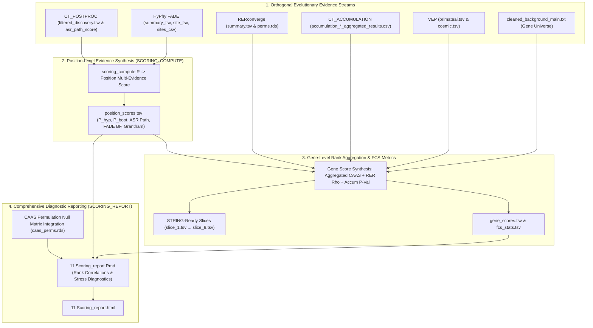

# PhyloPhere Methodological Archive: Entry 12
# Workflow: Multi-Evidence Integration & Rank Fusion Scoring (`scoring.nf`)

**Author / Specification**: Miguel Ramon Alonso (`miguel.ramon@upf.edu`)  
**Workflow File**: `workflows/scoring.nf`  
**Subworkflows Consumed**: `subworkflows/SCORING/` (`scoring_compute.nf`, `scoring_report.nf`), `subworkflows/CT/caas_permulation.nf`  
**Associated HTML Report**: `11.Scoring_report.html`  
**Core R Engines**: `scoring_compute.R`, `scoring_caas_perms.R`  
**Key Outputs**: `scoring/gene_scores.tsv`, `scoring/position_scores.tsv`, `scoring/fcs_stats.tsv`, `scoring/gene_lists/slice_*.tsv`  
**Target Publication**: Systematic Biology, Multi-Omics Data Fusion & Comparative Genomics  

---

## 1. Scientific & Methodological Rationale

A central challenge in comparative evolutionary genomics is **heterogeneity of evidence**:
- CAAS detects episodic site-level substitutions.
- HyPhy FADE detects branch-site directional positive selection.
- RERconverge detects pathway-wide evolutionary rate shifts.
- CT Accumulation detects polygenic substitution density.
- PrimateAI & COSMIC provide human structural and clinical relevance.

Individual methods evaluate distinct aspects of evolutionary adaptation and suffer from idiosyncratic false positives. A single unified score combining orthogonal evolutionary evidence lines drastically reduces false discoveries while amplifying genuine adaptive signals.

`SCORING` computes **calibrated, multi-evidence position-level and gene-level composite scores** using rank aggregation, probabilistic weighting, and empirical permulation null models.



---

## 2. Nextflow DSL2 Workflow Architecture

### 2.1 Process Execution Graph

`SCORING` integrates all upstream pipeline outputs in a single coordinated pass:

```groovy
workflow SCORING {
    take:
        postproc_ch              // filtered_discovery.tsv
        fade_summary_top_ch      // summary_top.tsv
        fade_summary_bottom_ch   // summary_bottom.tsv
        rer_summary_ch           // summary.tsv (RER)
        accum_ch                 // accumulation CSVs
        genomic_info_ch          // gene_ensembl_file.tsv
        fade_site_top_ch         // site_top.tsv
        fade_site_bot_ch         // site_bottom.tsv
        cleaned_background_ch    // cleaned_background_main.txt
        rer_perms_ch             // RER permulation RDS
        caas_perms_ch            // CAAS permulation RDS
        caas_pos_pval_ch         // LOO position p-values
        caas_pos_sample_ch       // Permutation sample distributions
        caas_pos_quantiles_ch    // Quantile distributions

    main:
        // 1. Execute Multi-Evidence Scoring Engine
        compute_out = SCORING_COMPUTE(
            resolved_postproc,
            resolved_fade_top,
            resolved_fade_bottom,
            resolved_fade_site_top_ch,
            resolved_fade_site_bot_ch,
            resolved_rer,
            accum_all_ch
        )

        // 2. Render Comprehensive HTML Report & Validation Diagnostics
        report_out = SCORING_REPORT(
            compute_out.position_scores,
            compute_out.gene_scores,
            compute_out.gene_correlations,
            ...,
            caas_perms_resolved,
            resolved_postproc,
            resolved_background
        )

    emit:
        position_scores = compute_out.position_scores
        gene_scores     = compute_out.gene_scores
        fcs_stats       = compute_out.fcs_stats
        fcs_stats_rer   = compute_out.fcs_stats_rer
        fcs_stats_fade  = compute_out.fcs_stats_fade
        fcs_stats_accum = compute_out.fcs_stats_accum
        gene_lists      = compute_out.gene_lists
        position_lists  = compute_out.position_lists
        caas_perms      = caas_perms_resolved
        report          = report_out.report
}
```

---

## 3. Mathematical & Algorithmic Formulation

### 3.1 Position-Level Score ($S_{\text{pos}}$)

For amino acid position $p$ in gene $g$:
$$S_{\text{pos}}(g, p) = w_{\text{hyp}} \cdot \left(-\log_{10} p_{\text{hyp}}\right) + w_{\text{boot}} \cdot \left(-\log_{10} p_{\text{boot}}\right) + w_{\text{ASR}} \cdot \text{ASR\_Path\_Score} + w_{\text{FADE}} \cdot \log_{10}(\text{BF}_{\text{FADE}} + 1) + w_{\text{biochem}} \cdot \tilde{D}_{\text{Grantham}}$$
Where default weighting coefficients in `conf/scoring.config` calibrate each empirical signal to comparable variance scales ($w_{\text{hyp}} = 1.0, w_{\text{boot}} = 1.5, w_{\text{ASR}} = 2.0, w_{\text{FADE}} = 1.0, w_{\text{biochem}} = 0.5$).

---

### 3.2 Gene-Level Multi-Evidence Composite Score ($S_{\text{gene}}$)

At the gene level, signals are integrated across modalities:
$$S_{\text{gene}}(g) = \text{RankScore}\left(\max_{p \in g} S_{\text{pos}}(g, p)\right) + \lambda_{\text{RER}} \cdot \text{RankScore}\left(|\rho_{\text{RER}}(g)|\right) + \lambda_{\text{accum}} \cdot \text{RankScore}\left(-\log_{10} p_{\text{accum}}(g)\right)$$
Where:
- $\text{RankScore}(x) = \frac{\text{Rank}(x)}{N_{\text{genes}}}$ scales values into normalized percentiles $[0, 1]$.
- Directional partitioning (`top` vs `bottom`) is maintained via `change_side` flags.

---

### 3.3 STRING-Ready Slice Stratification

`scoring_compute.R` automatically partitions the scoring universe into 9 standard functional slices:
- `slice_1.tsv`: Full ranked proteome (for continuous FCS ranking).
- `slice_2.tsv`: High-confidence CAAS hits ($S_{\text{gene}} \ge \text{P95}$).
- `slice_3.tsv`: Top-convergent genes (`change_top`).
- `slice_4.tsv`: Bottom-convergent genes (`change_bottom`).
- `slice_5.tsv`: Dual-convergent genes (`change_both`).
- `slice_6.tsv`: High-confidence FADE selection overlap.
- `slice_7.tsv`: Accelerating rate genes ($\rho_{\text{RER}} > 0, p < 0.05$).
- `slice_8.tsv`: Decelerating rate genes ($\rho_{\text{RER}} < 0, p < 0.05$).
- `slice_9.tsv`: Polygenic substitution accumulation hits ($p_{\text{accum}} < 0.05$).

---

## 4. Parameter Space & Configuration Reference

| Parameter | Type | Default | Description |
|---|---|---|---|
| `--scoring` | Boolean | `false` | Enables multi-evidence scoring integration. |
| `--scoring_postproc_input` | Path | `null` | Precomputed filtered CAAS table. |
| `--scoring_fade_summary_top` | Path | `null` | Precomputed FADE summary table for top direction. |
| `--scoring_fade_summary_bottom`| Path | `null` | Precomputed FADE summary table for bottom direction. |
| `--scoring_rer_input` | Path | `null` | Precomputed RERconverge summary table. |
| `--scoring_accum_dir` | Path | `null` | Precomputed accumulation results directory. |
| `--scoring_background_input` | Path | `null` | Precomputed cleaned background universe file. |

---

## 5. Artifact Schemas & Published Outputs

### 5.1 `gene_scores.tsv`
```tsv
gene	composite_score	max_pos_score	n_caas_sites	change_side	rer_rho	rer_p_perm	accum_p_val	fade_max_bf	primateai_max
TP53	0.9854	8.421	4	top	0.482	0.00099	0.00010	245.8	0.9654
```

### 5.2 `position_scores.tsv`
```tsv
gene	position	pos_score	pvalue_hyp	pvalue_boot	asr_path_score	fade_bf	grantham	change_side
TP53	175	8.421	0.00042	0.00199	0.9421	245.8	29.0	top
```

### 5.3 Output Directory Tree
```
${params.outdir}/
├── html_reports/
│   └── 11.Scoring_report.html
└── scoring/
    ├── gene_scores.tsv
    ├── position_scores.tsv
    ├── fcs_stats.tsv
    ├── fcs_stats_rer.tsv
    ├── fcs_stats_fade.tsv
    ├── fcs_stats_accum.tsv
    └── gene_lists/
        ├── slice_1.tsv
        ├── slice_2.tsv
        └── slice_3.tsv
```
