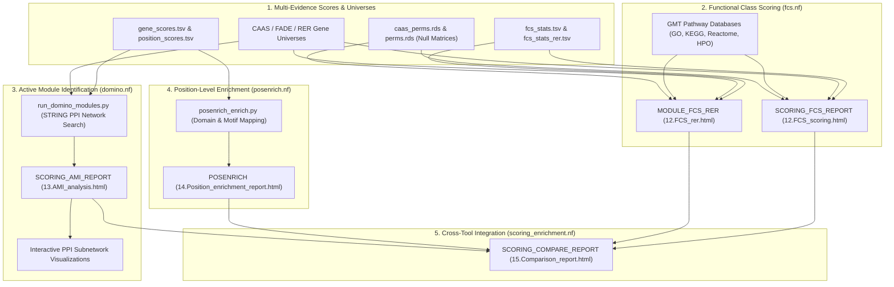

# PhyloPhere Methodological Archive: Entry 13
# Workflow: Functional Class Scoring & Systems Biology Enrichment (`enrichment.nf`)

**Author / Specification**: Miguel Ramon Alonso (`miguel.ramon@upf.edu`)  
**Workflow File**: `workflows/enrichment.nf`  
**Subworkflows Consumed**: `subworkflows/ENRICHMENT/` (`fcs.nf`, `domino.nf`, `posenrich.nf`, `scoring_enrichment.nf`)  
**Associated HTML Reports**: `12.FCS_scoring.html`, `12.FCS_rer.html`, `13.AMI_analysis.html`, `14.Position_enrichment_report.html`, `15.Comparison_report.html`  
**Core Engines**: `fcs_enrich.R`, `fcs_enrich_equivtest.R`, `run_domino_modules.py`, `build_domino_network.py`, `posenrich_enrich.py`, `build_position_gmt.py`, `percentile_flags.R`  
**Target Publication**: Genome Biology, Systems Evolutionary Biology & Pathway Network Informatics  

---

## 1. Scientific & Methodological Rationale

Single-gene associations in comparative genomics rarely capture the full complexity of phenotypic adaptation. Complex adaptations (e.g., extreme longevity, metabolic remodeling, body plan modifications) operate through **coordinated polygenic networks and biological pathways**:
1. **Functional Class Scoring (FCS)**: Classical Over-Representation Analysis (ORA / Hypergeometric) requires arbitrary gene score cutoffs (e.g., top 100 genes), discarding subtle coordinated shifts across hundreds of pathway members. FCS evaluates continuous rank-based shifts across complete gene sets (GO, KEGG, Reactome, Wikipathways, HPO, OncoVar).
2. **Active Module Identification (AMI via DOMINO)**: Biological processes do not always align with predefined pathway databases. DOMINO (Active Module Identification) searches the global **Protein-Protein Interaction (PPI) network** (STRING) to detect connected subgraphs exhibiting statistically significant over-representation of adaptive signatures.
3. **Position-Level Domain Enrichment (POSENRICH)**: Adaptive substitutions often cluster in specific functional protein domains (e.g., DNA-binding domains, catalytic pockets, phosphorylation motifs). POSENRICH maps amino acid coordinates to functional domain annotations to test for structural convergence.
4. **Cross-Method Orthogonal Concordance**: Evaluates intersection and concordance across all five analytical pillars (CAAS, FADE, RERconverge, Accumulation, VEP).



---

## 2. Nextflow DSL2 Workflow Architecture

### 2.1 Process Execution Graph

`ENRICHMENT` executes downstream of `SCORING`:

```groovy
workflow ENRICHMENT {
    take:
        fcs_stats
        fcs_stats_rer
        fcs_stats_fade
        fcs_stats_accum
        gene_lists
        gene_scores
        cleaned_background_ch
        rer_perms_ch
        caas_perms_ch
        caas_perm_scores_ch
        caas_pos_pval_ch
        caas_pos_sample_ch
        position_scores
        position_lists
        background_output_ch
        vep_primateai_ch
        vep_cosmic_ch
        fade_sites_top_ch
        fade_sites_bottom_ch
        rer_gene_lists_bg_ch
        rer_gene_lists_interest_ch
        fade_gene_lists_bg_top_ch
        fade_gene_lists_bg_bottom_ch
        fade_gene_lists_sig_top_ch
        fade_gene_lists_sig_bottom_ch

    main:
        // 1. Functional Class Scoring for CAAS and RER
        fcs_out = SCORING_FCS_REPORT(fcs_stats, fcs_universe_ch, caas_perms_resolved, gene_lists_ch)
        rer_fcs = MODULE_FCS_RER(Channel.value('scoring/rer'), fcs_stats_rer, rer_universe_ch, ...)

        // 2. DOMINO Active Module Identification on STRING PPI Network
        domino_main = DOMINO_MODULES_MAIN(Channel.value('main'), gene_scores, fcs_universe_ch)
        ami_out     = SCORING_AMI_REPORT(domino_main.results, gene_scores, fcs_universe_ch)

        // 3. Position-Level Domain & Motif Enrichment (POSENRICH)
        posenrich_out = POSENRICH(position_scores, position_lists, background_output_ch, ...)

        // 4. Cross-Module Comparison Report
        compare_out = SCORING_COMPARE_REPORT(fcs_stats, gene_scores, fcs_out.results, ...)
}
```

---

## 3. Mathematical & Algorithmic Deconstruction

### 3.1 Functional Class Scoring (FCS) Engine (`fcs_enrich.R`)

For each gene set $\mathcal{S} \in \text{GMT}$ of size $K = |\mathcal{S} \cap \mathcal{U}|$:
1. **Wilcoxon Rank-Sum Test**: Evaluates whether genes in set $\mathcal{S}$ have systematically higher composite scores $S_{\text{gene}}$ than background genes $\mathcal{U} \setminus \mathcal{S}$:
   $$W_{\mathcal{S}} = \sum_{g \in \mathcal{S}} \text{Rank}(S_{\text{gene}}(g))$$
   Standardized Z-score:
   $$Z_{\mathcal{S}} = \frac{W_{\mathcal{S}} - \frac{K(N+1)}{2}}{\sqrt{\frac{K(N - K)(N + 1)}{12}}}$$
2. **Empirical Permulation P-Value ($p_{\text{perm}}$)**: Evaluates $Z_{\mathcal{S}}$ across $M$ null permutations:
   $$p_{\text{perm}}(\mathcal{S}) = \frac{\sum_{m=1}^M \mathbf{1}\left(Z_{\mathcal{S}, \text{perm}}(m) \ge Z_{\mathcal{S}, \text{obs}}\right) + 1}{M + 1}$$
3. **Equivalence Testing Mode (`fcs_enrich_equivtest.R`)**: Implements Two One-Sided Tests (TOST) to distinguish genuine pathway divergence from lack of statistical power.

---

### 3.2 DOMINO Active Module Identification (`run_domino_modules.py`)

DOMINO (Levi et al., 2021) identifies connected subgraphs in the STRING Protein-Protein Interaction (PPI) network that are enriched for active genes:
1. **Active Gene Call**: Genes with score $S_{\text{gene}} \ge \text{Threshold}$ are marked active.
2. **Subnetwork Partitioning**: Computes modularity partitions on the global interaction graph $G = (V, E)$.
3. **Hypergeometric Subgraph Enrichment**:
   $$P_{\text{module}} = \sum_{i=k}^{|V_m|} \frac{\binom{K_{\text{active}}}{i} \binom{|V| - K_{\text{active}}}{|V_m| - i}}{\binom{|V|}{|V_m|}}$$
   Where $V_m$ is the module vertex set and $k$ is the number of active module members.
4. **Network Rendering**: Generates interactive Cytoscape / VisJS network subgraphs with directional overlays (`top` = red, `bottom` = blue, `both` = purple).

---

### 3.3 Position-Level Enrichment (POSENRICH, `posenrich_enrich.py`)

1. **Position GMT Construction**: Compiles protein domains (Pfam, InterPro, SMART), catalytic residues (UniProt), post-translational modification sites (PhosphoSitePlus), and structural disorder regions into coordinate-based GMT sets.
2. **Hypergeometric Domain Over-Representation**:
   Tests whether significant CAAS sites ($N_{\text{sig, domain}}$) are enriched within specific domain boundaries relative to the total pool of tested amino acid positions in that domain.

---

## 4. Parameter Space & Configuration Reference

| Parameter | Type | Default | Description |
|---|---|---|---|
| `--enrichment` | Boolean | `false` | Enables full functional enrichment pipeline. |
| `--fcs_gmt_dir` | Path | `subworkflows/ENRICHMENT/dat` | Directory containing GMT pathway database files. |
| `--domino_string_network` | Path | *Required* | STRING protein-protein interaction network file (`.txt.gz`). |
| `--domino_threshold` | Float | `0.05` | Active gene threshold for DOMINO module discovery. |
| `--posenrich_gmt` | Path | `null` | Precomputed coordinate GMT file for position-level testing. |

---

## 5. Artifact Schemas & Published Outputs

### 5.1 `fcs/fcs_all_results.tsv`
```tsv
Pathway_ID	Pathway_Name	GMT_Database	Gene_Set_Size	Observed_Hits	Z_score	P_val_wilcox	P_val_perm	FDR_BH
GO:0006281	DNA Repair	GO_Biological_Process	142	38	4.82	0.00001	0.00020	0.0018
R-HSA-69620	Cell Cycle Checkpoints	Reactome	88	24	4.15	0.00004	0.00060	0.0039
```

### 5.2 Output Directory Tree
```
${params.outdir}/
├── html_reports/
│   ├── 12.FCS_scoring.html
│   ├── 12.FCS_rer.html
│   ├── 13.AMI_analysis.html
│   ├── 14.Position_enrichment_report.html
│   └── 15.Comparison_report.html
├── fcs/
│   ├── fcs_all_results.tsv
│   └── fcs_significant_pathways.tsv
├── ami/
│   ├── ami_results/
│   ├── ami_summary/
│   ├── ami_plots/
│   └── ami_networks/
├── posenrich/
│   ├── position_enrichment_results.tsv
│   └── domain_overlays.tsv
└── compare/
    └── cross_module_concordance_matrix.tsv
```
