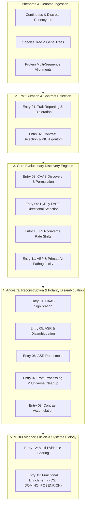

# PhyloPhere Methodological Archive: Master Index & Synthesis
# A Comprehensive Methodological Specification for Comparative Evolutionary Phenomics

**Author & Principal Architect**: Miguel Ramon Alonso (`miguel.ramon@upf.edu`)  
**Institutional Affiliation**: Institute of Evolutionary Biology (IBE, UPF-CSIC), Barcelona, Spain  
**Pipeline**: PhyloPhere (v2.0.0-paired)  
**Execution Engine**: Nextflow (DSL2)  
**Document Type**: Methodological Paper Master Specification & Complete Archive Index  

---

## 1. Executive Summary & Framework Architecture

**PhyloPhere** is an automated, high-throughput computational and statistical platform engineered for genome-phenome association studies in non-model organisms. It unites five orthogonal evolutionary modalities—episodic site-level convergence (CAAS), directional positive selection (HyPhy FADE), relative evolutionary rate shifts (RERconverge), polygenic substitution accumulation (CT Accumulation), and human clinical variant pathogenicity (VEP/PrimateAI/COSMIC)—into a single reproducible workflow.

---

## 2. Master Archive Chapter Index

Below is the complete inventory of technical archive chapters compiled in `archive/`:

| Chapter File | Primary Workflow | Subworkflows Depicted | Core Focus & Statistical Methodology |
|---|---|---|---|
| [`00_PIPELINE_ARCHITECTURE_AND_ORCHESTRATION.md`](00_PIPELINE_ARCHITECTURE_AND_ORCHESTRATION.md) | `main.nf` | Root orchestration, `lib/WorkflowMap.groovy`, `conf/` | Nextflow DSL2 orchestration, lifecycle hooks, execution profiles (local, slurm, apptainer), dynamic memory management, and interactive workflow map. |
| [`01_WORKFLOW_REPORTING_AND_EXPLORATION.md`](01_WORKFLOW_REPORTING_AND_EXPLORATION.md) | `reporting.nf` | `TRAIT_ANALYSIS` (`ta_name_curation`, `ta_data_prune`, `ta_dataset_exploration`, `ta_phenotype_exploration`) | Taxonomic nomenclature curation (`tree_cleanup.py`), dataset pruning, normality diagnostics, and phylogenetic signal ($\lambda, K$). |
| [`02_WORKFLOW_CONTRAST_SELECTION.md`](02_WORKFLOW_CONTRAST_SELECTION.md) | `contrast_selection.nf` | `TRAIT_ANALYSIS` (`ct_ci`, `ct_independent-contrasts`), `CT` (`ct_check_min_contrasts`) | Phylogenetic Independent Contrasts (PIC), Jeffreys Credible Intervals, Modified Dunn Index optimization ($\text{Dunn} \ge 1.0$), and minimum-contrast gating. |
| [`03_WORKFLOW_CT_CAAS_DISCOVERY_AND_PERMULATION.md`](03_WORKFLOW_CT_CAAS_DISCOVERY_AND_PERMULATION.md) | `ct.nf` | `CT` (`ct_discovery`, `ct_resample`, `ct_bootstrap`, `ct_concat`, `caas_permulation`) | Pair-aware CAAS scanning (Patterns 1–4), gap/missing symmetry filters, vectorized NumPy bootstrap tensors, and Pagel's $\lambda$ trait permulations. |
| [`04_WORKFLOW_CT_SIGNIFICATION.md`](04_WORKFLOW_CT_SIGNIFICATION.md) | `ct_signification.nf` | `CT_SIGNIFICATION` (`ctpp_signification`) | Analytical hypergeometric testing, empirical permutation p-values ($p_{\text{boot}}$), dual significance criteria, and dynamic FDR calibration. |
| [`05_WORKFLOW_CT_DISAMBIGUATION.md`](05_WORKFLOW_CT_DISAMBIGUATION.md) | `ct_disambiguation.nf` | `CT_DISAMBIGUATION` (`ct_disambiguation`) | Maximum Likelihood Ancestral State Reconstruction (ASR), substitution polarity categorization (`top`, `bottom`, `both`, `divergent`), and Grantham physicochemical distance. |
| [`06_WORKFLOW_ASR_ROBUSTNESS.md`](06_WORKFLOW_ASR_ROBUSTNESS.md) | `asr_robustness.nf` | `ASR_ROBUSTNESS` (`asr_robustness`) | Continuous `asr_path_score` decomposition (core, independence, MRCA diversity, agreement, conservation gate), and posterior sensitivity ($\tau \in \{0.90, 0.95, 0.99\}$). |
| [`07_WORKFLOW_CT_POSTPROC.md`](07_WORKFLOW_CT_POSTPROC.md) | `ct_postproc.nf` | `CT_POSTPROC` (`ctpp_clustfilter`, `ctpp_characterization`) | Sliding-window CAAS cluster filtering ($\text{minlen}, \text{maxcaas}$), gene length normalization, genomic background universe synchronization (`cleaned_background_main.txt`), and directional gene lists. |
| [`08_WORKFLOW_CT_ACCUMULATION.md`](08_WORKFLOW_CT_ACCUMULATION.md) | `ct_accumulation.nf` | `CT_ACCUMULATION` (`ctacc_run`, `accum_report`, `accum_gene_lists`) | Polygenic substitution accumulation, position-stratified Monte Carlo randomization nulls ($R = 10,000$), and directional gene lists. |
| [`09_WORKFLOW_FADE_SELECTION.md`](09_WORKFLOW_FADE_SELECTION.md) | `fade.nf` | `SELECTION` (`selection_prep`, `selection_utils`), `FADE` (`fade_run`, `fade_report`, `fade_gene_lists`, `fade_json_to_csv`) | HyPhy FADE directional selection on foreground branches, Dirichlet process mixture models, Empirical Bayes Factors ($\text{BF} \ge 100$), and site-level CSV extraction. |
| [`10_WORKFLOW_RERCONVERGE.md`](10_WORKFLOW_RERCONVERGE.md) | `rerconverge.nf` | `RERCONVERGE` (`rer_trait`, `rer_trees`, `rer_matrix`, `rer_cont`, `rer_bin`, `rer_report`, `rer_gene_lists`) | Relative Evolutionary Rate (RER) normalization residuals, ancestral trait projections, continuous/binary rate correlations, and phylogenetic permulations. |
| [`11_WORKFLOW_VEP_VARIANT_EFFECT.md`](11_WORKFLOW_VEP_VARIANT_EFFECT.md) | `vep.nf` | `VEP` (`primateai`, `cosmic`) | Genomic coordinate translation (hg38), PrimateAI-3D structural deep learning pathogenicity scoring, and COSMIC somatic cancer mutation recurrence profiling. |
| [`12_WORKFLOW_SCORING_INTEGRATION.md`](12_WORKFLOW_SCORING_INTEGRATION.md) | `scoring.nf` | `SCORING` (`scoring_compute`, `scoring_report`) | Multi-evidence rank fusion, calibrated position-level and gene-level composite scoring, STRING-ready functional slices, and diagnostic stress testing. |
| [`13_WORKFLOW_ENRICHMENT_AND_SYSTEMS_BIOLOGY.md`](13_WORKFLOW_ENRICHMENT_AND_SYSTEMS_BIOLOGY.md) | `enrichment.nf` | `ENRICHMENT` (`fcs`, `domino`, `posenrich`, `scoring_enrichment`) | Wilcoxon rank-sum Functional Class Scoring (FCS) with permulation nulls, DOMINO active module discovery on STRING PPI networks, position-level domain enrichment (POSENRICH), and cross-tool concordance. |

---

## 3. Mathematical Foundations & Statistical Summary

### 3.1 Phylogenetic Independent Contrasts & Modified Dunn Index
$$\text{Dunn}(C_k) = \frac{\min_{j \neq k} \min_{u \in C_k, v \in C_j} d(u, v)}{d(s_{k, 1}, s_{k, 2})} \ge 1.0$$

### 3.2 Dual CAAS Significance Model
$$P_{\text{hyp}}(X \ge k) = \sum_{i=k}^{\min(n, K)} \frac{\binom{K}{i}\binom{N - K}{n - i}}{\binom{N}{n}}, \quad p_{\text{boot}} = \frac{\sum_{b=1}^B \mathbf{1}(k_b \ge k_{\text{obs}}) + 1}{B + 1}$$

### 3.3 Continuous ASR Path Robustness Score
$$\text{ASR\_Path\_Score} = S_{\text{core}} \times S_{\text{independence}} \times S_{\text{mrca\_diversity}} \times S_{\text{derived\_agreement}} \times S_{\text{conservation\_gate}}$$

### 3.4 Relative Evolutionary Rate Normalization
$$\text{RER}_{g, b} = \frac{(l_{g, b} - \hat{l}_{g, b}) - \mu_g}{\sigma_g}, \quad \hat{l}_{g, b} = \alpha_g + \beta_g \bar{L}_b$$

### 3.5 HyPhy FADE Directional Substitution Acceleration
$$q_{ij}^{(s, \text{FG})} = \pi_j \cdot r_{ij} \cdot \exp\left(\sum_{k=1}^{20} \mathbf{1}(j = k) \cdot \theta_{s, k}\right)$$

### 3.6 Multi-Evidence Composite Scoring
$$S_{\text{gene}}(g) = \text{RankScore}\left(\max_{p \in g} S_{\text{pos}}(g, p)\right) + \lambda_{\text{RER}} \cdot \text{RankScore}\left(|\rho_{\text{RER}}(g)|\right) + \lambda_{\text{accum}} \cdot \text{RankScore}\left(-\log_{10} p_{\text{accum}}(g)\right)$$

### 3.7 Functional Class Scoring Wilcoxon Statistic
$$Z_{\mathcal{S}} = \frac{\sum_{g \in \mathcal{S}} \text{Rank}(S_{\text{gene}}(g)) - \frac{K(N+1)}{2}}{\sqrt{\frac{K(N - K)(N + 1)}{12}}}, \quad p_{\text{perm}}(\mathcal{S}) = \frac{\sum_{m=1}^M \mathbf{1}(Z_{\mathcal{S}, \text{perm}}(m) \ge Z_{\mathcal{S}, \text{obs}}) + 1}{M + 1}$$

---

## 4. Pipeline Execution & Publication Guide

This archive forms the complete methodological documentation for the PhyloPhere framework. When preparing manuscripts or method sections based on this work:
1. **Model Specifications**: Cite the exact equations detailed in Chapters 02, 03, 05, 08, 09, 10, and 12.
2. **Quality Controls**: Detail the name curation (Ch 01), power gating (Ch 02), pair-aware missing filters (Ch 03), sliding-window clustering filters (Ch 07), and ASR sensitivity diagnostics (Ch 06).
3. **Reproducibility**: Reference the Nextflow DSL2 orchestration and Singularity/Apptainer container specifications documented in Chapter 00.
