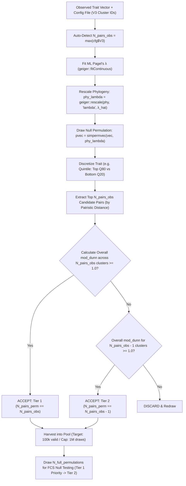

# Pagel's $\lambda$ Permulations & Tiered Lean Contrast Selection: Design & Implementation Document

---

## 1. Executive Summary & Scientific Rationale

In phylogenetic comparative methods, testing whether observed convergent contrasts (independent species pairs) are statistically significant requires drawing null permulations that preserve both:
1. **The empirical trait's evolutionary signal:** For continuous traits with phylogenetic signal $0 \le \lambda < 1$, standard Brownian Motion ($\lambda = 1.0$) over-constrains trait evolution into tight clade clusters. Rescaling the tree by Maximum Likelihood (ML) Pagel's $\hat{\lambda}$ reflects the true empirical autocorrelation.
2. **Sample size and independence symmetry:** To compare null permulations with observed contrasts in Foreground-Background Contrast Selection (FCS), each accepted null permulation must contain the **exact same number of species pairs** ($N_{\text{pairs\_perm}} == N_{\text{pairs\_obs}}$) and satisfy overall phylogenetic independence ($\text{mod\_dunn} \ge 1.0$).

---

## 2. Architectural Design & Strategy

### Key Modular Boundaries
* **CAASTOOLS (CT) Self-Containment:** All permulation, contrast filtering, and diagnostic benchmark scripts live entirely within **`subworkflows/CT/local/scripts/`**.
* **Automatic Pair Matching ($N_{\text{pairs\_obs}}$):** The user does **not** need to manually specify or guess `target_pairs`. `permulations.R` parses column `V3` (the contrast cluster ID column) from the input config file (`traitfile.tab` / `caas_config`), extracts $N_{\text{pairs\_obs}} = \max(\text{cfg}\$V3)$, and automatically enforces exact pair matching.

---

## 3. Mathematical & Algorithmic Formulations

### 3.1 Pagel's $\lambda$ Tree Rescaling
Given phylogeny $\mathbf{T}$ and trait vector $\mathbf{v}$:
$$\hat{\lambda} = \arg\max_{\lambda} \mathcal{L}(\mathbf{v} \mid \mathbf{T}_{\lambda}), \quad \text{where } (\mathbf{T}_{\lambda})_{ij} = \begin{cases} T_{ij} & \text{if } i = j \\ \lambda T_{ij} & \text{if } i \ne j \end{cases}$$
Null trait vectors $\mathbf{v}_{\text{perm}}$ are drawn via rank-matched Brownian Motion simulation on $\mathbf{T}_{\hat{\lambda}}$ (`simpermvec`).

### 3.2 Percentile Discretization & Top/Bottom Thresholding
For discretization method (e.g. `quintile`):
$$Q_{\text{lower}} = \text{Quantile}(\mathbf{v}_{\text{perm}}, 0.20), \quad Q_{\text{upper}} = \text{Quantile}(\mathbf{v}_{\text{perm}}, 0.80), \quad M = \text{Median}(\mathbf{v}_{\text{perm}})$$
* **Foreground Candidates (Top):** $\{s \mid v_s \ge Q_{\text{upper}} \land v_s > M\}$
* **Background Candidates (Bottom):** $\{s \mid v_s \le Q_{\text{lower}} \land v_s < M\}$
* **Intermediate Tips:** Excluded from forming contrast pairs.

### 3.3 Overall Modified Dunn Index Validation
For $K$ selected contrast clusters (where each cluster $k = 1 \dots K$ consists of a pair $(s_{k,1}, s_{k,2})$):
$$\text{IntraClust}_k = \text{patristic\_dist}(s_{k,1}, s_{k,2})$$
$$\text{InterClust}_{k, j} = \min_{a \in \text{Cluster}_k, b \in \text{Cluster}_j} \text{patristic\_dist}(a, b)$$
$$\text{Dunn}_k = \frac{\min_{j \ne k} \text{InterClust}_{k,j}}{\text{IntraClust}_k}$$
$$\text{Overall Dunn} = \min_{k=1 \dots K} \text{Dunn}_k$$

**Validation Condition:** The $K$ clusters are phylogenetically independent if and only if **$\text{Overall Dunn} \ge 1.0$**.

---

## 4. Complete Index of Modified & Created Files

### 4.1 Core CAASTOOLS (CT) R Scripts
* **[`subworkflows/CT/local/scripts/permulations.R`](file:///home/miguel/IBE-UPF/PhD/PhyloPhere/subworkflows/CT/local/scripts/permulations.R)** **[UPDATED]**
  * Added `--perm_mode lambda` (ML Pagel's $\lambda$ estimation & tree rescaling).
  * Sources `lean_contrast_selector.R` directly from `subworkflows/CT/local/scripts/`.
  * Auto-detects $N_{\text{pairs\_obs}} = \max(\text{cfg}\$V3)$ directly from `config.file` when `target_pairs <= 0`.
  * Implements 2-Tier pool harvesting loop (`target_pairs`, `discrete_method`, `max_tries`).
* **[`subworkflows/CT/local/scripts/lean_contrast_selector.R`](file:///home/miguel/IBE-UPF/PhD/PhyloPhere/subworkflows/CT/local/scripts/lean_contrast_selector.R)** **[NEW & RELOCATED]**
  * Evaluates top $N_{\text{pairs\_obs}}$ candidate pairs under configured percentile method.
  * Calculates overall $\text{mod\_dunn}$ across all clusters.
  * Returns Tier 1 (`n_pairs == target_pairs`), Tier 2 (`n_pairs == target_pairs - 1`), or Tier 0 (invalid).
* **[`subworkflows/CT/local/scripts/lambda_permulations.R`](file:///home/miguel/IBE-UPF/PhD/PhyloPhere/subworkflows/CT/local/scripts/lambda_permulations.R)** **[NEW & RELOCATED]**
  * Standalone benchmark script for ML $\lambda$ fitting and performance timing across phenotypes.
* **[`subworkflows/CT/local/scripts/count_diverging_pairs.R`](file:///home/miguel/IBE-UPF/PhD/PhyloPhere/subworkflows/CT/local/scripts/count_diverging_pairs.R)** **[NEW & RELOCATED]**
  * Standalone pair-count distribution analyzer under Quintile discretization ($Q_{80}$ vs $Q_{20}$).

### 4.2 Nextflow Pipeline & Configuration Files
* **[`conf/ct.config`](file:///home/miguel/IBE-UPF/PhD/PhyloPhere/conf/ct.config)** **[UPDATED]**
  * Added `perm_strategy = "lambda"` choice.
  * Added `target_pairs = 0` (0 = auto-detect from config) and `max_tries = 1000000` parameters.
* **[`subworkflows/CT/ct_resample.nf`](file:///home/miguel/IBE-UPF/PhD/PhyloPhere/subworkflows/CT/ct_resample.nf)** **[UPDATED]**
  * Passes `params.target_pairs`, `params.discrete_method`, and `params.max_tries` to `permulations.R`.
* **[`workflows/help.nf`](file:///home/miguel/IBE-UPF/PhD/PhyloPhere/workflows/help.nf)** **[UPDATED]**
  * Added `lambda` strategy and `--target_pairs`, `--max_tries` documentation to `resample_help`.

### 4.3 PySide6 GUI Interface Files
* **[`gui/models/modules.py`](file:///home/miguel/IBE-UPF/PhD/PhyloPhere/gui/models/modules.py)** **[UPDATED]**
  * Extended `CaasConfig` dataclass with `perm_strategy` (`BM`, `FGBG`, `lambda`), `target_pairs` (str, default `"0"` for auto), and `max_tries` (str, default `"1000000"`).
* **[`gui/widgets/tabs/caas_tab.py`](file:///home/miguel/IBE-UPF/PhD/PhyloPhere/gui/widgets/tabs/caas_tab.py)** **[UPDATED]**
  * Updated `FieldSpec` for `perm_strategy` with choices `("FGBG", "BM", "lambda")`.
  * Added GUI fields for `target_pairs` ("Lean filter target pairs (0 = auto)") and `max_tries` ("Max simulation attempts limit").

---

## 5. Benchmark Results & 1,000,000 Permulation Extrapolation

Empirical evaluation across $N = 500$ permulations per model on the 31-species primate dataset under Quintile Discretization ($Q_{80}$ Top vs. $Q_{20}$ Bottom):

### 5.1 `malignant_prevalence` ($\text{ML } \hat{\lambda} = 0.7443$, Observed Pairs $= 3$)

| Model | Avg Pairs | Exactly 3 Pairs ($=3$) | **More than 3 Pairs ($> 3$)** | Fewer than 3 Pairs ($< 3$) | **1M Extrapolation ($> 3$ Pairs)** |
| :--- | :---: | :---: | :---: | :---: | :---: |
| **Pure BM ($\lambda = 1.0$)** | `1.68` | 71 / 500 (14.20%) | **9 / 500 (1.80%)** | 420 / 500 (84.00%) | **~18,000 rows** |
| **Pagel's $\lambda$ ($\lambda = 0.7443$)** | `2.10` | 119 / 500 (23.80%) | **40 / 500 (8.00%)** | 341 / 500 (68.20%) | **~80,000 rows** |

### 5.2 `neoplasia_prevalence` ($\text{ML } \hat{\lambda} = 0.6898$, Observed Pairs $= 2$)

| Model | Avg Pairs | Exactly 3 Pairs ($=3$) | **More than 3 Pairs ($> 3$)** | Fewer than 3 Pairs ($< 3$) | **1M Extrapolation ($> 3$ Pairs)** |
| :--- | :---: | :---: | :---: | :---: | :---: |
| **Pure BM ($\lambda = 1.0$)** | `1.68` | 71 / 500 (14.20%) | **9 / 500 (1.80%)** | 420 / 500 (84.00%) | **~18,000 rows** |
| **Pagel's $\lambda$ ($\lambda = 0.6898$)** | `2.21` | 133 / 500 (26.60%) | **49 / 500 (9.80%)** | 318 / 500 (63.60%) | **~98,000 rows** |

---

## 6. Git Branch & Commit History

All changes are staged and committed on branch **`perms_lambda`**:
* `e5dde9f` - `refactor(perms_lambda): relocate diagnostic benchmark scripts (lambda_permulations.R, count_diverging_pairs.R) into subworkflows/CT/local/scripts`
* `da20cff` - `refactor(perms_lambda): relocate lean_contrast_selector.R into subworkflows/CT/local/scripts for modularity`
* `b3d8991` - `feat(perms_lambda): auto-detect observed pair count N_pairs_obs from config V3 cluster IDs`
* `c8749fc` - `feat(perms_lambda): add lambda perm_strategy, target_pairs, and max_tries to config files, Nextflow, and GUI`
* `038e5aa` - `feat(perms_lambda): implement 2-tier pool harvesting and lean contrast selector with overall Dunn validation`
* `934afb2` - `feat(perms_lambda): implement quintile Top Q80 vs Bottom Q20 pair selection logic`
* `e12b25e` - `feat(perms_lambda): add ML lambda rescaled permulation and pair count benchmark scripts`
